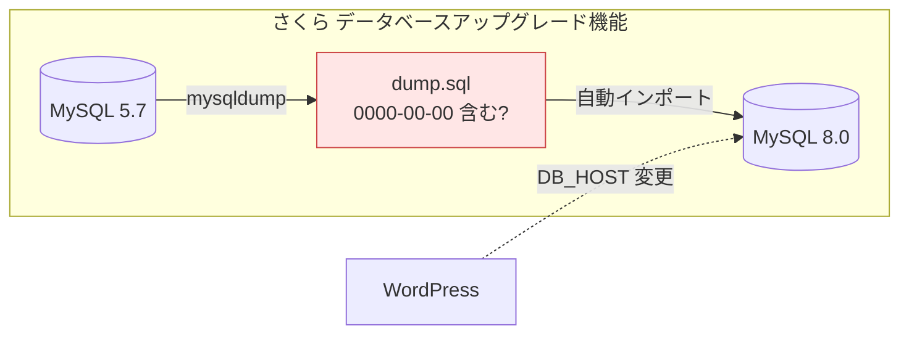
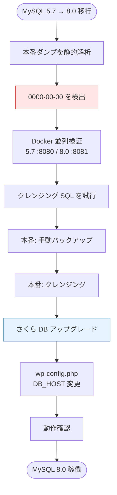
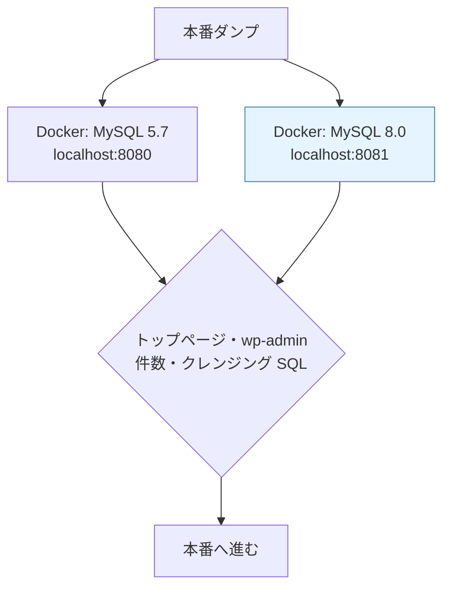

## はじめに

さくらインターネットの共用レンタルサーバー上で動いている WordPress サイトを、MySQL 5.7 から 8.0 へ移行しました。
さくらには「データベースアップグレード機能」があり、コントロールパネルのボタンを一度押せばダンプ取得・MySQL 8.0 へのインポート・接続先の切り替えまで自動で完了します。実際に「ボタンを押したら終わった」という体験記はネット上にたくさんあります。

私は、その手順で完全にデータ移行されるかが不安だったため、ローカルでいくつかの事前調査をした上で、アップグレードを実施しました。

結果として、自動機能による移行は問題なく終わり、不安は杞憂に終わりました！

ただ、検証を通じて得た知見や、念のために行った手順は、同じように慎重な移行を計画している方の参考になると思い、本記事では、その事前調査からアップグレード手順までをまとめています。


## 対象者

- さくらインターネットのサーバーで WordPress を管理しているエンジニア
- さくら共用サーバーで WordPress の MySQL 8.0 移行を控えている方
- ワンクリックアップグレードの前に何を確認すべきか知りたい方

## 環境

| 項目 | 内容 |
|---|---|
| サーバー | さくらインターネット 共用サーバー（FreeBSD） |
| WordPress | 6.9.4 / PHP 8.3.30 |
| MySQL | 5.7 → 8.0.39 |

## 背景

さくらインターネットの共用レンタルサーバー上で動いている WordPress サイトが MySQL 5.7 でヘルスチェックで引っかかってしまうため、MySQL 8.0 へ移行する必要が出てきました。

さくらには「データベースアップグレード機能」があり、コントロールパネルのボタンを一度押せばダンプ取得・MySQL 8.0 へのインポート・接続先の切り替えまで自動で完了します。実際に「ボタンを押したら終わった」という体験記はネット上にたくさんあります。

ただ、MySQL 5.7 と 8.0 では `sql_mode` のデフォルトが異なり、5.7 では通っていた無効な日付値 `0000-00-00 00:00:00` が、8.0 ではエラーになるケースがあります。さくらの自動アップグレードは内部的に mysqldump でダンプを取り、新しい MySQL 8.0 サーバーへ再インポートする流れなので、DB の中身次第ではインポート時にレコードが欠落するリスクも考えられます。



「ボタン一発」で見えるのは表向きの操作だけで、裏では上のようにダンプとインポートが走ります。体験記に事前準備の記述が少ないのは、この内部処理が見えにくいからかもしれません。

いきなりボタンを押すのは不安だったので、まず本番 DB のバックアップダンプを静的解析しました。すると `0000-00-00 00:00:00` を含むレコードが数件も見つかり、データの状態はかなりよくないと判断しました。本番で試す前に、MySQL 5.7 と 8.0 を並列に立てた Docker 環境でも同じダンプを使って検証し、クレンジング SQL を試してから本番に進むことにしました。

今回の移行は、次の流れで進めました。




## 1. ダンプ解析で 0000-00-00 が数千件見つかった

本番 DB のバックアップダンプを静的解析したところ、`0000-00-00 00:00:00` を含むレコードが大量に見つかりました。大半は `wp_posts` の `auto-draft`（自動下書き）で、ほかに `wp_pmxe_exports`（WP All Export）と `wp_yoast_indexable`（Yoast SEO）にも少数存在しました。

本番 MySQL 5.7 の `sql_mode` には `STRICT_TRANS_TABLES` がなく、無効な日付値が警告なしで蓄積されていたのが原因です。MySQL 8.0 では `STRICT_TRANS_TABLES` が有効になるため、さくらの自動アップグレード（ダンプ → インポート）でそのまま移すと問題になりえます。

## 2. Docker で事前検証した

本番で試す前に、MySQL 5.7（port 8080）と 8.0（port 8081）を並列に立てた Docker 環境を用意し、本番ダンプを両方にインポートして比較しました。MySQL 8.0 側では `MYSQL_AUTHENTICATION_POLICY: mysql_native_password` の指定が必要です。



公開ページ・管理画面ともに差異はなく、問題は `0000-00-00` データに限定されていることを確認しました。クレンジング SQL も Docker 上で先に実行し、件数欠落がないことを検証してから本番に進む方針としました。

## 3. クレンジングの方針

対処法は「データを書き換える（方針A）」か「移行後の sql_mode を緩める（方針B）」の二択です。さくら側の `sql_mode` をユーザーが変更できるか不明だったため、方針Aを採用しました。

| テーブル | 置換先 |
|---|---|
| `wp_posts`（日付4カラム） | `1970-01-01 00:00:00` |
| `wp_pmxe_exports`（NOT NULL カラム） | `1970-01-01 00:00:00` |
| `wp_yoast_indexable`（NULL 可カラム） | `NULL` |

## 4. アップグレード実施手順

1. 手動バックアップ（`mysqldump` または phpMyAdmin）
2. phpMyAdmin の SQL タブでクレンジング（トランザクション内で UPDATE、実行後にカウントが 0 件になることを確認）
3. クレンジング後のバックアップを再取得（クレンジング済みの状態を保険として残しておく）
4. コントロールパネルの「データベースアップグレード機能」で実行
5. `wp-config.php` の `DB_HOST` を新ホスト名（`mysql80.xxxx.sakura.ne.jp`）に変更
6. トップページ・`wp-admin`・サイトヘルスで DB バージョンを確認

クレンジング SQL の例（`wp_posts`）：

```sql
START TRANSACTION;

UPDATE wp_posts
SET post_date         = '1970-01-01 00:00:00',
    post_date_gmt     = '1970-01-01 00:00:00',
    post_modified     = '1970-01-01 00:00:00',
    post_modified_gmt = '1970-01-01 00:00:00'
WHERE post_date         = '0000-00-00 00:00:00'
   OR post_date_gmt     = '0000-00-00 00:00:00'
   OR post_modified     = '0000-00-00 00:00:00'
   OR post_modified_gmt = '0000-00-00 00:00:00';

COMMIT;
```

本番作業は約1時間。ボタンを押す操作自体は5分ほどでした。
「データベースアップグレード機能」を押すと、時間指定が可能でした。実際に「ボタンを押したらコントロールパネルのボタンを一度押せばダンプ取得・MySQL 8.0 へのインポート・接続先の切り替えまで自動で終わった」という感じです。

## まとめ

| 確認ポイント | 内容 |
|---|---|
| ダンプの件数確認 | `grep -c "0000-00-00" dump.sql` |
| sql_mode の実測 | `SELECT @@sql_mode;`（`STRICT_TRANS_TABLES` の有無） |
| クレンジング前の検証 | Docker 等で件数欠落がないことを確認 |

ワンクリックアップグレードは便利ですが、「データがそのまま移せるか」を事前に確認しておく必要があります。特に MySQL 5.7 から 8.0 では `0000-00-00` の有無確認（とクレンジング？）は事前に実施していくことをおすすめします。

## おわりに

本番作業は無事完了し、サイトも問題なく動いています。

裏話にはなりますが、移行が落ち着いてから調べ直したところ、WordPress は DB 接続のたびに `SQL mode` をセッションから除去しており、mysqldump の冒頭にも `SET SQL_MODE` が入っています。このため、クレンジングしなくても「ボタン一発」のアップグレード自体は、実は、成功していた可能性が高いです⋯。今回の調査とクレンジングは、WordPress の通常運用を守るという意味では必須ではなかったのかもしれません。

詳しくは後日譚「[【WordPress】sql_mode を自動で外す仕組み](https://zenn.dev/vspgkyo11/articles/cleansing-was-it-necessary)」にまとめています。
ぜひご覧ください。

---

## 株式会社ONE WEDGE

【ITエンジニアに、IT業界に貢献する企業】株式会社ONE WEDGEは、Webシステム開発・SES・AI/DX支援を行うIT企業です。生成AIを活用した業務効率化や次世代システム開発にも注力しており、企業の課題解決だけでなく、エンジニア一人ひとりの成長にも本気で向き合っています。また、技術は「一人で学ぶもの」ではなく「仲間と成長するもの」と考え、社内外でのコミュニティづくりにも力を入れています。

https://onewedge.co.jp/

