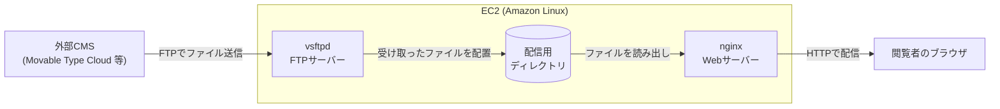
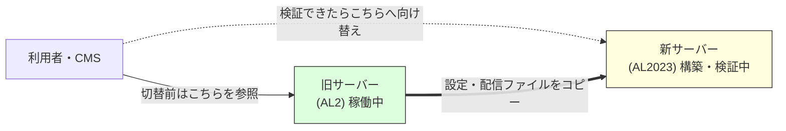

## はじめに

Amazon Linux 2 (AL2) のサポート終了に伴い、静的サイトを配信しているEC2をAmazon Linux 2023 (AL2023) へ移行しました。

Amazon LinuxはAWSがEC2向けに提供しているLinuxで、AL2は2026年6月30日にサポート終了 (EOL) を迎えました。EOL後はセキュリティ更新もバグ修正も提供されないため、まだAL2で動いているサーバーが残っているなら、後継であるAL2023への移行を急ぐ必要があります。

本記事では、実際に移行したときの流れをフェーズごとに整理しました。

https://docs.aws.amazon.com/ja_jp/elasticbeanstalk/latest/dg/using-features.migration-al.generic.from-al2.html

## 対象者

* Amazon Linux 2のEOL対応をこれから始めるインフラ担当者
* AL2からAL2023への移行の全体像を、まずざっくり掴みたい方
* 外部のCMSからFTPでファイルを受け取って配信するタイプのサーバーを運用している方

## 前提となる構成

今回移行したサーバーは、次のような構成でした。

* Movable Type Cloudなど外部のCMSでページを生成し、完成したファイルをFTPで送ってもらう
* 送られてきたファイルを、nginxがそのまま配信する
* サーバー自体はPHPもデータベースも持たない

図にすると、次のようなシンプルな流れです。



つまりサーバーの役割は「FTPでファイルを受け取る」「受け取ったファイルを配信する」の2つだけです。ページを生成する処理はCMS側にあるため、サーバーにはPHPもデータベースも要りません。動的な処理を持たない分、移行で気にすべき点も少なくて済みます。

登場するミドルウェアは次の2つです。

* **nginx**: Webサーバー。受け取ったファイルをブラウザへ配信する
* **vsftpd**: FTPサーバー。CMSからのファイル送信を受け付ける

## 移行の進め方

AL2からAL2023へは、稼働中のサーバーをそのまま書き換える (in-place) アップグレードのコマンドが提供されていません。AL2023のEC2を新しく構築し、設定とデータを移してから切り替える、いわゆるBlue/Green方式が基本の進め方になります。

旧サーバーを動かしたまま新サーバーを用意できるので、切り替え直前まで現行サービスに影響を与えずに作業できるのが利点です。



今回の構成では、作業は次の流れに集約できました。

| フェーズ | 主な作業 |
| --- | --- |
| 事前準備 | 稼働中インスタンスのバックアップAMIを取得し、ロールバック手段を確保する |
| 新EC2構築 | AL2023のAMIで新規EC2を起動し、OSを最新化する |
| Webサーバー導入 | nginxを導入し、旧サーバーの設定を移植する |
| FTPサーバー導入 | vsftpdを導入し、旧サーバーの設定を移植しつつAL2023特有の差分を調整する |
| データ移行 | 旧サーバーの配信用ファイルを新サーバーへ同期する |
| 動作確認・切替 | 静的ページの表示を確認したうえで、参照先を新サーバーへ切り替える |

以下、各フェーズを順番に見ていきます。

### 事前準備: バックアップを取る

作業を始める前に、稼働中サーバーのバックアップAMIを取得します。AMI (Amazon Machine Image) はEC2の状態をまるごと保存したイメージで、ここから元と同じサーバーを復元できます。

新サーバーを別に立てる方式なので旧サーバーはそのまま残りますが、切り替え後に問題が発覚したときの戻し先として、この時点の状態を固定しておくと安心です。

### 新EC2構築: AL2023でサーバーを立てる

AL2023のAMIを選んでEC2を起動します。インスタンスタイプやネットワーク (VPC・サブネット・セキュリティグループ) は、基本的に現行サーバーと揃えておくと移行後の差分が減ります。ディスクサイズだけは、現行が手狭であればこのタイミングで増やしておくとよいです。

起動できたらOSを最新化します。

```bash
sudo dnf update -y
sudo reboot
```

AL2では `yum` だったパッケージ管理コマンドが、AL2023では `dnf` に変わっています。

### Webサーバー導入: nginx

nginxを導入し、旧サーバーの設定を移植します。

```bash
sudo dnf install -y nginx
sudo systemctl enable --now nginx
```

移植の際は、旧サーバーで `nginx -T` を実行すると、実際に読み込まれている設定を全て出力できます。設定ファイルが複数に分かれていても実効値をまとめて確認できるので、移植漏れを防ぐのに便利です。

新しく入れたnginxには初期状態の設定ファイルが同梱されており、移植した設定と競合することがあります。`nginx -t` で構文チェックが通らない場合は、まず既定の設定ファイルを疑うとよいです。

### FTPサーバー導入: vsftpd

vsftpdを導入し、FTP用のユーザーを作成したうえで、旧サーバーの設定を移植します。

```bash
sudo dnf install -y vsftpd
sudo systemctl enable --now vsftpd
```

なお、旧サーバーの設定をそのまま移植すると動作しない項目がいくつかあります。AL2とAL2023でパッケージのビルド内容やデフォルト設定に差があるためで、移植後は設定を1行ずつ確認しながら起動テストをすることをおすすめします。

### データ移行: ファイルを同期する

旧サーバーの配信用ファイルを新サーバーへコピーします。`rsync` を使うと、パーミッションや所有者を保ったまま同期できます。

まず `-n` (dry-run) を付けて対象の件数と容量を確認してから、本実行するのが安全です。同期後は、ファイルの所有者が新サーバー側のFTPユーザーになっているかを確認します。

### 動作確認・切替

新サーバー上で、静的ページが旧サーバーと同じように表示されるかを確認します。

```bash
curl -I http://localhost/
```

トップページだけでなく、下層ページやリダイレクトの設定も含めて、現行と同等の応答が返るかを確認します。問題がなければ、CMS側のFTP送信先と、ロードバランサーやDNSの参照先を新サーバーへ向け替えて切り替え完了です。

## おわりに

AL2からAL2023への移行は、in-placeアップグレードが用意されていないため身構えてしまいますが、やること自体は「新しく立てて、設定とデータを移して、切り替える」という流れです。特に今回のようなPHPもDBも持たない静的配信サーバーであれば、移行対象も少なく取り組みやすい部類だと思いました。

本記録がAL2のEOL対応をこれから始める方の参考になれば幸いです。

---

## 株式会社ONE WEDGE

【ITエンジニアに、IT業界に貢献する企業】
株式会社ONE WEDGEは、Webシステム開発・SES・AI/DX支援を行うIT企業です。生成AIを活用した業務効率化や次世代システム開発にも注力しており、企業の課題解決だけでなく、エンジニア一人ひとりの成長にも本気で向き合っています。また、技術は「一人で学ぶもの」ではなく「仲間と成長するもの」と考え、社内外でのコミュニティづくりにも力を入れています。

https://onewedge.co.jp/

【 ONE WEDGE がレバテック転職フェアに出展】
7月26日開催！株式会社ONE WEDGEがレバテック転職フェアに出展します！
ご興味のある方はぜひご参加ください！詳細・事前エントリーはこちら！

https://lp.levtech-direct.jp/lp/112/05/02?via=c_zkk_cmp_fair260726_
