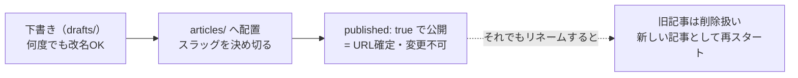
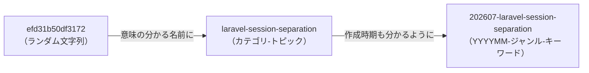

## はじめに

ローカルリポジトリにおいて、Zenn への執筆記事が溜まっていくと、`articles/` の中に大量の Markdown ファイルが溜まっていきます。私のリポジトリもすでに数十本を超え、ファイル名を見ても内容がまったく分からない状態になっていました。

```
articles/efd31b50df3172.md
articles/1a394203280067.md
articles/e1e6b072e89c27.md
```

「不規則な文字列の羅列でリネームできないなら、いっそ全部書き換えてしまおうか」と考えたのですが、調べてみるとこれは触ってしまうと壊れてしまう可能性が出てくる領域でした。本記事では、なぜファイル名を変えないほうがいいのか、その代わりにどう整理すれば見通しがよくなるのかをまとめます。

## 対象者

* Zenn の記事数が増えて `articles/` の中が把握しづらくなってきた方
* 個人運用の Zenn リポジトリに何らかの管理ルールを導入したい方
* Zenn 執筆に zenn-cli を利用中の方

## 結論

* 公開済み記事のファイル名はリネームしない
* これから作る記事のスラッグ形式を統一する：（例）`YYYYMM-<ジャンル>-<キーワード>[-<補足>]`
* Zenn-CLI コマンドをエイリアスに登録する

## なぜファイル名を変えてはいけないのか

Zenn では、ファイル名（スラッグ）がそのまま記事の公開URLになります。

```
articles/efd31b50df3172.md
→ https://zenn.dev/{username}/articles/efd31b50df3172
```

スラッグには技術的な制約もあります。使える文字は半角英小文字・数字・ハイフン・アンダースコアのみで、長さは12〜50文字です。加えてスラッグはZennサイト全体で一意である必要があり、記事や本などコンテンツの種類ごとに、他のユーザーがすでに使っているものは重複して使えません。

そして最大の注意点は、[公式のスラッグ解説](https://zenn.dev/zenn/articles/what-is-slug)にも明記されている通り、公開後にスラッグを変更する手段が用意されていないことです。スラッグを変更すると、別の投稿として新規作成される扱いになります。ファイル名を変更すると、Zenn 側からは「旧記事が削除されて、別の記事が新規投稿された」ように見えてしまいます。



いいねやコメントが失われる、検索エンジンに評価されていたURLが404になる、SNSや他サイトからの被リンクが切れる、といった影響があり、「新規作成扱いになる」という仕様からスラッグを変えるのは最後の手段と思っておくのが安全です。

:::message
スラッグのランダムな文字列は見にくいファイル名ではなく、記事に紐づく永続的なIDとなります。
:::

## これから作る記事には命名ルールを適用する

新規記事のスラッグは自分で指定できます。ランダムな文字列に頼らず、意味の分かる名前と作成時期を仕込んでおけば、索引ファイルを開かなくてもディレクトリを眺めるだけである程度迷子にならずに済みます。

私が最終的に決めた形式はこちらです。

```
YYYYMM-<ジャンル>-<キーワード>[-<補足>]
```

最初は `<カテゴリ>-<トピック>` だけの形式にしていたのですが、記事数が増えるにつれて「これはいつ書いたんだっけ」が分からなくなり、先頭に `YYYYMM` を足す形に落ち着きました。



`YYYYMM` を先頭に置いておくと、エディタのファイル一覧やターミナルの `ls articles/` は基本的に名前順（＝文字コード順）に並ぶため、ファイル名を眺めるだけで自然と時系列順になります。索引ファイルを開かなくても「最近書いたのはどれか」「特定の時期に何を書いていたか」がディレクトリ構造だけである程度追えるようになるので、迷子になりにくさがさらに増します。

| 例 | 意図 |
| --- | --- |
| `202607-laravel-reference-guide` | 2026年7月・Laravel 公式ドキュメント ガイド |
| `202607-nextjs-middleware-to-proxy` | 2026年7月・Next.js の middleware→proxy 移行 |

スラッグには次の制約があるので、決め切ってから作成するのがおすすめです。

* 使える文字は半角英小文字・数字・ハイフン・アンダースコアのみ
* 長さは12〜50文字
* 公開後は変更できない（今回学んだ制約そのもの）

### `npm run new:tech` / `new:idea` で作成する

Zen-CLI を使っている方は普段よく使うコマンド（`zenn new:article` など）は、`package.json` の `scripts` にエイリアスとして登録することをお勧めします。`type`（tech/idea）ごとに用意しているので、通常はこちらを使えば `--type` の指定漏れがありません。

```bash
# 技術記事（type: tech）を作成 — 第1引数がスラッグ、`--` の後ろに残りのオプション
npm run new:tech -- 202607-laravel-session-separation --title "タイトル" --emoji 🔐

# アイデア記事（type: idea）を作成
npm run new:idea -- 202607-gas-gmail-auto-delete --title "タイトル" --emoji ✨
```

エイリアスの中身はシンプルで、`zenn new:article` に `--type` と `--slug` をあらかじめ付けているだけです。

```json:package.json
{
  "scripts": {
    "new:tech": "zenn new:article --type tech --slug",
    "new:idea": "zenn new:article --type idea --slug"
  }
}
```

`--`（ダブルハイフン）を挟まないと `npm` が `--title` などのオプションを自身のフラグと誤認して警告を出したり値を落としたりするので、必ず `--` の後ろに残りのオプションを続けてください。

### type を都度指定したいとき

エイリアスを用意していないリポジトリで作業する場合は、素の `new:article` に `--slug` と `--type` を直接渡しても同じ結果になります。

```bash
npm run new:article -- --slug 202607-laravel-session-separation --title "タイトル" --type tech --emoji 🔐
```

## おわりに

「ファイル名が気に入らないから直したい」という気持ちは自然ですが、Zenn の場合はファイル名がそのままURLという仕組み上、公開済み記事には手を出さないほうが安全です。整理したくなったら、ファイル名そのものではなく「これからの命名ルール」で解決する、という考え方が個人的にはしっくりきました。

実際にスラッグへ年月を仕込むようにしてからは、索引ファイルを開く前にディレクトリを眺めるだけで「あ、これは去年書いたやつだ」と分かる場面が増え、思っていた以上に地味に効いています。ルール自体はごく小さな工夫ですが、記事数が増えるほど効いてくる類のものだと感じています。同じように記事が増えて迷子になっている方の参考になれば幸いです。

---

## 株式会社ONE WEDGE

【ITエンジニアに、IT業界に貢献する企業】
株式会社ONE WEDGEは、Webシステム開発・SES・AI/DX支援を行うIT企業です。生成AIを活用した業務効率化や次世代システム開発にも注力しており、企業の課題解決だけでなく、エンジニア一人ひとりの成長にも本気で向き合っています。また、技術は「一人で学ぶもの」ではなく「仲間と成長するもの」と考え、社内外でのコミュニティづくりにも力を入れています。

https://onewedge.co.jp/


【 ONE WEDGE がレバテック転職フェアに出展】
7月26日開催！株式会社ONE WEDGEがレバテック転職フェアに出展します！
ご興味のある方はぜひご参加ください！詳細・事前エントリーはこちら！

https://lp.levtech-direct.jp/lp/112/05/02?via=c_zkk_cmp_fair260726_
