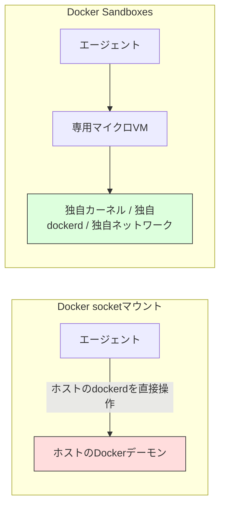

## はじめに

AIコーディングエージェントを用いて開発をしている際に、承認プロンプトを省いてエージェントに最大限の自律性を与える「YOLO mode」を使ったことがある方は多いのではないでしょうか？

ファイル変更のたびに承認を求められると作業が止まってしまうため、一度許可を出してしまえば楽なのですが、そのぶんエージェントが手元のPCに対してほぼ無制限の権限を持つことになります。意図しないディレクトリの読み書き、`rm -rf` のような破壊的コマンドの実行、`.ssh` 配下の秘密情報へのアクセスなど、リスクを挙げ始めるとキリがありません。

このリスクに対して、Dockerが2026年8月に「Docker Sandboxes」を発表しト注目を集めています。
エージェントの実行をコンテナではなくマイクロVM単位で隔離し、タスクが終われば使い捨てるという設計になっています。

本記事では、Docker Sandboxesが解決しようとしている課題と、その仕組み、そしてコミュニティでどのような議論が起きているかを整理します。

## 対象者

* Claude Code や Copilot CLI などのAIエージェントを日常的に使っている方
* エージェントの自律実行に踏み切れず、承認待ちの手間に悩んでいる方
* Docker socket のマウントなどでエージェントを動かしていて、隔離の甘さに漠然とした不安がある方
* コンテナとマイクロVMの技術的な違いを整理しておきたい方

## なぜ今、エージェント専用の隔離環境が必要になったのか

Dockerの公式ブログによると、本番環境にマージされるコードのうち25%以上がすでにAIによって書かれており、エージェントを使う開発者はそうでない開発者に比べて60%以上多くのプルリクエストをマージしているというデータが紹介されています。
エージェントの実行速度と生産性は、もはや無視できない規模になっています。

一方で、YOLO modeのようなノーガード運用には明確なリスクがあります。Docker側は次のような課題を挙げています。

* 意図しないファイルやディレクトリへのアクセス
* センシティブなデータの読み取り
* `rm -rf` のような破壊的コマンドの実行
* 環境変数や `.ssh` ディレクトリなど、秘密情報の意図しない露出

これらはエージェント自身の振る舞いを制御するだけでは根本的に防ぎきれません。
Docker公式ブログにもあるように、エージェントには「実行前に定義された制約と、アクセス・実行できる範囲の明確な上限」を持つ真の意味でのバウンディングボックスが必要であり、ガードレールはエージェント側ではなく実行環境そのものに強制されるべきだという考え方です。

## Docker Sandboxesとは何か

Docker Sandboxesは、AIコーディングエージェントを使い捨てのマイクロVM上で実行するための仕組みです。

コンセプトは「エージェントに一切のブレーキをかけず（YOLOモードで）自由に暴れさせても、安全な隔離空間（サンドボックス）の中だけであればホストPCが破壊される心配はない＝安全にYOLOできる」といったものです。

具体的には、
各サンドボックスは専用のDockerデーモン、ファイルシステム、ネットワークを持ち、エージェントはその中でパッケージのインストールやコンテナのビルド、ファイルの変更を自由に行えます。ホスト側のシステムには一切手を触れません。

特徴としては、
タスクが終わればサンドボックスごと破棄すればよく、環境が汚れる心配もありません。ポート公開やシークレットへのアクセス、複数ステップにまたがるタスクの実行にも対応しており、ターミナル経由でいつでも中の様子を確認できる点もメリットと言えます。

## コンテナではなくマイクロVMを選んだ理由

Docker Sandboxesの核となる設計判断は、隔離の単位をコンテナではなくマイクロVMにしたことです。通常のコンテナはホストとカーネルを共有しますが、マイクロVMはハードウェアをエミュレートし、独自のカーネルを持って動作します。信頼できないコードを実行する境界として、この差は小さくありません。

| 隔離方式 | カーネル | 隔離の強度 | 起動速度 |
| --- | --- | --- | --- |
| Docker socketマウント | ホストと共有 | 弱い(ホストデーモンを公開してしまう) | 速い |
| Docker in Docker | ホストと共有 | 中程度(特権アクセスが必要) | 速い |
| Docker Sandboxes(マイクロVM) | セッションごとに独自 | 強い | 数秒程度 |
| 従来型VM | 独自 | 強い | 遅い |

Docker Sandboxesは、独自のVMMを実装しています。
これによりmacOSやWindows、Linuxといった各プラットフォームの上でマイクロVMを動かせるようになっており、これらの環境でも数秒での起動時間を実現しています。



## 使ってみる: インストールから起動まで

`sbx` というCLIを使ってサンドボックスを起動します。インストール方法はOSごとに用意されています。

```bash:macOS
brew trust docker/tap && brew install docker/tap/sbx
```

```powershell:Windows
winget install Docker.sbx
```

```bash:Linux (Ubuntu)
curl -fsSL https://get.docker.com | sudo REPO_ONLY=1 sh
sudo apt-get install docker-sbx
```

インストール後は、次のコマンドでサンドボックス内のClaude Codeを起動できます。

```bash
sbx run claude
```

対応エージェントはClaude Code、GitHub Copilot CLI、Codex、Gemini CLI、OpenCode、Kiro、Cursor、Droid、Docker Agentのほか、NanoClawやOpenClawといった自律実行系のエージェントも含まれています。エージェントを搭載しないShellサンドボックスも用意されているため、手動セットアップや検証用途にも使えます。

:::message
sbx CLI自体は商用利用を含めて無料で使えます。ただしネットワーク・ファイルシステム・MCPのポリシーを組織全体で一元管理するAI Governance機能は、有料サブスクリプションプランの契約が前提になります。導入規模に応じて公式サイトの料金ページを確認してください。
:::

:::message alert
**導入を検討する際の注意点**
マイクロVMによる隔離は強力な境界ですが、万能ではありません。
ネットワークやシークレットの制限には回避策が存在するという指摘もあります。

隔離だけに頼らず、エージェントに渡す認証情報の権限を最小限に絞る、送信先ドメインを厳格に許可リスト化するといった多層的な対策を組み合わせる前提を運用することを推奨します。
:::

## おわりに

エージェントに「好きにやらせる」ことの怖さは、実際に手元の環境で一度ヒヤッとした経験がある人ほど実感が強いのではないかと思います。
私自身も、確認をスキップして作業を進めてもらった直後に想定外のファイルが書き換わっていて青ざめたことがあり、それ以来どこまで権限を渡すかにはかなり慎重になっていました。

Docker Sandboxesのように、実行環境そのものが境界を強制してくれる仕組みが整ってくると、エージェントの自律性を安心して引き出せる場面が増えていきそうです。とはいえ隔離は万能の解決策ではなく、渡す権限を絞るという地道な工夫と組み合わせは常々実施していきたいと考えています。

この記事が、AIエージェントとの向き合い方を見直すきっかけになれば幸いです。

---

## 株式会社ONE WEDGE

【ITエンジニアに、IT業界に貢献する企業】
株式会社ONE WEDGEは、Webシステム開発・SES・AI/DX支援を行うIT企業です。生成AIを活用した業務効率化や次世代システム開発にも注力しており、企業の課題解決だけでなく、エンジニア一人ひとりの成長にも本気で向き合っています。また、技術は「一人で学ぶもの」ではなく「仲間と成長するもの」と考え、社内外でのコミュニティづくりにも力を入れています。

https://onewedge.co.jp
