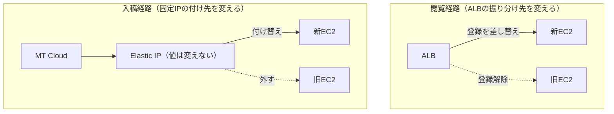

## はじめに

前回、Amazon Linux 2 (AL2) のサポート終了に伴い、静的サイトを配信しているEC2をAmazon Linux 2023 (AL2023) へ移行した流れを書きました。


https://zenn.dev/ykbone/articles/202607-linux-al2023-migration


前回は新サーバーを用意するところまでで、実際の切り替えはまだでした。本記事はその続編で、用意した新サーバーへ実際に向け先を変えるフェーズの記録です。

新サーバーを作り終えた時点では、利用者のアクセスもMT Cloudからのファイル送信も、まだ旧サーバー宛のままです。ここから先の「向け先を変える」作業が、実は一番緊張する部分でした。

切替本番の前には検証環境で同じ手順を一度通し、所要時間を計測しておくことを強くおすすめします。

本記事は、その切替作業やその事前検証で分かったことを中心に整理しています。

## 対象者

* AL2からAL2023への移行で、新サーバーを作り終えて切替待ちの方
* ALBのターゲットグループを差し替えてサーバーを入れ替えたい方
* Movable Type Cloud (MT Cloud) のように、外部CMSからFTPでファイルを受け取るタイプのサーバーを切り替える方
* 切替手順の事前検証を、何をどこまでやるべきか迷っている方

## 前提となる構成

前回と同じ構成です。Movable Type Cloud (以下MT Cloud) が生成したファイルをFTPで受け取り、それを`nginx`がそのまま配信するEC2で、手前にALBが入っています。詳しい構成図は前回の記事をご覧ください。

切替の話に入る前に、これから何度も出てくるAWSの用語を3つだけ整理しておきます。

* **ALB (Application Load Balancer)**: 届いたアクセスを、後ろに並べたサーバーへ振り分けるAWSのロードバランサー
* **ターゲットグループ**: ALBが振り分ける先のサーバーを登録しておく入れ物。ここの登録を入れ替えると、アクセスの向き先が変わる
* **Elastic IP**: AWSで確保できる固定のパブリックIPアドレス。付け替えれば、別のサーバーに同じIPを引き継げる

## 切替の進め方

この構成で切替の対象になる経路は2つあります。
閲覧者がページを見にくる経路と、MT Cloudがファイルを送ってくる経路です。後者を「入稿経路」と呼んでいるのは、EC2から見ると原稿にあたるファイルを受け取る側だからです。

| 経路 | 何が流れるか | 切替の実体 |
| --- | --- | --- |
| 閲覧経路 | 閲覧者 → ALB → EC2 | ターゲットグループの登録を差し替える |
| 入稿経路 | MT Cloud → FTP → EC2 | Elastic IPを旧サーバーから新サーバーへ付け替える |

ALBは振り分け先をプライベートIP (AWSの内部だけで通じるアドレス) で見ているため、Elastic IPを付け替えても閲覧経路には影響しません。逆にターゲットグループの登録を入れ替えても、FTPの宛先は変わらず、2つの経路は下図のとおり独立して動きます。



独立しているので順不同で打てますが、我々は閲覧経路→入稿経路の順にしました。閲覧側を先に通しておけば、入稿側で問題が出ても「サイトは新サーバーで正常に見えている」状態から切り分けできるためです。

## サーバー切替作業

サーバー切替作業は、次の順番で進めました。

| # | 作業内容 | 補足 |
| --- | --- | --- |
| 1 | 現行のヘルスチェック設定を控える | 戻す先の記録。パス・成功コード・間隔・しきい値を画面ごと保存しておく |
| 2 | 旧サーバーとの差分ファイルを再同期する | 旧サーバーは直前まで更新され続けている |
| 3 | ターゲットグループへ新サーバーを登録する | 正常と判定されるまで数十秒待つ |
| 4 | 旧サーバーを登録解除する | ここで閲覧経路の切替が完了。残しておく選択肢もある |
| 5 | Elastic IPを新サーバーへ付け替える | MT Cloud側の設定は変えずに済む |
| 6 | MT Cloudからテスト配信する | ファイルが新サーバーに届くことを確認する |

3と4が閲覧経路、5と6が入稿経路の切替です。以下、各フェーズを順番に見ていきます。

### 事前準備: ヘルスチェック設定の記録と差分再同期

ヘルスチェックの設定は、変更する前に画面ごと控えておきます。パス・成功とみなす応答コード・チェック間隔・正常/異常と判定するまでの回数まで含めて記録しておかないと、戻したいときに「元がどうだったか」を思い出すところから始めることになります。

差分ファイルの再同期は、地味ですが飛ばせない作業です。新サーバー構築時に一度`rsync`でファイルをコピーしていますが、そこから切替当日までの間も、旧サーバーはMT Cloudから更新され続けています。切替直前にもう一度同期しておかないと、切り替えた瞬間に数日前のページが表示されることになります。

### 閲覧経路の切替: ターゲットグループの登録替え

手順自体は、ALBのターゲットグループに新サーバーを登録し、ヘルスチェック (ALBが定期的に各サーバーへリクエストを送り、応答で状態を判定する仕組み) で正常と判定されてから旧サーバーを登録解除するだけです。

対処として、認証を外したヘルスチェック専用のURLを用意し、本番環境でも同じURLを使うようにしました。切替を進めてよいかの判断や、戻すまでの時間を見積もるには実際に測った数字が要ります。検証環境で本番と同じ切替を一度通して計測できたのは次のとおりです。

| 計測項目 | 実測値 |
| --- | --- |
| 新サーバーを登録してから正常と判定されるまで | 約20秒 |
| 旧サーバーの登録解除 | 配信断ゼロ |
| 切替中の配信断 | 無し・0秒 |

### 入稿経路の切替: Elastic IPの付け替え

続いて、入稿経路です。MT CloudからのFTP送信先を新サーバーへ向けます。狙いは、MT Cloud側の設定を1文字も変えずにサーバーだけ入れ替えることでした。Elastic IPを旧サーバーから新サーバーへ付け替えれば、MT Cloudから見た宛先IPは変わらないので、作業がAWS側だけで完結します。

付け替えたら、MT Cloudから実際にテスト配信を流し、ファイルが新サーバー側に届いていることを確認して完了です。
お疲れ様でした。

### コラム：ロールバック手順

戻す手順は切替の逆で、新サーバーを登録解除して、旧サーバーを登録し直すだけです。

旧サーバーがヘルスチェックに応答できていたなら、戻し時間は閲覧経路の切替で測った秒数が目安となります。切替時に旧サーバーを登録解除せず残しておけば、戻すときは新サーバーを外すだけで済み、この待ち時間ごと無くせます。

新旧どちらのサーバーが応答しているかは、`Host`ヘッダ (どのドメイン宛のリクエストかを伝える情報) を付けてALBやEC2へ直接リクエストを送って確かめます。

```bash
# ALBやEC2に対してHostヘッダを付けて直接叩く
curl -I -H 'Host: example.com' http://<ALBのDNS名>/
```

以上です。
万が一のために、ロールバックの手順も整理しておくと安心です。

## おわりに

当日は、ターゲットグループの登録を差し替える、Elastic IPを付け替える、という操作の組み合わせで問題なく終わりました。難しかったのは操作そのものより、ヘルスチェックの結果が検証環境と本番で変わることや、切替直前の差分同期、監視の付け替えといった周辺の部分でした。閲覧経路と入稿経路を切り分け、検証環境で事前に数字を測っておいたことで、当日は判断ではなく確認の作業として進められました。

同じようにALBとElastic IPが絡む構成を切り替える方には、2つの経路を最初から別物として整理し、検証環境で一度通しで測っておくことをおすすめします。手順書に書ける「やること」が同じでも、かかる秒数を自分の目で確認しているかどうかで、当日の安心感は変わります。

本記事がAL2のサポート終了対応を進めている方の参考になれば幸いです。

---

## 株式会社ONE WEDGE

【ITエンジニアに、IT業界に貢献する企業】
株式会社ONE WEDGEは、Webシステム開発・SES・AI/DX支援を行うIT企業です。生成AIを活用した業務効率化や次世代システム開発にも注力しており、企業の課題解決だけでなく、エンジニア一人ひとりの成長にも本気で向き合っています。また、技術は「一人で学ぶもの」ではなく「仲間と成長するもの」と考え、社内外でのコミュニティづくりにも力を入れています。

https://onewedge.co.jp/
