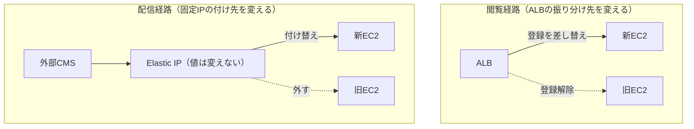

## はじめに

前回、Amazon Linux 2 (AL2) のサポート終了に伴い、静的サイトを配信しているEC2をAmazon Linux 2023 (AL2023) へ移行した流れを書きました。

https://zenn.dev/ykbone/articles/202607-linux-al2023-migration

前回は新サーバーを用意するところまでで、実際の切り替えはまだでした。本記事はその続編で、用意した新サーバーへ実際に向け先を変えるフェーズの記録です。

新サーバーを作り終えた時点では、利用者のアクセスも外部CMSからのファイル配信も、まだ旧サーバー宛のままです。ここから先の「向け先を変える」作業が、実は一番緊張する部分でした。切替本番の前には検証環境で同じ手順を一度通し、所要時間を計測しておくことを強くおすすめします。本記事は、そのリハーサルで分かったことを中心に整理しています。

## 対象者

* AL2からAL2023への移行で、新サーバーを作り終えて切替待ちの方
* ALBのターゲットグループを差し替えてサーバーを入れ替えたい方
* Movable Type Cloudなど、外部CMSからFTPでファイルを受け取るタイプのサーバーを切り替える方
* 切替手順のリハーサルを、何をどこまでやるべきか迷っている方

## 前提となる構成

前回と同じ構成です。Movable Type Cloud (MTクラウド) などの外部CMSがFTPで送ってきたファイルをnginxが配信し、その手前にCDNとALBが入っています。詳しい構成図は前回の記事をご覧ください。

切替の話に入る前に、これから何度も出てくるAWSの用語を3つだけ整理しておきます。

* **ALB (Application Load Balancer)**: 届いたアクセスを、後ろに並べたサーバーへ振り分けるAWSのロードバランサー
* **ターゲットグループ**: ALBが振り分ける先のサーバーを登録しておく入れ物。ここの登録を入れ替えると、アクセスの向き先が変わる
* **Elastic IP**: AWSで確保できる固定のパブリックIPアドレス。付け替えれば、別のサーバーに同じIPを引き継げる

## 切替は「2つの独立したレイヤ」で考える

この構成で切替の対象になる経路は2つあります。閲覧者がページを見にくる経路と、CMSがファイルを送ってくる経路です。この2つを別々の層 (レイヤ) として分けて考えられるかどうかが、手順の見通しを大きく左右しました。

| レイヤ | 何が流れるか | 切替の実体 |
| --- | --- | --- |
| 閲覧経路 | 閲覧者 → CDN → ALB → EC2 | ターゲットグループの登録を差し替える |
| 配信経路 | 外部CMS → FTP → EC2 | Elastic IPを旧サーバーから新サーバーへ付け替える |

重要なのは、この2つが互いに独立しているという点です。ALBは振り分け先をプライベートIP (AWSの内部だけで通じるアドレス) で見ているため、パブリックIPであるElastic IPを付け替えても、閲覧経路には影響しません。逆にターゲットグループの登録を入れ替えても、FTPの宛先は変わりません。



独立しているので順不同で打てますが、我々は閲覧経路→配信経路の順にしました。閲覧側を先に通しておけば、配信側で問題が出ても「サイトは新サーバーで正常に見えている」状態から切り分けできるためです。

## リハーサル①: ターゲットグループの登録替え

切替を進めてよいかの判断や、問題が起きたときに戻すまでの時間を見積もるには、手順書よりも実際に測った数字が要ります。そこで検証環境で本番と同じ切替を一度通し、時間を計測しました。

手順は、ALBのターゲットグループに新サーバーを登録し、正常と判定されてから旧サーバーを登録解除するだけです。

ここで悩んだのがヘルスチェックでした。ヘルスチェックとは、ALBが定期的に各サーバーへリクエストを送り、その応答でサーバーを使うかどうかを判定する仕組みです。検証環境にはBasic認証が掛かっていたため、ヘルスチェックがトップページ (`/`) を叩くと「認証が必要」を意味する401が返り続け、いつまでも正常と判定されませんでした。

このときALBは、登録されたサーバーが全て異常と判定されると、逆に全サーバーへ振り分けるという動きをします。おかげで配信自体は途切れていなかったのですが、ヘルスチェックはまったく機能していない状態でした。

対処として、認証を外したヘルスチェック専用のURLを用意し、本番環境でも同じURLを使うようにしました。正常とみなす応答コードに401を加える方法もありますが、それだと本番で本当に401が出たとき (＝本来の異常) まで見逃してしまうため、採用していません。

なお、ヘルスチェックの宛先を変えると、そのURLを持たない旧サーバーは異常と判定されます。問題が起きたときに旧サーバーへ戻す (ロールバックする) 前提なら、旧サーバーにも同じURLを用意しておくか、戻すときだけ設定を元へ戻すか、どちらかを事前に決めておく必要があります。

実測できたことは次のとおりです。

| 計測項目 | 実測値 |
| --- | --- |
| 新サーバーを登録してから正常と判定されるまで | 概ね60〜90秒 |
| 旧サーバーの登録解除 | 配信断ゼロ |
| 切替中の配信断 | 無し・0秒 |

AWSの仕様では、新しく登録したサーバーは最初のヘルスチェックに1回成功すれば正常と判定されます。今回の60〜90秒は、最初のチェックが走るまでの待ち時間や、サーバー起動直後の処理が重なった実測値です。旧サーバーを外すのは新サーバーが正常になってからで、この順序さえ守れば配信は途切れませんでした。

本番では旧サーバーもヘルスチェックに応答できていたため、戻すときの復帰時間は検証環境のような数秒ではなく、この60〜90秒が目安になりました。切替時に旧サーバーを登録解除せず残しておけば、戻すときは新サーバーを外すだけで済み、この待ち時間ごと無くせます。

## リハーサル②: Elastic IPの付け替え

続いて配信経路です。外部CMSからのFTP送信先を新サーバーへ向けます。狙いは、CMS側の設定を1文字も変えずにサーバーだけ入れ替えることでした。Elastic IPを旧サーバーから新サーバーへ付け替えれば、CMSから見た宛先IPは変わらないので、作業がAWS側だけで完結します。CMSの管理画面を別の部署や委託先が持っているケースでは、これはかなり大きな利点でした。

ここでは2点だけ注意が必要でした。1つは、1つのプライベートIPに紐づけられるElastic IPは1つだけ、という制約です。新サーバーに動作確認用のElastic IPを別途付けていると、そこへ本番用のIPを付け替えたときに、先に付いていたIPの紐づけが外れます。どのIPを何に使っているかを、事前に洗い出しておく必要があります。

もう1つは、FTPをパッシブモード (ファイル転送用の接続を、受信側から張りにいく方式) で使っている場合の設定です。vsftpdでは`pasv_address`という項目にサーバー自身のグローバルIPを書くため、Elastic IPを付け替えたら、この値も新しいIPへ更新してvsftpdを再起動する必要があります。忘れると、FTPのログインは通るのにファイル転送だけが失敗するという、原因の分かりにくい詰まり方をします。

## リハーサル③: ロールバック

戻す手順は切替の逆で、新サーバーを登録解除して、旧サーバーを登録し直すだけです。

ただし検証環境で測った戻し時間は、そのまま本番の想定値にはできませんでした。検証環境では旧サーバーも401で異常と判定されており、さきほどの「全て異常なら全サーバーへ振り分ける」という動きで配信が復活していたためです。数秒で戻ったように見えても、それは正規のルートを通った数字ではありません。本番の戻し時間は、リハーサル①で測った60〜90秒を目安にする必要があります。

新旧どちらのサーバーが応答しているかは、ALBやEC2へ直接リクエストを送って確かめます。`Host`ヘッダ (どのドメイン宛のリクエストかを伝える情報) を付ければ、実際の公開ドメインと同じ扱いで応答を確認できます。

```bash
# ALBやEC2に対してHostヘッダを付けて直接叩く
curl -I -H 'Host: example.com' http://<ALBのDNS名>/
```

## 本番切替の当日

リハーサルで手順と時間が固まったら本番です。当日は次の順番で進めました。

| # | やること | 補足 |
| --- | --- | --- |
| 1 | 現行のヘルスチェック設定を控える | 戻す先の記録。パス・成功コード・間隔・しきい値を画面ごと保存しておく |
| 2 | 旧サーバーとの差分ファイルを再同期する | 後述。旧サーバーは直前まで更新され続けている |
| 3 | ターゲットグループへ新サーバーを登録する | 正常と判定されるまで60〜90秒待つ |
| 4 | 旧サーバーを登録解除する | ここで閲覧経路の切替が完了。残しておく選択肢もある |
| 5 | Elastic IPを新サーバーへ付け替える | 続けて`pasv_address`を新しいIPへ更新し、vsftpdを再起動する |
| 6 | CMSからテスト配信する | ファイルが新サーバーに届くことを確認する |
| 7 | 監視アラームの対象を新サーバーへ付け替える | 後述。忘れると異常に気づけなくなる |

3と4が閲覧経路、5と6が配信経路の切替です。前述のとおり2つは独立しているので、閲覧側を先に通し、サイトが新サーバーで正常に見えている状態を作ってから配信側に手を付けました。

検証環境で通した手順に加えて、本番だけで必要になった作業が2つあります。

### 切替直前の差分同期

前回の記事で、旧サーバーの配信ファイルを`rsync` (差分だけをコピーするコマンド) で新サーバーへ同期しました。しかし旧サーバーはその後も現役で動き続けているので、CMSからの配信で中身は日々増えていきます。実際、初回の同期から1週間で新しいディレクトリが増え、記事ページも更新されていました。切替の直前にもう一度差分を同期しておかないと、切り替えた瞬間に最新記事が消えたように見えてしまいます。

同期のとき`--delete` (コピー元に無いファイルを、コピー先からも消すオプション) は付けない方針にしました。安全側に倒す判断ですが、副作用として、旧サーバーで削除したファイルが新サーバーには残ります。掲載を終えたページが切替後に復活して見えるおそれがあるので、新旧のファイル一覧を突き合わせ、「旧に無いが新に在る」ファイルを洗い出しておきます。

```bash
# 新旧それぞれでファイル一覧を取得して比較する（読み取りのみ）
find /var/www/html -type f | sort > /tmp/files.txt
```

一括で消さずリストとして持っておき、切替後に個別対応する形にしました。切替の可否を判断する条件にまで持ち上げると、当日の判断が重くなりすぎるためです。

### 監視の付け替え

CloudWatch (AWSの監視サービス) のアラームが、監視対象をインスタンスID (EC2を1台ずつ識別するID) で直接指定している場合、サーバーを入れ替えるとアラームは旧サーバーに張り付いたままになります。新サーバーの異常を検知できず、しかもアラーム自体は正常に見えるので、気づきにくい種類の抜けです。

切替直後に、監視対象のIDを新サーバーへ付け替える (または作り直す) 作業を手順に入れておきます。通知先のメールアドレスが前任者や旧ベンダーのままになっていないかも、このタイミングで見直すと良いと思います。

### 実際にやってみてどうだったか

当日は、リハーサルで測った数字がほぼそのまま出ました。新サーバーを登録してから正常と判定されるまでが60〜90秒、旧サーバーを外すときの配信断はゼロ。閲覧経路の切替は、実際のところ「登録して、正常になるのを1分ほど眺めて、旧サーバーを外す」だけで終わりました。

配信経路も同じで、Elastic IPを付け替えて`pasv_address`を直し、CMSからテスト配信を流して新サーバーにファイルが届くことを確認した時点で完了です。狙いどおり、CMS側の設定は1文字も触っていません。

拍子抜けするほど淡々と終わったのですが、それはリハーサルで数字と手順が固まっていたからでした。もし実測値を持たずに当日を迎えていたら、「まだ正常にならないが、もう少し待つべきか、それとも戻すべきか」で必ず迷っていたはずです。切替作業でいちばん怖いのは操作そのものではなく、想定していない時間が流れることだと感じました。

## 検証環境と本番の差分は、事前に表にしておく

リハーサルをやって一番効いたのは、手順の確認そのものよりも「検証環境と本番でここが違う」というリストが手に入ったことでした。我々の場合、次のような差分が出てきました。

| 差分 | 本番での扱い |
| --- | --- |
| 検証環境にはBasic認証があるが本番には無い | ヘルスチェックの作りを両環境で揃える。旧サーバーが正常と判定されるかが変わる |
| 本番のElastic IPは現役で配信を受けている | 構築中は絶対に触らない。付け替えは切替当日のみ |
| 本番のCMS設定は変更しない | Elastic IPの付け替えで宛先IPが変わらない。切替後にテスト配信で届くことだけ確認する |
| 本番の監視アラームは旧サーバーのIDを直接指定している | 切替後に新サーバーのIDへ付け替える |

リハーサルは本番と同じことを一度やるのが目的ですが、実際には完全に同じにはなりません。同じにできない部分を明示的に洗い出すことが、リハーサルのもう半分の成果だと感じました。

## おわりに

作業自体は、ターゲットグループの登録を差し替える、Elastic IPを付け替える、というごく短い操作の組み合わせです。それでも難しく感じたのは、ヘルスチェックの結果が検証環境と本番で変わることや、切替直前の差分同期、監視の付け替えといった、手順そのものより周辺にあるものでした。

閲覧経路と配信経路を別々のものとして切り分け、検証環境でリハーサルして数字を測っておいたことで、当日は判断ではなく確認の作業として進められました。本記録がAL2のサポート終了対応を進めている方の参考になれば幸いです。

---

## 株式会社ONE WEDGE

【ITエンジニアに、IT業界に貢献する企業】
株式会社ONE WEDGEは、Webシステム開発・SES・AI/DX支援を行うIT企業です。生成AIを活用した業務効率化や次世代システム開発にも注力しており、企業の課題解決だけでなく、エンジニア一人ひとりの成長にも本気で向き合っています。また、技術は「一人で学ぶもの」ではなく「仲間と成長するもの」と考え、社内外でのコミュニティづくりにも力を入れています。

https://onewedge.co.jp/

