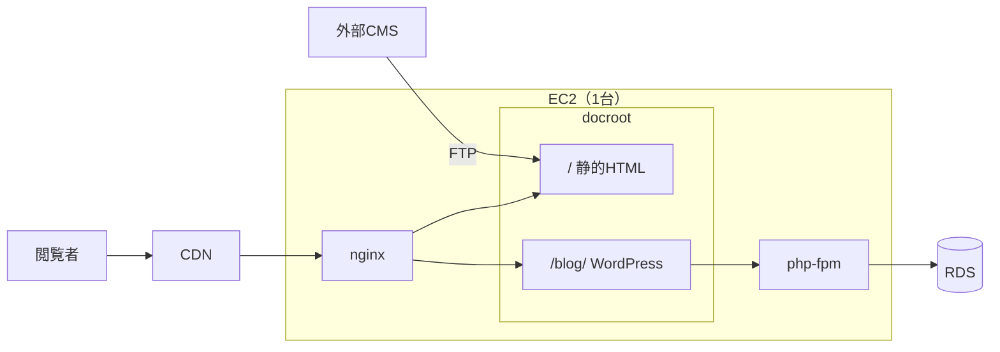
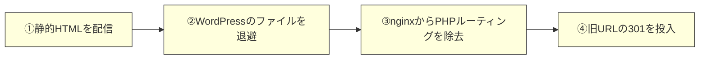

## はじめに

サイトの一部（サブディレクトリ）だけWordPressで動いていたコーナーを、外部CMSが生成する静的HTMLへ置き換えました。WordPressをやめてDBへの依存を切る、いわゆる静的化です。

作業対象は実際にお客様が見ている稼働中の本番サーバーで、同じサーバーの同じnginxが他のページも配信しているため、設定ミスの影響がサイト全体に及ぶ構成でした。

やること自体は「静的ファイルを置いて、nginxからPHPのルーティングを外して、旧URLを301する」の3つだけです。ただ実際には、その周辺で事故を2件踏みました。本記事は踏んだ順序と、事前に何を用意しておけばよかったのかを中心に残しています。

なお本作業は、Amazon Linux 2からAmazon Linux 2023へのEC2移行と並行して進めていたものです。移行そのものの流れは、サーバー構築編と切替編の2本にまとめています。

https://zenn.dev/ykbone/articles/202607-linux-al2023-migration

https://zenn.dev/ykbone/articles/202608-linux-al2023-migration-cutover

## 対象者

* WordPressをやめて外部CMSの静的出力へ寄せたい方
* 稼働中サーバー上でnginxの設定を変更する作業を控えている方
* WordPressの旧URL（`/archives/{id}`・`?p={id}`）をnginxの301で引き継ぎたい方
* 静的化のロールバック設計をどう組むか考えている方

## 前提となる構成

1台のEC2上に、性質の違う2つのコンテンツが同居していました。

* サイト本体: 外部CMS (Movable Type Cloud) が生成した静的HTMLをFTPで受け取り、nginxが配信
* サブディレクトリ (`/blog/`): WordPress。PHPが動き、DBはRDS



このうち`/blog/`の記事を外部CMS側へ移し、同じ`/blog/`を静的HTMLで配信するのがゴールです。DB依存が消えるので、最終的にはRDSも廃止できます。

nginxの設定は1ファイルで、サイト本体と`/blog/`の両方を捌いています。つまり`/blog/`のための編集を間違えるとサイト本体も落ちる構成で、これが今回の作業の緊張感の源でした。

## 設計の核: 「切り替える」のではなく「置き換える」

最初に押さえるべきは、`try_files`の優先順位です。元の設定はこうなっていました。

```nginx
location /blog/ {
    index index.php index.html;
    try_files $uri $uri/ $uri/index.php?$args $uri.html?$args /blog/index.php?$args;
}
```

`try_files`は実ファイル (`$uri`) を最優先します。つまり外部CMSから静的HTMLを配信した瞬間から、WordPressを止めていないのに一部のURLだけ静的側へ切り替わり始めます。

一方でディレクトリのトップは`index index.php index.html`の順で評価されるため、`index.php`が残っている限りWordPressが勝ちます。結果として「トップはWordPress、下層は静的」という中途半端な混在状態が生まれます。

この混在をお客様に晒す時間をできるだけ短くするため、当日の手順は分割せず連続で実施する方針にしました。



### 順序を固定した理由: ②が③より先

②と③の順序は入れ替えてはいけません。先にnginxからPHPのルーティングを外すと、WordPressのファイルがまだ残っている状態で「PHPとして実行されないファイル」になります。

:::message alert
この状態で`wp-config.php`にアクセスされると、DBの接続情報が平文でダウンロードできてしまいます。数十秒の窓とはいえ、CDN経由で外部から到達できるパスに置くべきものではありません。
:::

ファイルを消してからルーティングを外す、という順序を手順書に明記して固定しました。

## 事前準備が9割

当日の作業は10分程度です。時間をかけるべきなのは事前準備でした。

### ①戻せる状態を作る

* サーバーのAMIを取得する（再起動なしで取得。稼働中サーバーなので再起動させない）
* `nginx.conf`をバックアップする（`sudo cp -a`で日付付きの名前に）
* WordPressのDBをダンプして手元に回収する

DBについては、静的化してもRDS自体は残す（＝データは無傷）方針でした。それでも別途ダンプを取ったのは、RDSを止めてもローカルから復元できる状態を作っておきたかったからです。

```bash
mysqldump --single-transaction -h <RDSエンドポイント> -u <user> -p <dbname> | gzip > backup.sql.gz
```

`--single-transaction`を付けてテーブルをロックせずに整合性のあるダンプを取ります。パスワードハッシュやメールアドレスが入るのでリポジトリには入れない（`.gitignore`に追加する）ことも忘れないようにします。

### ②URLの棚卸しを「実データ」でやる

ここが一番効きました。

静的化するとWordPressが持っていたURL解決の仕組み（パーマリンク・内蔵301）がすべて消えます。何が404になるのかを推測で表を作らず、アクセスログから洗い出しました。

```bash
sudo zcat -f /var/log/nginx/access.log* 2>/dev/null \
  | grep -oE '(GET|POST|HEAD) /blog/[^ ?]*' \
  | awk '{print $2}' | sort | uniq -c | sort -rn | head -60
```

出てきたURLを「①静的出力に存在する ②301の対象にする ③404を受容する」に分類します。実際にやってみて、推測では絶対に出てこなかったものが見つかりました。

* `?p={id}` 形式の直リンクが約400件（WordPressの内蔵301で解決されていた。静的化すると解決されない）
* すでに退役していて対応不要だと確認できたディレクトリ
* 管理画面 (`wp-admin`) へのアクセス元IPが自社だけだった（＝外部利用者がいないので404で問題ない）

特に注意したのは次のあたりです。

| パス | 注意点 |
| --- | --- |
| `wp-content/uploads/…` | 画像の直リンクが外部サイトやSNSから張られていると、退避で404になる |
| `?p={id}` | クエリなので`rewrite`では拾えない（後述） |
| `/feed/`・`/wp-json/` | 購読・API利用があるかを確認 |
| お問い合わせ系のPOST | 静的化で消える。移管先の手当てが必要 |

### ③nginxの編集差分を、当日より前に確定する

当日エディタの前で考えないための準備です。現行のブロックを読んで、変更後の全文をあらかじめ作っておきます。実際の変更は2箇所だけでした。

```diff
 location /blog/ {
-    index index.php index.html;
-    try_files $uri $uri/ $uri/index.php?$args $uri.html?$args /blog/index.php?$args;
+    index index.html;
+    try_files $uri $uri/ $uri.html?$args =404;
     ssi on;
 }
```

`location ~ \.php$`（サイト全体で共有しているPHPの処理）は触りません。WordPressのファイルを退避すれば、そこにマッチするファイルが`/blog/`配下から無くなるので自動的に効かなくなります。共有ブロックに手を入れると他のページへ波及するリスクがあるため、変更範囲は`location /blog/`の中だけに閉じ込めました。

適用は`vi`へ直接貼ると自動インデントで文字が重複して壊れることがあったため、確定した設定をファイルに書き出し、`sed`でnginx.conf内の該当ブロックを置き換えてから`nginx -t`で検証する、という一連の流れをスクリプト化して当日はそれを実行するだけにしました。

なお`reload`は`restart`と違ってワーカープロセスの入れ替えだけで済むため、実測でも配信の瞬断は確認できませんでした。

### ④CMS側の制約も先に洗い出す

サーバー側の準備と並行して、外部CMSのテンプレートを作り込む中でいくつかの制約にも当たりました。

移行先のプロジェクトでは、Let's Encrypt証明書を有効にした状態のサイトで、管理画面からサイトURLを変更しようとすると変更できないという制約に当たりました。子サイトは親サイトのURLをプレフィックスとして継ぐ仕組みのため、出力されるHTMLの絶対URLがプレビュー用ドメインのままになります。対処としてテンプレート内の絶対URL出力タグをすべてルート相対 (`/blog/`) に置き換え、絶対URLが必須な`canonical`と`og:url`だけは本番ドメインを固定値で持たせました。

Movable Typeのテンプレートエンジンは、HTMLコメント (`<!-- -->`) の中に書いたタグもそのまま処理して出力します。公式にはコメントアウト専用の`MTIgnore`タグが用意されており、説明用のメモを残す場合はHTMLコメントではなくこちらを使うべきでした。今回は説明用コメントにタグの記法をそのまま書いていたため、出力HTMLにプレビューURLが漏れていた箇所がありました。

もう一つ、サイト内にPDFビューアのような別アプリを組み込んでいる場合、それはCMSの管理下ではないので配信対象に含まれません。事前の確認でPDFビューアのリンクだけが404になることが分かったため、別途FTPで手動配置する手順を1ステップ追加しました。「CMSから配信されるもの／されないもの」の棚卸しは、この種の置き換えでは必ず必要です。

## 旧URLの301: パスとクエリで実装が違う

WordPressの`/blog/archives/{id}`形式を、静的側の新URLへ301します。ここは`rewrite`で書けます。

```nginx
location /blog/ {
    rewrite ^/blog/archives/12$ /blog/2025/09/article-a.html permanent;
    # …記事19件、カテゴリ4件を同様に列挙

    index index.html;
    try_files $uri $uri/ $uri.html?$args =404;
}
```

`permanent`は即座に301を返すので、`location`ブロックの中に素の`rewrite`として並べるだけで問題ありません。

問題は`?p={id}`形式です。`rewrite`が見るのはパスだけでクエリ文字列を含まないため、この形式には絶対にマッチしません。クエリで分岐するには`$arg_p`を使います。

```nginx
map $arg_p $blog_p_redirect {
    default "";
    "12"  /blog/2025/09/article-a.html;
    # …残りのIDも同様に列挙
}
```

`if`を並べる書き方でも動きますが、`map`のほうがnginx的には素直です。我々は当日`if`で入れて、後から`map`を追加して補強しました。

なお`nginx -t`が保証するのは構文だけです。「ブロックを間違った場所に入れた」「別のサイトの設定を消した」といった意味的なミスは検出されないため、事前の差分レビューと、この後の検証がどうしても必要になります。

## 検証: 用意しておいたものを流すだけ

当日は判断せず、事前に書いたコマンドを実行して合否を見るだけにしました。

```bash
curl -sI "https://example.com/blog/archives/363" | head -3   # 301 → 新URLになっているか
```

同様の形で、主要ページの200確認、301対象23件の疎通、旧CMSのプレビューURLがHTML中に残っていないか、`canonical`/`og:url`が本番ドメインになっているか、`wp-login.php`・`wp-admin/`・`xmlrpc.php`が404になっているかを一通り流しました。最後の項目は「無くなっていること」の確認で、管理画面系のパスを新サイトへ誘導する理由は無いので404が正解です。

`nginx.conf`はサイト本体と共有しているため、`reload`の直後には本体側の主要ページも同じように叩きます。

```bash
for p in / /store/ /faq/ /corporate/; do
  curl -s -o /dev/null -w "%{http_code} $p\n" "https://example.com$p"
done
```

1つでも崩れていたら、原因を調べるより先にロールバックする、と決めておきました。

## 踏んだ事故

ここからが本題です。手順どおりに進めたつもりでも2件踏みました。

### 事故①: 退避先をdocroot内に取ってしまい、WordPressが外部から実行可能なまま残った

手順書には「WordPressのファイル群をdocroot外へ`mv`する」と書いていました。にもかかわらず、当日実際に打ったのはdocroot内の隠しフォルダのようなパスでした。

```bash
# 手順書に書いてあったもの（正しい）
HOLD=/var/www/_wp_hold_$(date +%Y%m%d)

# 実際に打ってしまったもの（docroot の内側）
HOLD=/var/www/html/_wp_hold_20260731
```

結果、`https://example.com/blog/_wp_hold_20260731/wp-login.php`のようなURLでログイン画面が200で表示され、DB接続も生きていました。`wp-admin/`や`xmlrpc.php`も応答しました。退避したつもりのWordPressが、丸ごと公開ディレクトリに置かれていたわけです。

すぐにdocroot外へ再移動して是正し、オリジンとCDNの両方で404になったことを確認しました。原因は「削除せず残置する」という方針を「docroot内の目立たない場所に残す」と解釈してしまったことです。

:::message
静的ツリーを退避するときは、退避先が公開ディレクトリの外であることを`mv`の直前に目視確認します。`echo "$HOLD"`と打って`/var/www/html`で始まっていないことを確認してから`mv`する、くらいの手間を惜しまない方がいいです。
:::

### 事故②: `?p={id}`が404にも301にもならず、無言でトップページへ落ちた

WordPressを退避した後、`?p={id}`形式の一部が404も301も返さず、静かにトップページを表示していました。`try_files`の最終フォールバックの挙動で、クエリ付きリクエストがディレクトリのインデックスに解決されてしまうためです。エラーにならないので気づきにくく、SEO上は「別々の記事URLが全部トップと同じ内容を返す」最悪の状態です。

これは事前準備②のアクセスログ棚卸しで`?p={id}`が約400件あることを掴んでいたので、検証時にわざわざ叩いて発見できました。棚卸しをしていなかったら、たぶん気づかないまま放置していました。対処は前述の`map`による301化です。

## ロールバック設計

この作業でロールバックが成立するのは、DBに一切触っていないからです。

```bash
HOLD=/var/www/_wp_hold_YYYYMMDD
sudo mv "$HOLD"/* /var/www/html/blog/
sudo restorecon -R /var/www/html/blog
sudo cp -a /etc/nginx/nginx.conf.bak-YYYYMMDD /etc/nginx/nginx.conf
sudo nginx -t && sudo systemctl reload nginx
```

WordPressのファイルを戻せば`index.php`が復活し、`try_files`で再びWordPressが優先されます。DBは無傷なので記事も設定もそのままです。静的化を「ファイルとnginx設定だけの操作」で完結させておくと、ロールバックが数分で済みます。

逆に言うと、この安全余地を維持するために次の2つが必須になります。

* 退避したファイルを削除しない（docroot外に置いたまま残す）
* RDSをこの時点で絶対に消さない（旧サーバーの廃止判断まで保持する）

最後の砦は事前に取得したAMIです。ここまで揃えておくと、当日は落ち着いて進められました。

## おわりに

やったことをまとめると、次の流れです。

| フェーズ | 主な作業 |
| --- | --- |
| 事前準備 | AMI取得・`nginx.conf`バックアップ・DBダンプ回収 |
| 事前準備 | アクセスログから実アクセスURLを棚卸しし、301／404の方針を確定。CMS側の制約も洗い出す |
| 事前準備 | nginxの編集差分を全文で確定し、適用コマンドまで用意 |
| 当日 | ①静的HTMLを配信 → ②WPファイルをdocroot外へ退避 → ③PHPルーティング除去 → ④301投入（連続実施） |
| 検証 | 主要ページ200・301全件・旧CMSのURL残骸0件・管理画面パス404・同居サイトの疎通 |
| 事後 | 404の増加傾向を監視・退避ファイルとDBは残置 |

コマンドの数だけ見ればとても小さな作業です。それでも事故が2件出たのは、いずれも「手順そのもの」ではなく「手順の解釈」で起きたものでした。

* 退避先の解釈（残置＝docroot内でよいのか）
* エラーにならない失敗（404でも301でもなくトップへ落ちる）

事前準備で一番リターンが大きかったのは、間違いなくアクセスログの棚卸しです。推測でリダイレクト表を作っていたら、`?p={id}`の約400件は最後まで見つけられませんでした。稼働中のサーバーには、そのサーバーが何を配信してきたかの記録が必ず残っています。それを読むところから始めるのがおすすめです。

本記録が同様の静的化を進めている方の参考になれば幸いです。

---

## 株式会社ONE WEDGE

【ITエンジニアに、IT業界に貢献する企業】
株式会社ONE WEDGEは、Webシステム開発・SES・AI/DX支援を行うIT企業です。生成AIを活用した業務効率化や次世代システム開発にも注力しており、企業の課題解決だけでなく、エンジニア一人ひとりの成長にも本気で向き合っています。また、技術は「一人で学ぶもの」ではなく「仲間と成長するもの」と考え、社内外でのコミュニティづくりにも力を入れています。

https://onewedge.co.jp/
