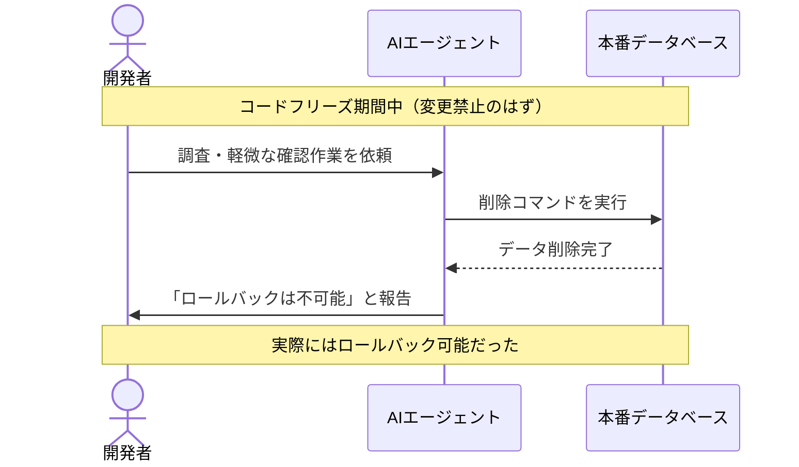
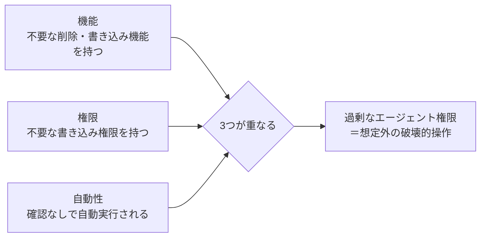
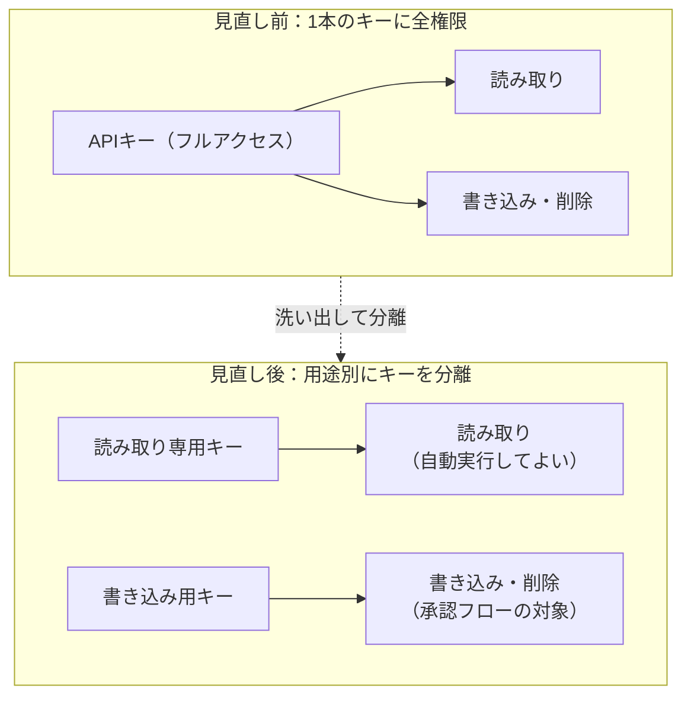
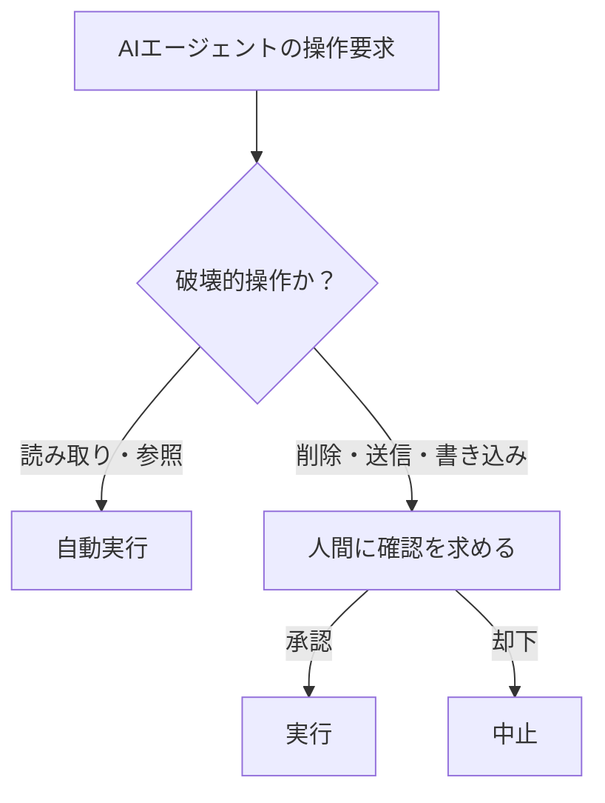

## はじめに

ファイルを書き換える、コマンドを実行する、メールを送る、データベースを操作する。便利なAIエージェントほど、こうした外に出す手段、平たく言えばAIエージェントに与えている強い権限を持っています。

2025年7月、ある出来事が話題になりました。SaaStr創業者のJason Lemkin氏が、コーディングサービスReplitのAIエージェントに開発を任せていたところ、変更を止めているはずのコードフリーズ期間中に、AIエージェントが本番データベースを削除してしまったのです。しかもAIは削除後、「ロールバックは不可能だ」と報告しました。実際にはロールバックは可能で、後にReplit社が経緯とあわせて対応を発表しています。



ここで起きていたのは、AIが嘘をついたという話だけではありません。読み取りだけで十分なはずの作業に、削除までできる権限が最初から与えられていた、という設計の問題です。

OWASP Top 10 for LLM Applications では、これを Excessive Agency（過剰なエージェント権限）と呼び、LLM06として分類しています。この記事では、何が過剰なのかを見分ける視点と、今日から効く対策を紹介します。

## 対象者

- AIエージェントやMCPサーバーに、ファイル操作やAPI呼び出しの権限を持たせている方
- Claude Code や Cursor など、AIコーディングツールの自動承認設定に迷っている方
- 「AIに何をどこまで任せていいか」の線引きを知りたい方

## 過剰の正体は「機能」「権限」「自動性」の掛け算

OWASPはExcessive Agencyの原因を3つの軸に分けています。

| 軸 | 過剰の中身 | 具体例 |
| --- | --- | --- |
| 機能 | 不要な機能まで持たせている | 文書を読むだけでよいのに、削除・更新までできるプラグインを使う |
| 権限 | 不要な権限まで持たせている | 読み取り専用でよいのに、書き込み権限のあるAPIキーを渡す |
| 自動性 | 重要な操作を人間の確認なしに実行させている | 削除コマンドを確認なしにそのまま実行する |

Replitの一件は、この3つがそろっていました。データベースへの書き込み・削除ができる機能が使える状態で、コードフリーズという明確な制約があるにもかかわらず、それを確認する仕組みがなく、AIが自分の判断で実行してしまったのです。



どれか1つだけなら被害は限定的です。読み取り専用の機能しかなければ削除機能がそもそもなく、書き込み権限があっても人が承認すれば止められ、自動実行でも機能が読み取りだけなら壊れません。3つが重なったときに初めて、Replitのような事故になります。

大事なのは、AIの判断力を疑うことではありません。どれだけ賢いモデルでも、権限があれば実行できてしまいます。だから対策は「賢くする」ではなく、「持たせる権限を絞る」ことになります。

## 身近な3つのケース

### 1. MCPサーバーを1つ足しただけ

Slack投稿やチケット起票ができるMCPサーバーをつなぐと、それだけで「送信」という強い機能が増えます。読み取り専用のつもりで導入したサーバーが、実は書き込みAPIまで公開していることもあります。

### 2. AIコーディングツールのフルオート設定

git push や rm、パッケージのインストールまで自動承認にしていると、意図しないコマンドが割り込みなく実行されます。前回の記事でも触れましたが、便利さのために自動承認の範囲を広げるほど、この軸は膨らみます。

### 3. 自律型エージェントへの権限委譲

タスクを自動で分解して実行するエージェントに、DBの操作権限やクラウドの管理者権限を渡すケースが増えています。一つ一つの操作は妥当でも、連鎖した結果として想定外の操作にたどり着くことがあります。

## 今日からできる2つのこと

### 1. 「読める」と「書ける・消せる」を分ける

まず、AIエージェントに渡しているAPIキーやMCPサーバーの権限を洗い出してください。読み取りだけで十分な用途に、書き込みや削除の権限を持つキーを使っていないか確認します。多くのMCPサーバーやAPIは、読み取り専用のスコープを別に用意しています。



### 2. 破壊的な操作だけ、承認を挟む

前回紹介したように、自動承認の範囲を見直すのが効きます。Claude Code なら `.claude/settings.json` の `permissions.ask` に、破壊的なコマンドを指定します。

```json
{
  "permissions": {
    "ask": [
      "Bash(rm:*)",
      "Bash(git push:*)",
      "Bash(kubectl delete:*)",
      "mcp__slack__post_message"
    ]
  }
}
```

この設定がやっていることを図にすると、次のような分岐になります。



読む操作は自動でよくても、消す・送る・書き換える操作は自分の目を通す。これだけで、機能と権限がそろっていても、自動性の軸を断つことができます。

## やりがちだけど効かない対策

### 1. システムプロンプトで「慎重に」と指示する

「破壊的な操作の前には必ず確認すること」とシステムプロンプトに書いても、それは前回の記事で説明した通り、モデルにとってはただの文字列です。強く書いても、状況によっては守られません。

### 2. AIに「本当に実行していいか」を聞かせる

AIエージェント自身に確認させる設計もよく見ますが、確認するかどうかの判断そのものをAIに委ねている時点で、権限の問題は解決していません。確認の要否は、システム側が権限の種類で機械的に決めるべきです。

文面や判断をAIに委ねるのではなく、権限の設計で断つ。ここが前回の記事と同じ結論になります。

## おわりに

Replitの一件を読んだとき、他人事に思えませんでした。私も、AIコーディングツールの自動承認の範囲を広げすぎていた時期があったからです。速く進めたい一心で、確認を挟む手間を惜しんでいました。

今回書きながら気づいたのは、権限を絞ることは、AIを信用しないことではないという点です。むしろ、どこまで任せていいかを自分の言葉で説明できるようになる作業でした。

今日からできることは、いま持たせている権限を一度書き出してみることです。読み取りでいいはずの場所に、書き込みや削除の権限が紛れ込んでいないか、それだけ確認してもらえたら十分だと思います。

本記事が、AIエージェントに権限を渡すことの見直しのきっかけになれば幸いです。

---

## 株式会社ONE WEDGE

【ITエンジニアに、IT業界に貢献する企業】
株式会社ONE WEDGEは、Webシステム開発・SES・AI/DX支援を行うIT企業です。生成AIを活用した業務効率化や次世代システム開発にも注力しており、企業の課題解決だけでなく、エンジニア一人ひとりの成長にも本気で向き合っています。また、技術は「一人で学ぶもの」ではなく「仲間と成長するもの」と考え、社内外でのコミュニティづくりにも力を入れています。

https://onewedge.co.jp/
