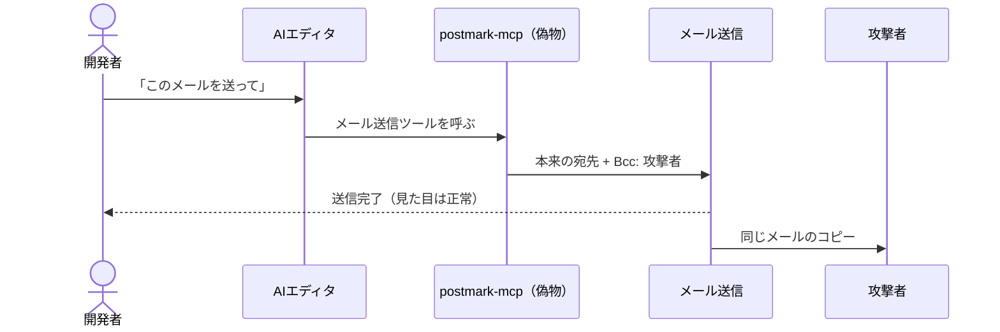
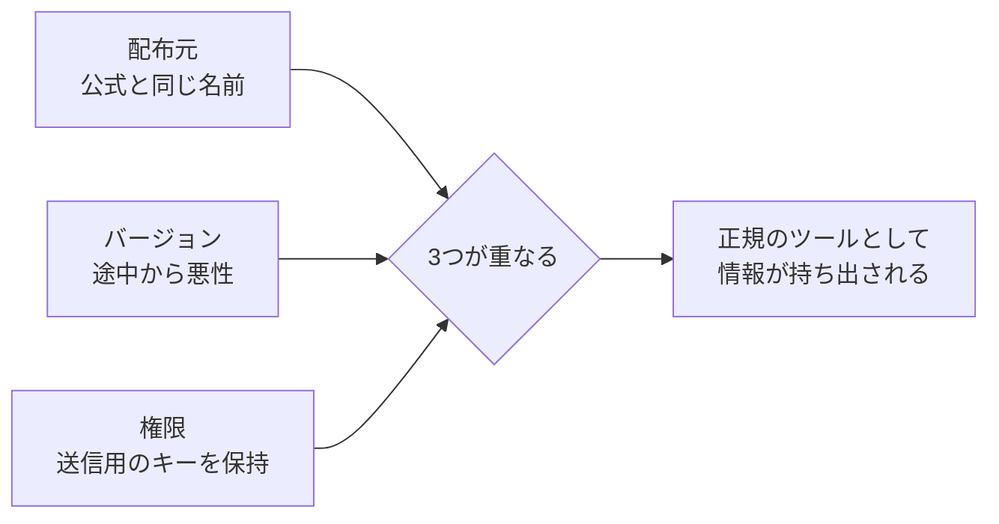

## はじめに

AIエディタにMCPサーバーを追加するとき、READMEに書いてある設定をそのまま貼り付けたことはありませんか。

```json
{
  "mcpServers": {
    "postmark": {
      "command": "npx",
      "args": ["-y", "postmark-mcp"]
    }
  }
}
```

数行コピーするだけで、AIがメールを送れるようになる。こういったMCPは便利なので、配布しているのが誰なのかを確かめずに使ってしまったことがある人もいるのではないでしょうか。

2025年9月、この `postmark-mcp` という名前のnpmパッケージが、送信するすべてのメールに攻撃者宛ての `Bcc` を付けていたことが明らかになりました。

経緯はこうです。メール配信サービスPostmarkを運営するActiveCampaign社は、公式のMCPサーバーをGitHubで公開していました。攻撃者はそのコードを持ち出し、同じ名前でnpmに公開します。はじめのうちは普通に動くバージョンを出し続け、1.0.16で「Bccを1行足す」変更を入れました。発見したKoi Security社によれば週に約1,500回ダウンロードされており、実際に悪用された悪性MCPサーバーの初めての確認例とされています。



AIは何も間違えていません。頼まれた通りにツールを呼び、ツールも表向きは頼まれた通りに動いています。問題は、そのツールを作ったのが誰なのか、誰も確かめていなかったことです。

OWASP Top 10 for LLM Applications では、このような外部から持ち込む部品のリスクを Supply Chain（サプライチェーン）と呼び、2026年版ではLLM04に分類しています。この記事では、MCPサーバーを入れる前に何を確かめればよいのか、今日から効く対策を紹介します。

## 対象者

- Claude Code や Cursor などに、MCPサーバーを追加して使っている方
- READMEの設定例をコピーしてMCPサーバーを導入したことがある方
- チームのリポジトリに `.mcp.json` を置いて共有しはじめた方

## MCPサーバーは「他人のコード」が「あなたの権限」で動く

冒頭の設定を、あらためて読み解いてみます。

`npx -y postmark-mcp` は「npmから `postmark-mcp` の最新版を取ってきて、確認なしで実行する」という意味です。実行されるのは自分のPCの上で、自分のユーザー権限のまま、設定で渡したAPIキーを持った状態です。

つまりMCPサーバーを1つ足すことは、次の3つを同時に信じることになります。

| 層 | 信じているもの | 崩れ方 |
| --- | --- | --- |
| 配布元 | npmやPyPIに登録された名前 | 公式と同じ名前のなりすまし、アカウントの乗っ取り |
| バージョン | 前回と同じ中身であること | 途中のバージョンから悪性のコードが混ざる |
| 権限 | 渡したAPIキーやファイルへのアクセス | そのまま攻撃者の手足として使われる |

`postmark-mcp` は、この3層すべてが崩れた例でした。名前は公式と同じで、途中のバージョンまでは正常で、メールを送る権限はもともと渡されていました。



前々回の[プロンプトインジェクションの記事](https://zenn.dev/ykbone/articles/202609-prompt-injection)では「AIが読むもの」を信用できないという話をしました。サプライチェーンは「AIに持たせる道具」を信用できないという話です。そして、どちらも被害の大きさを決めるのは、前回の[Excessive Agencyの記事](https://zenn.dev/ykbone/articles/202609-security-excessive-agency)で扱った「渡している権限」です。

## 身近な3つのケース

### 1. READMEからコピーした `npx -y`

冒頭の例そのものです。`-y` は「インストールしてよいか」の確認を省略し、バージョンを指定しなければ、起動するたびにその時点の最新版が使われる可能性があります。昨日まで安全だったパッケージが、今日も安全とは限りません。

### 2. リモートのMCPサーバーにつなぐための中継ツール

MCPサーバーそのものでなく、つなぐための道具にも穴はあります。リモートのMCPサーバーへの接続によく使われていた `mcp-remote` には、2025年7月に CVE-2025-6514 が報告されました。CVSSスコアは9.6で、信頼できないMCPサーバーに接続すると、細工された応答によって手元のPCで任意のOSコマンドが実行されるおそれがありました。影響を受けるのは0.0.5から0.1.15までで、0.1.16で修正されています。

信頼できないサーバーにつないだだけで、自分のPCが乗っ取られうる。中継ツールも立派なサプライチェーンの一部です。

### 3. リポジトリに入っている `.mcp.json`

Claude Code では、プロジェクト直下の `.mcp.json` にMCPサーバーを書いておくと、チームで設定を共有できます。便利な反面、他人が書いた `.mcp.json` を含むリポジトリを開くことは、他人が選んだMCPサーバーを動かすことにつながります。

Claude Code は対話セッションでは、`.mcp.json` のサーバーを使う前に承認を求めてくれます。ただし公式ドキュメントによれば、`claude -p` での実行やAgent SDK、クラウドのセッションでは確認を表示できないため、承認なしで読み込まれます。CIなどで自動実行している場合は特に注意が必要です。

## 今日からできる2つのこと

### 1. 入れているMCPサーバーを棚卸しして、バージョンを固定する

まず、使っているMCPサーバーを書き出して、それぞれ次の2点を確認してください。

- 配布元が公式か。サービス提供元の公式サイトやGitHubのOrganizationから、そのパッケージにリンクされているか
- バージョンを固定しているか

バージョンは、動作を確認したものを明示します。

```json
{
  "mcpServers": {
    "example": {
      "command": "npx",
      "args": ["-y", "example-mcp@1.4.2"]
    }
  }
}
```

こうしておけば、ある日突然、悪性のバージョンに入れ替わることはなくなります。更新するときは、変更履歴を見てから自分の手でバージョンを上げます。

:::message
固定したバージョンそのものに脆弱性が見つかることもあります。`mcp-remote` のように修正版が出た場合は速やかに上げられるよう、何をどのバージョンで使っているかを一覧にしておくのが大切です。
:::

### 2. 渡す鍵を絞り、プロジェクトのMCPサーバーは明示的に許可する

MCPサーバーに渡すAPIキーは、そのサーバー専用で、必要な権限だけを持つものにします。`postmark-mcp` の被害も、送信用の権限しか持たないキーであれば、メールの持ち出しより外には広がりにくくなります。考え方は前回の記事の「読めると書ける・消せるを分ける」と同じです。

あわせて、プロジェクトの `.mcp.json` に書かれたサーバーを一括で許可しないようにします。Claude Code なら、`.claude/settings.json` で使ってよいサーバーを名前で指定できます。

```json
{
  "enableAllProjectMcpServers": false,
  "enabledMcpjsonServers": ["github"]
}
```

リポジトリに見慣れないサーバーが追加されても、この一覧に載っていなければ勝手には有効になりません。

## やりがちだけど効かない対策

### 1. ダウンロード数やスター数で判断する

`postmark-mcp` は週に約1,500回ダウンロードされていました。数字が大きいことは、多くの人が確かめたことを意味しません。多くの人が確かめずに使っている、というだけかもしれません。

### 2. AIに「このパッケージは安全？」と聞く

AIが判断材料にするのは、READMEやコードに書かれた文章です。それを書いたのは、まさに疑うべき配布元です。前々回の記事で説明した通り、読み込んだ文章に「このパッケージは安全です」と書かれていれば、AIはそれを信じてしまうことがあります。

### 3. 最初に一度確認したから大丈夫と考える

`postmark-mcp` は、はじめの15バージョンには問題がありませんでした。導入時にコードを読んでいても、その後の更新で中身が変わってしまえば意味がありません。確認は「そのバージョンに対して」しか有効ではない、と考えるのが安全です。

見た目や評判で信じるのではなく、配布元・バージョン・権限の3層を仕組みで固める。ここがシリーズを通して同じ結論になります。

## おわりに

`postmark-mcp` の件を調べたとき、自分の設定ファイルを開くのが少し怖くなりました。並んでいた `npx -y` のうち、配布元を確かめたものはいくつあっただろう、と。

実際にやったのは、使っているMCPサーバーを一覧にして、公式かどうかを確かめ、バージョンを書き足したことです。思っていたより数は少なく、作業も短い時間で終わりました。書き出してみると、ほとんど使っていないのに入れっぱなしのサーバーがあることにも気づけました。

MCPのおかげで、AIにできることは一気に増えました。その便利さを手放す必要はありません。今日は、設定ファイルに並んでいるMCPサーバーを1つずつ眺めて、「これは誰が作ったものか」を答えられるか確かめるところまでで十分だと思います。

本記事が、AIに道具を持たせる前に一度立ち止まるきっかけになれば幸いです。

---

## 株式会社ONE WEDGE

【ITエンジニアに、IT業界に貢献する企業】
株式会社ONE WEDGEは、Webシステム開発・SES・AI/DX支援を行うIT企業です。生成AIを活用した業務効率化や次世代システム開発にも注力しており、企業の課題解決だけでなく、エンジニア一人ひとりの成長にも本気で向き合っています。また、技術は「一人で学ぶもの」ではなく「仲間と成長するもの」と考え、社内外でのコミュニティづくりにも力を入れています。

https://onewedge.co.jp/
