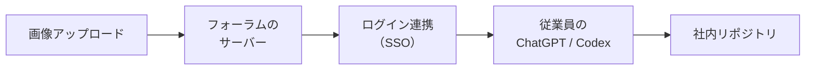

## はじめに

2026年9月、セキュリティ企業 Hacktron の研究者3人が [Hacking OpenAI](https://www.hacktron.ai/blog/hacking-openai) というレポートを公開しました。OpenAIのバグバウンティ（脆弱性報奨金制度）の中で行った調査の報告です。フォーラムへの画像アップロードを起点に、72時間足らずでOpenAI従業員のChatGPT/Codexアカウントへのアクセスを得て、社内リポジトリに無害なプルリクエストを1件作るところまでたどり着いています。

https://www.hacktron.ai/blog/hacking-openai



私がいちばん驚いたのは、侵入の手順そのものよりも、エクスプロイト（攻撃コード）作りの大部分をAIに任せていた、という点でした。

本記事では、このレポートを題材に、「攻撃が難しいこと」そのものが守りになっていた時代が終わりつつあること、そしてそれを前提に何を見直せばいいのかを整理していきます。

## 対象者

- Webサービスや社内ツールを運用していて、依存ライブラリの更新を判断する立場にある方
- 「うちは大きな企業じゃないから狙われない」と、どこかで思っている方
- AIが攻撃側にもたらす変化を、大まかにつかんでおきたい方

## 何が起きたのか


| 項目    | 内容                                                                              |
| ----- | ------------------------------------------------------------------------------- |
| 入口    | OpenAIのヘルプフォーラム（Discourseで構築）の画像アップロード                                          |
| 原因1   | 画像処理ライブラリ `libheif` の、CVEの付いていないセキュリティ修正がDebianのパッケージに取り込まれていなかった               |
| 原因2   | OpenAIのSSO（シングルサインオン）の設定不備                                                      |
| AIの役割 | Claude Opus 4.8/Opus 5 を使い、エクスプロイトの作成と環境への適合を進めた                                |
| 期間    | 脆弱性の発見から実証まで72時間未満                                                              |
| 対応    | OpenAIは報告から約14時間で修正し、報奨金6,500ドルを支払った。Discourseはアドバイザリ（GHSA-vhm9-85gw-x335）を公開した |


表を見ると、どちらの原因もAIが生み出したものではないことが分かります。

「ライブラリの修正が届いていなかった」「認証の設定に不備があった」という、昔からよくあるミスです。

## 「攻撃の難しさ」という見えない防壁

レポートの最後で、著者たちはこんなことを書いています。

> Software has long benefited from a kind of security through complexity.
> （ソフトウェアは長いあいだ、一種の「複雑さによるセキュリティ」に守られてきた）

コードも脆弱性の情報も公開されている。それでも、バグを実際に動く攻撃コードに仕立てるには、珍しい専門知識と長い時間、そして相手の環境についての知識が必要でした。この「難しさ」が、知らないうちに私たちを守ってくれていたわけです。

特にメモリ破壊系の脆弱性は、ライブラリのバージョン、OS、メモリ管理の方式によって攻撃コードを細かく調整しなければなりません。そのため、すでに知られている脆弱性（n-day）でも実際に使うまでには手間がかかり、まだ知られていない脆弱性（0-day）は、よほど価値の高い相手にしか使われませんでした。


|         | これまで        | AIを使える今           |
| ------- | ----------- | ----------------- |
| 必要な専門知識 | 熟練者のチームが必要  | AIがかなりの部分を肩代わりする  |
| かかる時間   | 数週間〜数ヶ月     | 数日（今回は72時間未満）     |
| 対象環境の知識 | 事前の詳しい調査が必要 | ほぼ手探りの状態から適合させられる |
| 狙われる対象  | 割に合う大きな標的   | 割に合う対象の範囲が広がる     |


レポートによれば、研究者たちは対象のライブラリのバージョンもlibcのバージョンもデプロイ環境も正確には知らない状態から、AIに攻撃コードを適合させています。Opus 4.8 では守りが有効な環境で何度もつまずいたものの、途中で登場した Opus 5 では、ARM64向けの攻撃コードが約3時間で動いたそうです。

著者たちはこれを、AIが「希少な専門知識を計算資源に変えつつある」と表現しています。言い換えると、お金を払えば専門家の代わりが手に入るようになってきた、ということです。私は、ここが今回いちばん重く受け止めたい点だと感じました。

:::message alert
「AIが勝手にOpenAIをハッキングした」わけではありません。経験豊富な研究者3人が、最新のモデルを上手に使いこなした結果です。ただ、数ヶ月かかっていた作業が数日に縮んだという変化は、悪意のある攻撃者にとっても同じように起きています。
:::

## 前提が変わると、何を見直すべきか

ここでは大まかな4つの考え方にまとめてみました。

### 1. 使っていない機能は止める

今回の入口は、「HEIC形式の画像の変換」という機能でした。

外から受け取るファイルの形式は必要なものだけに絞って、使っていない形式の変換は止めておきましょう。たとえば ImageMagick なら、`policy.xml` で扱わない形式を指定できます。

```xml
<policymap>
  <!-- 使わない形式のデコードを止める -->
  <policy domain="coder" rights="none" pattern="HEIC" />
</policymap>
```

攻撃コードを作る手間が小さくなるほど、「そもそも攻撃される場所を減らしておく」ことが効いてきます。

### 2. 危険な処理は隔離する

画像やPDFのように、外から受け取ったデータを読み解く処理は、どうしても脆弱性が見つかりやすい場所です。レポートでも、信頼できない入力を処理するパイプラインは、権限を絞った使い捨てのサンドボックスの中で動かすことが勧められています。Discourse自身も、修正とあわせてImageMagickのサンドボックス化を入れました。

万が一破られても、そこから先へ広がらないようにしておく。それだけで、被害の大きさはずいぶん変わってきます。

### 3. 「CVEがない＝安全」とは考えない

今回の `libheif` の修正にはCVEが付いていませんでした。そのため、ディストリビューションのセキュリティ更新には取り込まれず、`apt upgrade` をきちんと実行していても、脆弱なバージョンが残ったままだったのです。

CVEを基準に判定する脆弱性スキャナは便利ですが、それだけでは今回のような「修正はあるのに届いていない」状態を見つけられません。すべてを追いかけるのは大変なので、外から来たデータを最初に扱うような大事なライブラリだけでも、上流のリリースノートをときどきのぞいてみると安心です。

### 4. つながりの先が乗っ取られる前提で考える

フォーラムは、本業のサービスから見ればあくまで周辺のツールです。それでも、ログイン連携を通じて、本体のアカウントにまで影響が届いてしまいました。著者たちも、問題はDiscourse固有のものではなく、OpenAI側のSSOにあったと明言しています。

社内Wikiやフォーラム、お試しで作った管理画面など、ログインを共通にしている周辺サービスはありませんか。それが乗っ取られたとき、本体側で何ができてしまうのか。一度書き出してみるだけでも、見え方がずいぶん変わると思います。

## コラム：やりがちだけど効きにくい考え方

### 1. 「うちは狙われるほど大きくない」

攻撃のコストが高かった頃は、この考え方にもそれなりの理由がありました。でも、コストが下がれば「割に合う相手」の範囲は広がっていきます。規模が小さいことは、以前ほど安心材料にはならないと思っておいたほうがよさそうです。

### 2. 「ちゃんとアップデートしているから大丈夫」

更新はもちろん大切です。ただ今回は、配布元が修正を取り込んでいなかったので、更新しても直りませんでした。「更新している」ことと「修正が届いている」ことは、別のものとして考えておくと安心です。

### 3. 「攻撃側がAIを使うなら、守りもAIに任せればいい」

AIで脆弱性を探したり、コードをレビューしてもらったりするのは、とても有効です。ただ、今回の原因は「使っていない機能が開いていたこと」と「つながりの信頼境界があいまいだったこと」でした。ここは、設計と運用で塞いでいくしかありません。AIは手を速くしてくれますが、何を守るかを決めるのは、やはり私たち人間の側です。

## おわりに

このレポートを読んで、私は「脆弱性はあっても、攻撃するのは難しいはず」と考えていた自分に気づきました。それは防御ではなく、単に攻撃者の手間に頼っていただけだったのだと思います。

AIが攻撃を速くするなら、守る側にできるのは、「攻撃される場所を減らす」「破られても広げない」という昔ながらの基本を、一つずつ積み重ねていくことだと思います。派手な対策ではありませんが、使っていない機能を1つ止めるだけでも大きな前進です。

本記事が、自分のシステムを見直すきっかけになれば幸いです。

---

## 株式会社ONE WEDGE

【ITエンジニアに、IT業界に貢献する企業】
株式会社ONE WEDGEは、Webシステム開発・SES・AI/DX支援を行うIT企業です。生成AIを活用した業務効率化や次世代システム開発にも注力しており、企業の課題解決だけでなく、エンジニア一人ひとりの成長にも本気で向き合っています。また、技術は「一人で学ぶもの」ではなく「仲間と成長するもの」と考え、社内外でのコミュニティづくりにも力を入れています。

[https://onewedge.co.jp/](https://onewedge.co.jp/)