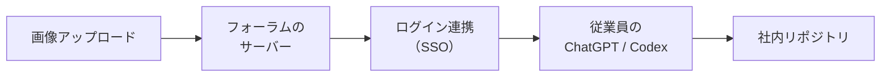

## はじめに

2026年9月、セキュリティ企業 Hacktron の研究者3人が [Hacking OpenAI](https://www.hacktron.ai/blog/hacking-openai) というレポートを公開しました。OpenAIのバグバウンティ（脆弱性報奨金制度）の中で行った調査の報告です。フォーラムへの画像アップロードを起点に、72時間足らずでOpenAI従業員のChatGPT／Codexアカウントへのアクセスを得て、社内リポジトリに無害なプルリクエストを1件作るところまでたどり着いています。

https://www.hacktron.ai/blog/hacking-openai



私が注目したのは、侵入の手順そのものより、エクスプロイト（攻撃コード）作りの大部分をAIに任せていたことです。この記事では、このレポートを題材に、「攻撃が難しいこと」自体が防御になっていた時代が終わりつつあること、そしてそれを前提に何を見直すべきかを整理します。

## 対象者

- Webサービスや社内ツールを運用していて、依存ライブラリの更新を判断する立場にある方
- 「うちは大企業じゃないから狙われない」と、どこかで思っている方
- AIが攻撃側にもたらす変化を、大まかにつかんでおきたい方

## 何が起きたのか（ざっくり）

細部は省いて、要点だけ並べます。

| 項目 | 内容 |
| --- | --- |
| 入口 | OpenAIのヘルプフォーラム（Discourseで構築）の画像アップロード |
| 原因1 | 画像処理ライブラリ `libheif` の、CVEの付いていないセキュリティ修正がDebianのパッケージに取り込まれていなかった |
| 原因2 | OpenAIのSSO（シングルサインオン）の設定不備 |
| AIの役割 | Claude Opus 4.8／Opus 5 を使い、エクスプロイトの作成と環境への適合を進めた |
| 期間 | 脆弱性の発見から実証まで72時間未満 |
| 対応 | OpenAIは報告から約14時間で修正し、報奨金6,500ドルを支払った。Discourseはアドバイザリ（GHSA-vhm9-85gw-x335）を公開した |

どちらの原因も、AIがなければ存在しなかった類いのものではありません。「ライブラリの修正が届いていなかった」と「認証の設定に不備があった」は、昔からある種類のミスです。

変わったのは、それを「実際に攻撃できる形」にするまでのコストです。

## 「攻撃の難しさ」という見えない防壁

レポートの結びで、著者たちはこう書いています。

> Software has long benefited from a kind of security through complexity.
> （ソフトウェアは長いあいだ、一種の「複雑さによるセキュリティ」に守られてきた）

コードも脆弱性の情報も公開されている。それでも、バグを安定して動く攻撃コードに仕立てるには、希少な専門知識と、長い時間と、攻撃対象の環境についての知識が必要でした。

特にメモリ破壊系の脆弱性は、ライブラリのバージョン、OS、メモリ管理の方式によって攻撃コードを細かく調整しなければなりません。そのため、既知の脆弱性（n-day）でも実用化には手間がかかり、未知の脆弱性（0-day）は価値の高い標的にだけ使われる、というコスト構造がありました。

| | これまで | AIを使える今 |
| --- | --- | --- |
| 必要な専門知識 | 熟練者のチームが必要 | AIがかなりの部分を肩代わりする |
| かかる時間 | 数週間〜数ヶ月 | 数日（今回は72時間未満） |
| 対象環境の知識 | 事前の詳しい調査が必要 | ほぼ手探りの状態から適合させられる |
| 狙われる対象 | 割に合う大きな標的 | 割に合う対象の範囲が広がる |

レポートによれば、研究者たちは対象のライブラリのバージョンもlibcのバージョンもデプロイ環境も正確には知らない状態から、AIに攻撃コードを適合させています。Opus 4.8 では守りが有効な環境で何度もつまずいたものの、途中で登場した Opus 5 では、ARM64向けの攻撃コードが約3時間で動いたそうです。

著者たちの言葉を借りると、AIは「希少な専門知識を計算資源に変えつつある」。これが今回いちばん重く受け止めるべき点だと思います。

:::message alert
「AIが勝手にOpenAIをハッキングした」わけではありません。経験豊富な研究者3人が、最新のモデルを使いこなした結果です。ただ、その研究者たちが数ヶ月かけていた作業が数日に縮んだ、という変化は、攻撃者の側にもそのまま当てはまります。
:::

## 前提が変わると、何を見直すべきか

「攻撃されても、攻撃コードを作るのが大変だから大丈夫」という前提を外すと、見直すべきところが見えてきます。ここでは抽象度を上げて、4つにまとめます。

### 1. 使っていない機能は止める

今回の入口は、多くの利用者が意識していない「HEIC形式の画像の変換」でした。受け付けていると気づいていない機能は、守りの意識からも漏れがちです。

外部から受け取るファイルの形式を必要なものだけに絞り、使っていないデコーダーは無効にします。たとえば ImageMagick なら、`policy.xml` で特定の形式を扱わないように指定できます。

```xml
<policymap>
  <!-- 使わない形式のデコードを止める -->
  <policy domain="coder" rights="none" pattern="HEIC" />
</policymap>
```

攻撃コードを作るコストが下がるほど、「そもそも攻撃できる場所を減らす」ことの価値は上がります。

### 2. 危険な処理は隔離する

画像やPDFのように、外部から受け取ったデータを解析する処理は、脆弱性が見つかりやすい場所です。レポートでも、信頼できない入力を処理するパイプラインは、権限を絞った使い捨てのサンドボックスの中で動かすことが勧められています。Discourse自身も、修正とあわせてImageMagickのサンドボックス化を入れました。

仮に破られても、そこから先へ広がらない構成にしておくことが大切です。

### 3. 「CVEがない＝安全」とは考えない

今回の `libheif` の修正にはCVEが付いていませんでした。そのため、ディストリビューションのセキュリティ更新には取り込まれず、`apt upgrade` を欠かさず実行していても、脆弱なバージョンが残る状態でした。

CVEを基準に判定する脆弱性スキャナは便利ですが、それだけでは今回のような「修正はあるのに届いていない」状態を見つけられません。重要な依存ライブラリについては、上流のリリースノートにも目を通す習慣を持っておくと安心です。

### 4. つながりの先が乗っ取られる前提で考える

フォーラムは本来、本業のサービスから見れば周辺のツールです。それでも、ログイン連携を通じて本体のアカウントにまで影響が及びました。著者たちも、問題はDiscourse固有のものではなく、OpenAI側のSSOにあったと明言しています。

社内Wikiやフォーラム、お試しで作った管理画面など、認証基盤とつながっている周辺サービスが乗っ取られたとき、本体側に何ができてしまうのか。一度書き出してみる価値があります。

## コラム：やりがちだけど効きにくい考え方

### 1. 「うちは狙われるほど大きくない」

攻撃のコストが高かった頃は、この考え方にもある程度の合理性がありました。コストが下がれば、「割に合う標的」の範囲は広がります。規模の小ささは、これまでほど盾になりません。

### 2. 「ちゃんとアップデートしているから大丈夫」

更新はもちろん大切です。ただ、今回の例では、配布元が修正を取り込んでいなかったため、更新しても直りませんでした。「更新している」ことと「修正が届いている」ことは別だと考えておくのが安全です。

### 3. 「攻撃側がAIを使うなら、守りもAIに任せればいい」

AIで脆弱性を探したり、コードをレビューしたりするのは有効です。ただ、今回の原因は、使っていない機能が開いていたことと、つながりの信頼境界があいまいだったことです。これは設計と運用で塞ぐものです。AIは手段を速くしてくれますが、何を守るかを決めるのは人間の側です。

## おわりに

このレポートを読んで、私は「脆弱性はあっても、攻撃するのは難しいはず」と考えていた自分に気づきました。それは防御ではなく、単に攻撃者の手間に頼っていただけだったのだと思います。

AIが攻撃を速くするなら、守る側は「攻撃できる場所を減らす」「破られても広がらないようにする」という、昔からある基本に立ち返るしかありません。派手な対策ではありませんが、使っていない機能を1つ止めるだけでも、確実に前進です。

本記事が、自分のシステムを「攻撃の難しさ」抜きで見直すきっかけになれば幸いです。

---

## 株式会社ONE WEDGE

【ITエンジニアに、IT業界に貢献する企業】
株式会社ONE WEDGEは、Webシステム開発・SES・AI/DX支援を行うIT企業です。生成AIを活用した業務効率化や次世代システム開発にも注力しており、企業の課題解決だけでなく、エンジニア一人ひとりの成長にも本気で向き合っています。また、技術は「一人で学ぶもの」ではなく「仲間と成長するもの」と考え、社内外でのコミュニティづくりにも力を入れています。

https://onewedge.co.jp/
