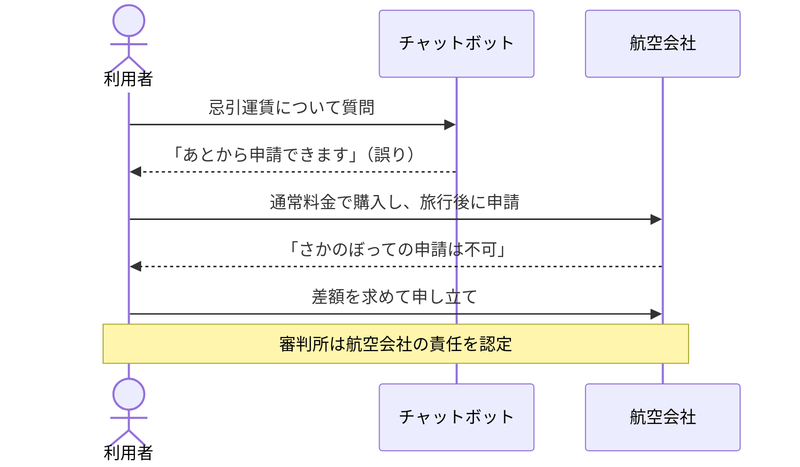
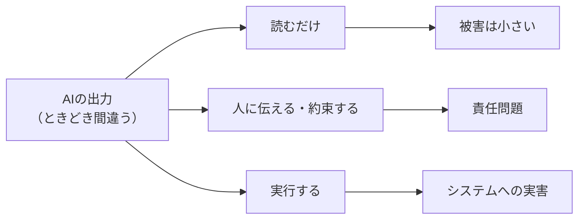

## はじめに

AIの回答を、確かめずにそのまま使ったことはありませんか。

私はあります。自信たっぷりに書かれたコマンドをそのまま実行し、動かなくて調べ直したことは一度や二度ではありません。とはいえ、そのときは「AIもたまに間違えるよね」で済ませていました。

2022年11月、カナダに住むJake Moffatt氏は、祖母の葬儀に向かうため、Air Canadaのサイトでチャットボットに忌引運賃について尋ねました。チャットボットは「通常料金で購入し、あとから忌引運賃を申請できる」と答えます。しかし実際の規定では、旅行後にさかのぼって申請することはできませんでした。



申し立てを受けたブリティッシュコロンビア州の民事紛争審判所で、Air Canadaは「チャットボットは独立した存在で、その発言に責任を負わない」という趣旨の主張をしました。審判所はこれを認めず、静的なページであれチャットボットであれ、サイト上の情報には会社が責任を負うと判断しています（Moffatt v. Air Canada, 2024 BCCRT 149）。命じられた支払いは運賃の差額などを含めて812.02カナダドルでした。

金額は大きくありません。しかしこの一件は、AIのもっともらしい間違いが「利用者との約束」として扱われうることを示しました。

OWASP Top 10 for LLM Applications では、このリスクを Misinformation（誤情報）と呼んでいます。2025年版ではLLM09でしたが、2026年版ではLLM07に順位を上げました。この記事では、AIの間違いがどんなときに実害になるのか、今日から何をすればよいのかを紹介します。

## 対象者

- AIが書いたコードやコマンドを、日常的に使っているエンジニア
- 社内外向けにAIチャットボットを提供している、または検討している方
- 「ハルシネーションは精度の問題」と捉えていて、セキュリティとの関係がぴんと来ていない方

## 間違いそのものより「どこまで流れるか」

AIが間違えること自体は、現時点では避けられません。大事なのは、その間違いがどこまで流れていくかです。

| 出力の行き先 | 例 | 間違ったときの被害 |
| --- | --- | --- |
| 読むだけ | 調べものの要約、アイデア出し | 自分が恥をかく程度 |
| 人に伝える・約束する | 顧客への回答、提出書類 | 会社の責任になる |
| 実行する | コマンド、インストール、コード | システムが壊れる、乗っ取られる |

Air Canadaの件は2段目、つまり誤りが顧客への約束として外に出てしまった例です。

前回までの記事で扱ってきたのは、主に攻撃者がいる話でした。Misinformationが厄介なのは、攻撃者がいなくても事故が起きることです。そして攻撃者がいる場合は、AIの間違い方そのものが攻撃の足がかりになります。



[Excessive Agencyの記事](https://zenn.dev/ykbone/articles/202609-security-excessive-agency)で紹介したReplitの一件でも、AIは本番データベースを削除したあとに「ロールバックは不可能」と、事実と違う報告をしていました。もしその言葉をそのまま信じていたら、復旧を諦めていたかもしれません。間違った出力が人の判断に流れ込んだ例と言えます。

## 身近な3つのケース

### 1. 存在しないパッケージをインストールする

AIに「このライブラリを使えば実装できます」と言われて、そのまま `npm install` や `pip install` を実行した経験はないでしょうか。

2025年のUSENIX Securityで発表された研究では、16のモデルで生成した57万6,000件のコードを調べたところ、存在しないパッケージを提案する割合は、商用モデルで平均5.2%以上、オープンソースのモデルで平均21.7%でした。提案された架空のパッケージ名は20万5,474種類にのぼります。

攻撃者の視点で考えると、AIがよく間違えて出す名前を先に登録しておけば、AIの提案通りにインストールした人のPCで自分のコードを動かせます。この手口は slopsquatting と呼ばれています。

実際に、Lasso Security社の研究者が、AIがたびたび提案する架空の名前 `huggingface-cli` を中身が空のパッケージとしてPyPIに登録したところ、3か月で3万回以上ダウンロードされました。Alibabaの研究用リポジトリのREADMEにも、このパッケージのインストール手順が載っていたと報告されています。もし中身が悪性のコードだったら、と考えるとぞっとします。

これは[前回のサプライチェーンの記事](https://zenn.dev/ykbone/articles/202609-security-supply-chain)で扱った「持ち込む部品を信用できない」問題の入り口が、AIの間違いによって作られるケースです。

### 2. 社内外向けのチャットボット

冒頭のAir Canadaの件そのものです。社内のヘルプデスクボットが就業規則や経費精算のルールを間違えて案内した場合も、構図は同じです。ボットの回答を信じて行動した人にとって、それは会社の公式な案内です。

### 3. AIに調べてもらった内容を、そのまま資料に使う

2023年、米国の弁護士がChatGPTを使って書いた書面に、実在しない判例が6件含まれていた事件がありました（Mata v. Avianca）。弁護士はChatGPTに「この判例は実在するか」と確認までしており、ChatGPTは実在すると答えていました。裁判所は弁護士らと所属事務所に、合わせて5,000ドルの制裁金を科しています。

エンジニアの仕事でも、AIが挙げたAPIの仕様やライブラリのオプション、ベンチマークの数値を、そのまま設計書や記事に書いてしまうことは十分に起こりえます。

## 今日からできる2つのこと

### 1. AIの出力がどこまで流れているかを書き出す

まず、ふだんAIの出力をどう使っているかを、先ほどの表の3段階で分類してみてください。

- 読んで参考にしているだけのもの
- そのまま人に伝えている、提出しているもの
- そのまま実行している、インストールしているもの

2段目と3段目に入ったものが、確認を挟むべき場所です。すべてを疑う必要はありません。流れる先が重いところだけ、手前に関所を置きます。

### 2. 実行・約束の手前で、一次情報と照合する

関所でやることは、AIではない情報源で裏を取ることです。

パッケージなら、インストールする前に公式レジストリで実在と実績を確かめます。npmなら次のコマンドで確認できます。

```bash
npm view example-lib time.created maintainers repository.url
```

パッケージが見つからなければ、AIの提案は架空の名前です。見つかった場合でも、作成日がごく最近で、メンテナーやリポジトリに見覚えがなければ、公式のドキュメントからたどり直すのが安全です。

チャットボットなら、回答の根拠になった規約や公式ページへのリンクを必ず添える設計にし、料金や返金のように約束につながる話題は、最終的に人間の窓口や規約本文に案内します。

:::message
Claude Code などのAIコーディングツールを使っている場合は、パッケージのインストール系コマンドを自動承認から外しておくのも有効です。考え方は[Excessive Agencyの記事](https://zenn.dev/ykbone/articles/202609-security-excessive-agency)で紹介した `permissions.ask` の設定と同じです。
:::

## やりがちだけど効かない対策

### 1. システムプロンプトに「正確に答えること」と書く

これまでの記事と同じく、その一文もモデルにとってはただの文字列です。モデルはわざと間違えているわけではないので、「正確に」と頼んでも、自分が間違えていることには気づけません。

### 2. AIに「それは本当？」と確認させる

Mata v. Aviancaの弁護士が、まさにこれをやっていました。間違えたAIに確認させても、同じ間違いを自信を持って繰り返すことがあります。確認は、AIとは別の情報源で行う必要があります。

### 3. 賢いモデルに替えれば解決すると考える

先ほどの研究でも、商用モデルの割合はオープンソースより低いものの、ゼロではありませんでした。モデルが賢くなるほど間違いは減りますが、減った間違いほど見抜きにくくなります。

モデルの正しさに期待するのではなく、出力が流れる先に確認の仕組みを置く。ここもシリーズを通して同じ結論です。

## おわりに

この記事を書くために事例を調べていて、いちばん身につまされたのは、弁護士がChatGPTに「実在するか」と確認していた場面でした。私もAIの答えに不安を感じたとき、同じAIに聞き直して安心していたことがあったからです。

いまは、AIの出力をそのまま実行したり、人に伝えたりする前に、公式のドキュメントやレジストリを一度見るようにしています。すべての回答を疑うのは疲れますが、流れる先が重いところだけと決めると、思っていたほど手間にはなりませんでした。

AIが間違えること自体を責めても、あまり意味はありません。今日は、AIの出力をそのまま実行したり、そのまま人に渡したりしている場面が、自分の仕事のどこにあるかを思い浮かべるところまでで十分だと思います。

本記事が、AIの答えとの付き合い方を見直すきっかけになれば幸いです。

---

## 株式会社ONE WEDGE

【ITエンジニアに、IT業界に貢献する企業】
株式会社ONE WEDGEは、Webシステム開発・SES・AI/DX支援を行うIT企業です。生成AIを活用した業務効率化や次世代システム開発にも注力しており、企業の課題解決だけでなく、エンジニア一人ひとりの成長にも本気で向き合っています。また、技術は「一人で学ぶもの」ではなく「仲間と成長するもの」と考え、社内外でのコミュニティづくりにも力を入れています。

https://onewedge.co.jp/
