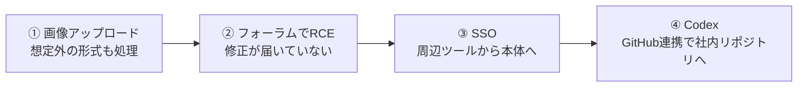

## はじめに

「アップロードされた画像は、ライブラリに渡せばいい感じにしてくれる」
「`apt upgrade` はちゃんと回しているから、うちは最新」
「社内ツールもまとめてSSOにしておけば楽」
「AIエージェントにGitHub連携を付けておくと便利」

どれも、開発の現場でよく聞く、ごく普通の判断だと思います。

2026年9月、セキュリティ企業 Hacktron の研究者3人が [Hacking OpenAI](https://www.hacktron.ai/blog/hacking-openai) というレポートを公開しました。OpenAIのヘルプフォーラムに画像を1枚アップロードするところから始まり、OpenAI従業員のChatGPT／Codexアカウントを経由して、社内のモノレポに無害なプルリクエストを1件作るところまでたどり着いた記録です。

https://www.hacktron.ai/blog/hacking-openai

読んでみて感じたのは、使われたのは世界にひとつの特別なバグではなかった、ということです。冒頭に並べたような「まあいいか」が4つ、順番につながっただけでした。



この記事では、4つのステップを1つずつ取り上げ、それぞれが私たちの現場ではどんな形で起きうるのか、自分の環境で何を確かめればよいのかを整理します。

## 対象者

- ユーザーからのファイルアップロードを受け付けるWebサービスを運用している方
- Dockerイメージやサーバーのパッケージ更新を担当している方
- 社内ツールや周辺サービスをSSOでつないでいる方
- AIエージェントにGitHubなどの外部サービスを連携させて使っている方

## 前提：これは許可された調査です

最初に一点だけ。このレポートは、OpenAIのバグバウンティ（脆弱性報奨金制度）を通じて報告されたものです。研究者たちは機密情報に触れず、アクセスできることを示すPRを1件作った時点で調査を止めています。

:::message
OpenAIは後に、Discourseがホストしている `community.openai.com` へのテストはバグバウンティの対象外だったと明言しています。報奨金（6,500ドル）は、OpenAI側のSSOの問題に対してのみ支払われました。実在するサービスへの調査は、必ず対象範囲を確認してから行ってください。
:::

## ① 「画像はライブラリがいい感じにしてくれる」

### 何が起きたか

OpenAIのフォーラムは、オープンソースのフォーラムソフト Discourse で動いています。Discourseは、アップロードされた画像をまず `FastImage` というライブラリで確認します。ところが `FastImage` はHEIC/HEIF形式（iPhoneの写真などで使われる形式）に対応していなかったため、それらのファイルはそのまま ImageMagick の `magick` コマンドに渡され、変換されていました。

ImageMagickは、HEICの解析を `libheif` というライブラリに任せています。つまり、攻撃者が用意したファイルが、誰も意識していない裏側のライブラリまでそのまま届く構造になっていました。

### 私たちの現場では

画像のリサイズやサムネイル作成に ImageMagick や類似のライブラリを使っているサービスは多いと思います。そのとき、受け付けている形式を把握しているでしょうか。

アプリケーション側で「JPEGとPNGだけ」と決めているつもりでも、実際の変換処理は、ライブラリが対応している形式すべてを受け付けてしまうことがあります。

### 確かめること

まず、自分の環境の ImageMagick が扱える形式を一覧で見てみます。

```bash
# ImageMagick 7 の場合
magick -list format | grep -i -E "heic|heif|avif"

# ImageMagick 6 の場合
convert -list format | grep -i -E "heic|heif|avif"
```

使っていない形式が出てきたら、`policy.xml` で止めておきます。

```xml
<policymap>
  <policy domain="coder" rights="none" pattern="{HEIC,HEIF,AVIF}" />
</policymap>
```

設定が効いているかは `magick -list policy` で確認できます。

## ② 「`apt upgrade` してるから最新」

### 何が起きたか

DiscourseのDockerイメージはDebian 12をベースにしていて、`libheif` は1.19.7が入っていました。このバージョンには、HEICのデコード中にヒープバッファオーバーフローを起こすバグが残っていました。

厄介なのは、このバグは上流ではすでに前年に直っていたことです。ただし、その修正は「overlayの重なり領域の計算を簡単にする」というリファクタリングのコミットとして入っており、セキュリティ修正とは書かれていませんでした。CVEも振られていません。

そのため、Debianのセキュリティ更新には取り込まれず、Debian 12（1.19.7）とDebian 13（1.19.8）の両方に、脆弱なバージョンが残っていました。Debianが修正を出したのは、今回の報告後の2026年8月8日です。

研究者たちは、このバグからメモリの範囲外を読み書きする手がかりを得て、Claude Opus 4.8、そして途中から登場した Opus 5 を使い、Discourseの環境（x86-64、メモリ管理に `jemalloc`）に合わせた攻撃コードを仕上げました。まず自分たちで用意したDiscourse Cloudのインスタンスで試し、その後OpenAIのフォーラムでリモートコード実行（RCE）と管理者権限の取得に成功しています。

### 私たちの現場では

「ベースイメージを最新にして、`apt upgrade` を回している」は、多くのチームにとって十分な対策に見えます。脆弱性スキャナでCVEが出ていなければ、なおさら安心してしまいます。

でも今回は、その両方をやっていても防げませんでした。配布元の「最新」と、上流の「修正済み」は別物だからです。

### 確かめること

外部からの入力を直接解析するライブラリ（画像、PDF、動画、圧縮ファイルなど）について、手元のバージョンと上流の最新版を並べてみます。

```bash
# Debian / Ubuntu で入っている libheif のバージョンを確認
dpkg -l | grep libheif
apt-cache policy libheif1
```

:::message
すべての依存ライブラリで上流を追いかけるのは現実的ではありません。まずは「外部から来たデータを最初に解析するライブラリ」だけに絞って、上流のリリースノートを見る対象にするのがおすすめです。
:::

## ③ 「周辺ツールもSSOでまとめれば楽」

### 何が起きたか

OpenAIのフォーラムには「Sign in with OpenAI」、つまり `auth.openai.com` を使ったSSOが組み込まれていました。研究者たちは、フォーラムを乗っ取れば、このログイン連携を通じてOpenAIの他のサービスにも届くのではないかと考えました。

結果として、フォーラムの侵害から、フォーラムを利用していたOpenAI従業員のChatGPT／Codexアカウントにアクセスできる状態になりました。

SSOの不備が具体的にどういう仕組みだったのかは、レポートでは公開されていません。ただ著者たちは、「これはDiscourse固有の問題ではなく、OpenAIのSSOの問題だ」と明言しています。

### 私たちの現場では

社内Wiki、問い合わせフォーラム、お試しで立てた管理画面。こうした周辺ツールを、本番サービスと同じ認証基盤につなぐのはよくあることです。ログインが一つで済むのは、利用者にとっても管理者にとっても便利です。

ただ、そのとき私たちは「周辺ツールが乗っ取られることはない」と無意識に前提しています。周辺ツールは本体ほど更新や監視に手が回らないことが多いのに、です。

### 確かめること

認証基盤につないでいるサービスを書き出して、それぞれについて次の問いに答えてみます。

| 問い | 見るポイント |
| --- | --- |
| このサービスが乗っ取られたら、何を受け取れるか | 渡しているトークンや属性、スコープ |
| そのトークンで、本体側の何ができるか | 本体のAPIやアカウント操作に使えないか |
| 本体と同じ信頼レベルで扱ってよいか | 更新頻度・監視・管理者の数は本体と同等か |

「周辺ツールが乗っ取られても、本体のアカウントは取られない」と言い切れるかどうか。ここが境界線です。

## ④ 「AIエージェントにGitHub連携を付けっぱなし」

### 何が起きたか

アクセスできた従業員のアカウントを確認すると、その人のCodexはOpenAIのGitHub組織と連携していました。研究者たちはCodexに指示を出し、社内のモノレポ `openai/openai` に無害なプルリクエスト（#1186742）を作らせています。そして、そこで調査を止めました。

研究者たちは社内のコードを直接操作したのではなく、従業員のAIエージェントにお願いしただけです。

### 私たちの現場では

Claude Code や Codex、Cursor などのAIエージェントに、GitHubやSlack、クラウドの権限を渡して使うことは、もう当たり前になりつつあります。

AIエージェントは、アカウントを持っている人の代わりに、その人の権限で動きます。裏を返せば、アカウントを取られた瞬間、AIエージェントはそのまま攻撃者の手足になります。しかも、疲れも迷いもなく指示どおりに動く手足です。

### 確かめること

- AIエージェントに連携しているリポジトリを、必要なものだけに絞っているか（組織全体へのアクセスを許していないか）
- mainブランチなどに保護ルールを設定し、PRが作られてもレビューなしではマージされないようにしているか
- AIエージェントが作ったPRやコミットを、人間の変更と区別して追えるか

今回、被害が「PRが1件作られた」ところで止まったのは、研究者が止めたからです。攻撃者であれば、次の一手があったはずです。

## 4つをつなげて見る

あらためて並べると、どのステップも単体では「よくある判断」です。

| ステップ | 現場の「まあいいか」 | 実際に起きたこと |
| --- | --- | --- |
| ① | 画像はライブラリに任せればいい | 想定外のHEICが裏のライブラリまで届いた |
| ② | `apt upgrade` してるから最新 | CVEのない修正が配布元に届いていなかった |
| ③ | 周辺ツールもSSOでまとめれば楽 | フォーラムの侵害が本体のアカウントに届いた |
| ④ | AIエージェントに連携を付けっぱなし | 取られたアカウントのAIが社内リポジトリに届いた |

どれか1つでも止まっていれば、チェーンはそこで切れていました。逆に言えば、防御も「全部を完璧に」ではなく、「どこか1か所で切れるようにしておく」ことから始められます。

そして、この4つをつなげる作業、特に②の攻撃コードづくりは、これまで熟練者が長い時間をかけて行うものでした。今回はAIを使い、脆弱性の発見から社内リポジトリへのPRまで、72時間かかっていません。

## おわりに

このレポートを読みながら、①から④まで、自分の関わってきた現場にも思い当たる節がありました。どれも、そのときは合理的な判断だったはずです。

攻撃者から見れば、1つ1つの「まあいいか」はパズルのピースです。ピースが揃うまでの手間は、AIによって確実に小さくなっています。

まずは自分の環境で、4つのうちどれか1つだけでも確かめてみてください。チェーンを1か所切るだけで、結果は大きく変わるはずです。

---

## 株式会社ONE WEDGE

【ITエンジニアに、IT業界に貢献する企業】
株式会社ONE WEDGEは、Webシステム開発・SES・AI/DX支援を行うIT企業です。生成AIを活用した業務効率化や次世代システム開発にも注力しており、企業の課題解決だけでなく、エンジニア一人ひとりの成長にも本気で向き合っています。また、技術は「一人で学ぶもの」ではなく「仲間と成長するもの」と考え、社内外でのコミュニティづくりにも力を入れています。

https://onewedge.co.jp/
