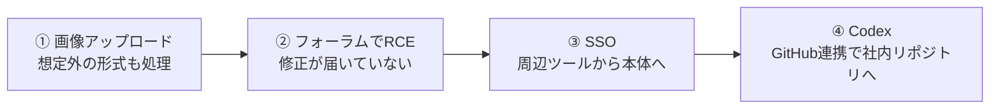

## はじめに

2026年9月、セキュリティ企業 Hacktron の研究者3人が [Hacking OpenAI](https://www.hacktron.ai/blog/hacking-openai) というレポートを公開しました。OpenAIのヘルプフォーラムに画像を1枚アップロードするところから始まり、OpenAI従業員のChatGPT／Codexアカウントを経由して、社内のモノレポに無害なプルリクエストを1件作るところまでたどり着いた記録です。

https://www.hacktron.ai/blog/hacking-openai

前回の記事では、このレポートを「AIで攻撃のコストが下がった」という視点から紹介しました。

https://zenn.dev/ykbone/articles/202610-security-hacking-openai

そして、このレポートの中で驚いたのは、侵入に使われたのが特別なバグではなく、次のような、ごく普通の判断の積み重ねだったことです。
どれも開発の現場でよく耳にするものです。皆さんの現場にも、思い当たるものが1つくらいはあるのではないでしょうか。

- 「アップロードされた画像は、ライブラリに渡せばいい感じにしてくれる」
- 「`apt upgrade` はちゃんと回しているから、うちは最新」
- 「社内ツールもまとめてSSOにしておけば楽」
- 「AIエージェントにGitHub連携を付けておくと便利」

本記事では、この4つのステップを1つずつ見ながら、自分の環境で何を確かめておけばいいのかを、一緒に整理していきます。



## 対象者

- ユーザーからのファイルアップロードを受け付けるWebサービスを運用している方
- Dockerイメージやサーバーのパッケージ更新を担当している方
- 社内ツールや周辺サービスをSSOでつないでいる方
- AIエージェントにGitHubなどの外部サービスを連携させて使っている方

:::message
このレポートは、OpenAIのバグバウンティ（脆弱性報奨金制度）を通じて報告されたものです。研究者たちは機密情報には触れず、アクセスできることを示すPRを1件作ったところで調査を止めています。
:::

## ① 「画像はライブラリがいい感じにしてくれる」

### 何が起きたのか

OpenAIのフォーラムは、オープンソースのフォーラムソフト Discourse で動いています。Discourseは、アップロードされた画像をまず `FastImage` というライブラリで確認します。
ところが `FastImage` はHEIC/HEIF形式（iPhoneの写真などで使われる形式）に対応していなかったため、これらのファイルはそのまま ImageMagick の `magick` コマンドに渡されて変換されていました。

ImageMagickは、HEICの解析を `libheif` というライブラリに任せています。平たく言えば、攻撃者が用意したファイルが、誰も意識していなかった裏側のライブラリまで、そのまま届いてしまう作りになっていたわけです。

### 自分の現場に置き換えると

画像のリサイズやサムネイル作成に、ImageMagick や似たライブラリを使っているサービスは多いと思います。そのとき、実際にどんな形式を受け付けているか、把握できているでしょうか。

アプリ側では「JPEGとPNGだけ」のつもりでも、裏で動く変換処理は、ライブラリが対応している形式ならなんでも受け付けてしまうことがあります。

### 確かめておきたいこと

まずは、自分の環境の ImageMagick がどんな形式を扱えるのか、一覧で眺めてみましょう。

```bash
# ImageMagick 7 の場合
magick -list format | grep -i -E "heic|heif|avif"

# ImageMagick 6 の場合
convert -list format | grep -i -E "heic|heif|avif"
```

使っていない形式が見つかったら、`policy.xml` で止めておくと安心です。

```xml
<policymap>
  <policy domain="coder" rights="none" pattern="{HEIC,HEIF,AVIF}" />
</policymap>
```

設定が効いているかは `magick -list policy` で確認できます。

## ② 「`apt upgrade` してるから最新」

### 何が起きたのか

DiscourseのDockerイメージはDebian 12をベースにしていて、`libheif` は1.19.7が入っていました。このバージョンには、HEICのデコード中にヒープバッファオーバーフローを起こすバグが残っていました。

やっかいなのは、このバグが上流ではすでに前年に直っていたことです。ただ、その修正は「overlayの重なり領域の計算を簡単にする」というリファクタリングのコミットとして入っていて、セキュリティ修正とは書かれていませんでした。CVEも振られていません。

そのため、Debianのセキュリティ更新には取り込まれず、Debian 12（1.19.7）とDebian 13（1.19.8）のどちらにも、脆弱なバージョンが残ったままでした。Debian 13向けのセキュリティ更新（DSA-6417-1）が出たのは、今回の報告後の2026年8月8日です。

研究者たちは、このバグを足がかりに、Claude Opus 4.8、そして途中から登場した Opus 5 を使って、Discourseの環境（x86-64、メモリ管理に `jemalloc`）に合わせた攻撃コードを仕上げました。まず自分たちで用意したDiscourse Cloudのインスタンスで試し、その後OpenAIのフォーラムでリモートコード実行（RCE）と管理者権限の取得に成功しています。

### 自分の現場に置き換えると

「ベースイメージを最新にして、`apt upgrade` も回している」。
多くのチームにとって、これは十分な対策に見えます。脆弱性スキャナでCVEが出ていなければ、なおさら安心してしまうと思います。

でも今回は、その両方をきちんとやっていても防げませんでした。言い換えると、配布元の「最新」と、上流の「修正済み」は、同じではなかったということです。

### 確かめておきたいこと

外から来たデータを直接読み解くライブラリ（画像、PDF、動画、圧縮ファイルなど）について、手元のバージョンと上流の最新版を並べてみましょう。

```bash
# Debian / Ubuntu で入っている libheif のバージョンを確認
dpkg -l | grep libheif
apt-cache policy libheif1
```

:::message
すべての依存ライブラリで上流を追いかけるのは現実的ではありません。まずは、外から来たデータを最初に解析するライブラリだけに絞って、上流のリリースノートをときどきのぞいてみるのがおすすめです。
:::

## ③ 「周辺ツールもSSOでまとめれば楽」

### 何が起きたのか

OpenAIのフォーラムには「Sign in with OpenAI」、つまり `auth.openai.com` を使ったSSOが組み込まれていました。研究者たちは、「フォーラムを乗っ取れば、このログイン連携を通じてOpenAIの他のサービスにも届くのでは？」と考えました。

結果として、フォーラムの侵害から、フォーラムを利用していたOpenAI従業員のChatGPT／Codexアカウントにアクセスできる状態になりました。

SSOの不備が具体的にどういう仕組みだったのかは、レポートでは公開されていません。ただ著者たちは、「これはDiscourse固有の問題ではなく、OpenAIのSSOの問題だ」と明言しています。

### 自分の現場に置き換えると

社内Wiki、問い合わせフォーラム、お試しで立てた管理画面。こうした周辺ツールを、本番サービスと同じログインにつなぐのはよくあることです。ログインが1つで済むのは、使う人にとっても管理する人にとっても、とても便利ですよね。

ただ、そのとき「周辺ツールが乗っ取られることはない」と、どこかで思い込んでいないでしょうか。実際には、周辺ツールほど更新や監視に手が回らないことが多いと思います。

### 確かめておきたいこと

ログインを共通にしているサービスを書き出して、それぞれについて次の問いに答えてみてください。

| 問い | 見るポイント |
| --- | --- |
| このサービスが乗っ取られたら、何を受け取れるか | 渡しているトークンや属性、スコープ |
| そのトークンで、本体側の何ができるか | 本体のAPIやアカウント操作に使えないか |
| 本体と同じ信頼レベルで扱ってよいか | 更新頻度・監視・管理者の数は本体と同等か |

周辺ツールが乗っ取られても、本体のアカウントまでは取られないと言い切れるかどうか、ここを一度確かめておくだけでもずいぶん安心できると思います。

## ④ 「AIエージェントにGitHub連携を付けっぱなし」

### 何が起きたのか

アクセスできた従業員のアカウントを確認すると、その人のCodexはOpenAIのGitHub組織と連携していました。研究者たちはCodexに指示を出し、社内のモノレポ `openai/openai` に無害なプルリクエスト（#1186742）を作らせています。そして、そこで調査を止めました。

ここで注目したいのは、研究者たちが社内のコードを自分で操作したわけではない、という点です。従業員のAIエージェントに「お願い」しただけでした。

### 自分の現場に置き換えると

Claude Code や Codex、Cursor などのAIエージェントに、GitHubやSlack、クラウドの権限を渡して使うのは、もう当たり前になりつつあります。

AIエージェントは、持ち主の代わりに、持ち主の権限で動いてくれます。とても頼もしい存在ですが、裏を返せば、アカウントを取られたとたんに、同じ頼もしさで攻撃者の指示にも従ってしまうということです。

### 確かめておきたいこと

- AIエージェントに連携しているリポジトリを、必要なものだけに絞っているか（組織全体へのアクセスを許していないか）
- mainブランチなどに保護ルールを設定し、PRが作られてもレビューなしではマージされないようにしているか
- AIエージェントが作ったPRやコミットを、人間の変更と区別して追えるか

今回「PRが1件作られた」ところで止まったのは、研究者たちが自分で手を止めたからです。もし悪意のある攻撃者だったら、と考えると少しひやっとしますね。

## まとめ - 4つをつなげて見る -

あらためて並べてみると、どのステップも、1つだけ見れば「よくある判断」です。

表を見ると、どれか1つでも止まっていれば、チェーンはそこで切れていたことが分かります。

ただ、この4つをつなげる作業、特に②の攻撃コードづくりは、これまで熟練者が長い時間をかけて行うものでした。今回はAIの力を借りて、脆弱性の発見から社内リポジトリへのPRまで、72時間もかかっていません。こうした見落としをそのままにしておける時間は、思っているより短くなっていると考えておいたほうがよさそうです。

| ステップ | 現場でよくある判断 | 実際に起きたこと |
| --- | --- | --- |
| ① | 画像はライブラリに任せればいい | 想定外のHEICが裏のライブラリまで届いた |
| ② | `apt upgrade` してるから最新 | CVEのない修正が配布元に届いていなかった |
| ③ | 周辺ツールもSSOでまとめれば楽 | フォーラムの侵害が本体のアカウントに届いた |
| ④ | AIエージェントに連携を付けっぱなし | 取られたアカウントのAIが社内リポジトリに届いた |


## おわりに

このレポートを読みながら、①から④に似たような見落としが自身の開発現場にありそうだなと感じましたし、自分の現場を見直すきっかけにしたいと思いました。
攻撃者から見れば、1つ1つのよくある判断が、パズルのピースになります。そして、ピースがそろうまでの手間は、AIによってどんどん小さくなっています。

本記事が、ご自身の現場に潜む見落としに気づくきっかけになれば幸いです。

---

## 株式会社ONE WEDGE

【ITエンジニアに、IT業界に貢献する企業】
株式会社ONE WEDGEは、Webシステム開発・SES・AI/DX支援を行うIT企業です。生成AIを活用した業務効率化や次世代システム開発にも注力しており、企業の課題解決だけでなく、エンジニア一人ひとりの成長にも本気で向き合っています。また、技術は「一人で学ぶもの」ではなく「仲間と成長するもの」と考え、社内外でのコミュニティづくりにも力を入れています。

https://onewedge.co.jp/
