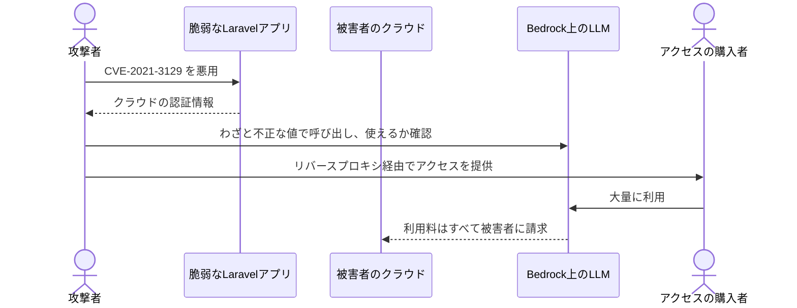
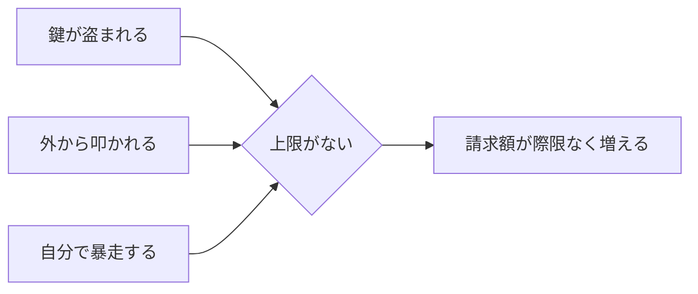

## はじめに

AIのAPIキーを発行したとき、利用額の上限を設定しましたか。

私は、最初のうちは設定していませんでした。個人で試すだけなら、使った分だけ払えばいい。そう思っていたからです。

2024年5月、クラウドセキュリティ企業のSysdig社が、LLMjacking と名付けた攻撃を報告しました。攻撃者は、脆弱性の残ったLaravelアプリケーションからクラウドの認証情報を盗み出し、それを使って AWS Bedrock 上の Claude を、持ち主に無断で呼び出していました。



侵入口の CVE-2021-3129 は、デバッグモードで動いているLaravelのIgnitionを狙い、認証なしで任意のコードを実行できる脆弱性です。攻撃者は盗んだ鍵ですぐにモデルを使うのではなく、わざと不正なパラメーターで呼び出し、返ってくるエラーの種類から「このアカウントでLLMが使えるか」を確かめていました。さらに、複数の盗んだ鍵をリバースプロキシでまとめ、そのアクセスを第三者に売っていた形跡も見つかっています。

Sysdig社の試算では、利用上限いっぱいまで使われた場合、被害額は1日あたり4万6,000ドルを超えるとされています。

攻撃者はデータを盗んだわけでも、システムを壊したわけでもありません。ただ、他人のお金でAIを使っただけです。それでも、被害者には確実に請求書が届きます。

OWASP Top 10 for LLM Applications では、LLMを際限なく使われてしまうリスクを Unbounded Consumption（際限のない消費）と呼んでいます。2025年版ではLLM10でしたが、2026年版ではLLM06に順位を上げました。この記事では、AIの利用料が跳ね上がる経路と、今日から設定できる上限について紹介します。

## 対象者

- OpenAIやAnthropicなどのAPIキーを発行して、アプリや個人開発で使っている方
- AIチャット機能を持つWebサービスを公開している、または公開を検討している方
- `claude -p` やAgent SDKで、AIエージェントを自動実行している方

## 従量課金では「使われる」は「請求される」と同じ

サーバーへのDoS攻撃であれば、最悪でもサービスが止まるだけで済みます。しかしLLMのAPIは使った分だけ課金されるため、使われ続ける限り請求額が増え続けます。OWASPはこれを Denial of Wallet（財布へのサービス妨害）と呼んでいます。

そして上限を設定していなければ、被害額にも上限がありません。

利用料が膨らむ経路は、大きく3つに分けられます。

| 経路 | 何が起きるか | 具体例 |
| --- | --- | --- |
| 鍵が盗まれる | 他人が自分の名義でAIを使う | `.env` のコミット、デバッグ画面やログへの露出 |
| 外から叩かれる | 公開した機能を想定外に使われる | 認証なしのAIチャット、長文の連続投入 |
| 自分で暴走する | 自分のエージェントが止まらない | 失敗とリトライの無限ループ |



3つの経路は原因こそ違いますが、行き着く先は同じです。だから対策も、それぞれの経路をふさぐことに加えて、最後の「上限がない」を断つことが効きます。

## 身近な3つのケース

### 1. 鍵が漏れる

LLMjackingの侵入口は、デバッグモードのまま公開されていたLaravelアプリでした。本番環境で `APP_DEBUG=true` になっていると、エラー画面から環境変数や設定値が見えてしまうこともあります。

ほかにも、`.env` をうっかりGitHubにコミットした、AIエージェントが `.env` を読んでログや出力に書き出した、といった経路で鍵は漏れます。`.env` とAIエージェントの関係については、[dotenvxの記事](https://zenn.dev/ykbone/articles/202607-security-ai-dotenv)で詳しく書きました。

### 2. 公開したAIチャットを外から叩かれる

自社サイトに、ログインなしで使えるAIチャットを置いたとします。便利な反面、誰でも、何回でも、どれだけ長い文章でも投げられる状態です。

OWASPは、長さの異なる入力を大量に送りつける手口や、コンテキストウィンドウの限界を超える入力を送り続ける手口を挙げています。問い合わせ対応のつもりで置いたチャットが、無料で使える汎用AIとして使い回される可能性もあります。

### 3. 自分のエージェントが暴走する

攻撃者がいなくても、利用料は跳ね上がります。

CIで `claude -p` を動かしていて、テストが通るまで修正を繰り返すよう指示したとします。テストが環境の問題で絶対に通らない場合、エージェントは修正と実行を延々と繰り返すかもしれません。サブエージェントを並列で動かしていれば、そのぶん消費も増えます。夜間に動かしたジョブが、朝までに想定の何倍もの利用料を使っている、ということが起こりえます。

## 今日からできる2つのこと

### 1. プロバイダ側で、利用上限とアラートを設定する

いちばん確実なのは、AIのAPIを提供している側で上限をかけることです。アプリ側でどれだけ対策しても、鍵そのものが盗まれれば素通りされるからです。

たとえばClaude Consoleでは、Spend limits のタブから月ごとの利用額の上限を設定でき、利用額が指定した金額に達したときのメール通知も追加できます。Workspaceごとに個別の上限を設定することもできます。

:::message
設定画面の名前や場所はプロバイダごとに異なり、変更されることもあります。使っているサービスの公式ドキュメントで「spend limit」「budget」「usage alert」といった項目を探してください。
:::

上限は「普段の利用額の少し上」に設定し、通知はそれより低い金額でも鳴るようにしておくと、異常にいち早く気づけます。

### 2. 鍵を用途ごとに分け、自動実行には回数と金額の上限をかける

APIキーは、アプリごと、用途ごとに分けて発行します。1本の鍵をあちこちで使い回していると、どこから漏れたのか分からず、止めたときの影響も大きくなります。使い終わった鍵や、漏れた可能性がある鍵はすぐに失効させます。

エージェントを自動実行する場合は、ターン数と利用額の上限を明示します。Claude Code を `-p` で動かすなら、次のように指定できます。

```bash
claude -p --max-turns 10 --max-budget-usd 5.00 "テストを実行して、失敗していたら修正して"
```

`--max-turns` はエージェントのターン数の上限で、達するとエラーで終了します。`--max-budget-usd` はAPI利用額の上限で、サブエージェントの利用分も合算されます。どちらも `-p`（print mode）専用のオプションです。Agent SDK を使う場合も、`maxTurns` や `maxBudgetUsd`（Pythonでは `max_turns` や `max_budget_usd`）で同じ上限をかけられます。

ループそのものは、エージェントの判断で止まることを期待するのではなく、仕組みで止めます。

## やりがちだけど効かない対策

### 1. 個人開発だから狙われないと考える

LLMjackingの攻撃者は、特定の企業を狙っていたわけではありません。脆弱なアプリや漏れた鍵を広く探し、見つかったものを使っていました。狙われるかどうかは、規模ではなく、鍵が見つかるかどうかで決まります。

### 2. レート制限だけで安心する

1分あたりのリクエスト数を制限しても、消費のペースが遅くなるだけです。24時間、30日と続けば、合計額は積み上がります。レート制限は速度の制限であって、金額の上限ではありません。

### 3. 月末に請求書を見て確認する

Sysdig社の試算の通り、条件がそろえば1日で大きな額に達します。月に一度の確認では、気づいたときにはすでに手遅れです。気づく仕組みは、人間の習慣ではなく、アラートに任せます。

どの経路から来るかを予想しきるのではなく、最後に必ず効く上限を仕組みでかける。ここもシリーズを通して同じ結論です。

## おわりに

LLMjackingの報告を読んで、いちばん驚いたのは侵入口がLaravelだったことです。私がふだん記事にしている、見慣れたフレームワークでした。AIのセキュリティというと新しい話に聞こえますが、入口はデバッグモードの消し忘れという、昔からある問題だったのです。

いまは、APIキーを発行したら最初に利用上限と通知を設定し、自動実行するエージェントには必ずターン数の上限をつけるようにしています。どちらも数分で終わる設定ですが、「最悪いくらで止まるか」が分かっているだけで、安心してAIを動かせるようになりました。

今日は、自分が発行しているAPIキーを一覧にして、利用上限が設定されているかを確認するところまでで十分だと思います。

本記事が、AIを気兼ねなく使い続けるための備えのきっかけになれば幸いです。

---

## 株式会社ONE WEDGE

【ITエンジニアに、IT業界に貢献する企業】
株式会社ONE WEDGEは、Webシステム開発・SES・AI/DX支援を行うIT企業です。生成AIを活用した業務効率化や次世代システム開発にも注力しており、企業の課題解決だけでなく、エンジニア一人ひとりの成長にも本気で向き合っています。また、技術は「一人で学ぶもの」ではなく「仲間と成長するもの」と考え、社内外でのコミュニティづくりにも力を入れています。

https://onewedge.co.jp/
