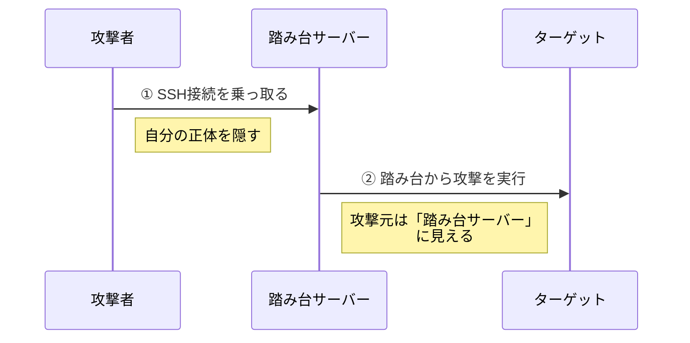
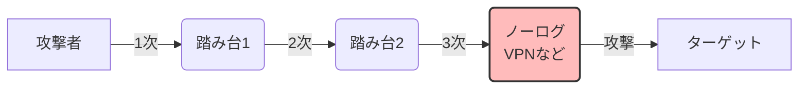
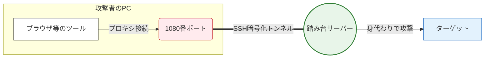

## はじめに

昨今、増加傾向にあるサイバー攻撃において、攻撃者が自分自身のIPアドレスから直接攻撃を仕掛けることは稀です。第三者が管理するサーバーを踏み台として利用し、自身の身元を隠匿することが常套手段となっています。

本記事では、サーバーエンジニアが業務で使うコマンドが、
実際どのようにサイバー攻撃に悪用されているのかを交えながら、その原理と対策を解説します。

## 対象者

- Webサーバー等を構築しインターネットに公開しているエンジニア
- サイバー攻撃の仕組みを知って対策したい方
- サーバーのセキュリティ設定が不安な方

## なぜ踏み台を経由すると送信元が分からないのか？

インターネットの通信は、手紙のやり取りによく似ています。「手紙（やり取りされるデータ）」には「送信元の住所（IPアドレス）」が書かれており、通常はこの住所を見れば誰が送ってきたのかが一目でわかります。

しかし、攻撃者が踏み台サーバーを悪用すると、この前提が根底から覆されます。
攻撃者は自分から直接ターゲットにアクセスするのではなく、乗っ取った踏み台サーバーに対して「この通信をターゲットに転送してくれ」と命令します。すると、踏み台サーバーは自分のIPアドレスを送信元として書き換え、新たな通信としてターゲットへ送り届けてしまうのです。

ターゲット側のサーバーログには直前に経由した踏み台サーバーのIPアドレスしか記録されず、その背後にいる通信の真の発生源を知ることはインターネットの通信の仕組み上、極めて困難となります。



#### コラム：実際のWebサーバーのアクセスログ

実際のWebサーバーのアクセスログを確認すると、以下のように踏み台サーバーのIPアドレスのみが記録されており、背後にいる攻撃者の痕跡が全くないことがわかります。

```bash
# Nginxのアクセスログを確認するコマンド例
$ tail -n 1 /var/log/nginx/access.log
192.0.2.100 - - [17/Mar/2026:12:00:00 +0900] "GET / HTTP/1.1" 404 153 "-" "Mozilla/5.0..."
```

## サイバー攻撃の追跡に立ちはだかる2つの壁

仮に踏み台にされたサーバーの内部ログを解析できれば、一つ前の真の送信元を割り出せる可能性は残されています。しかし、実際のサイバー攻撃の特定には技術と法律という2つの壁が存在します。

### 1. 技術の壁（複数サーバーの多段中継）

実際の攻撃では、Torネットワークなどを代表とする複数のサーバーを数珠つなぎにする多段中継という手法が日常的に用いられています。



:::message alert
**多段中継による追跡の困難さ**
この中継点に、通信ログを一切保存しないノーログポリシーを掲げるVPNサービスや、犯罪組織が管理するアンダーグラウンドなサーバーが一つでも介在すると、通信記録が完全に途絶えます。ログがない以上、そこから先へ経路を遡る手段は実質的に失われます。
:::

### 2. 法律の壁（国境と管轄の違い）

技術的な追跡ルートが辛うじて残っていたとしても、最大の要因として法的管轄の違いが立ちはだかります。攻撃者は意図して、日本とは法的協力関係にない国家や、情報開示請求が機能しにくい海外のサーバーを中継点に選びます。

他国のサーバー管理者に対してログの開示を求めても、現地の法律や国家間の協定が壁になり、捜査は事実上ストップしてしまいます。仮に技術的にはログが残る構成であっても、国境の存在によって最終的な特定には至らないという限界があります。

## サーバーを踏み台化するメカニズム

そもそも管理しているサーバーがなぜ乗っ取られて、勝手に踏み台として機能させられてしまうのでしょうか。その最も代表的な原因がSSH接続の乗っ取りです。

パスワード認証を許可したまま放置されているSSHポート（22番）に対して攻撃者は世界中から無数のIDとパスワードの組み合わせを自動的に試行し続けるブルートフォース攻撃（総当たり攻撃）を仕掛けます。具体的には以下のように休むことなくログイン試行が繰り返されます。

```bash
$ ssh root@192.0.2.100 (パスワードAを試行)
$ ssh admin@192.0.2.100 (パスワードBを試行)
$ ssh test@192.0.2.100 (パスワードCを試行)
...
```

安易なパスワードが設定されていた場合システムへのログインを許してしまいます。
SSHのログインに成功した攻撃者は単にサーバー内のデータを盗み見るだけではありません。SSHプロトコル自体が標準で備えている「ポートフォワーディング」という強力な機能を悪用します。
この機能を使うと、攻撃者の手元にある端末と乗っ取られたサーバーとの間に暗号化されたトンネルが形成されます。これにより、単なるWebサーバーが「攻撃者の通信をすべて肩代わりし、身元を完全に隠蔽しながらあらゆる標的へと攻撃を中継する拠点（プロキシ）」へと変貌します。

```bash
# 攻撃者が自身の端末から実行するコマンドのイメージ（ポートフォワーディング）
$ ssh -D 1080 -q -C -N compromised-user@192.0.2.100
```

**ポートフォワーディングを悪用した踏み台の仕組み(イメージ)**


このコマンドが成功すると攻撃者の端末のポート1080に送られた通信はすべて暗号化トンネルを経由して踏み台サーバー（192.0.2.100）へと転送されそこからインターネット上のあらゆる標的へと放出されるようになります。マルウェアのような専用のプログラムをわざわざインストールさせる必要すらなくOSの標準機能だけで踏み台が完成してしまうという点がこの攻撃手法の最も恐ろしいところです。

## SSH乗っ取りに対する防衛手段

このような追跡不可能なサイバー攻撃の基点として、自身が稼働させているサーバーを悪用させないためには、アタックサーフェス（攻撃可能面）を徹底的に減らすことが唯一で最大の防衛策となります。

第一に、不要なポートはファイアウォールで確実に閉鎖し、外部からの不要なアクセス経路をネットワークレベルで断ち切ります。例えば、ファイアウォール管理ツール `ufw` を用いて、必要なポートのみを許可し、その他すべての受信を拒否する設定を行います。

```bash
# すべての受信を拒否し、必要なポートだけを開ける基本方針
$ sudo ufw default deny incoming
$ sudo ufw default allow outgoing

# 必要最小限のポートのみ許可する
$ sudo ufw allow 22/tcp  # SSH
$ sudo ufw allow 80/tcp  # HTTP
$ sudo ufw allow 443/tcp # HTTPS

# ファイアウォールを有効化する
$ sudo ufw enable
```

さらに、SSHなどの管理用ポートへのアクセスはパスワード認証を廃止し、暗号化された公開鍵認証のみに限定します。`sshd_config` の設定ファイルを編集し、ブルートフォース攻撃を無効化させます。

```text
# /etc/ssh/sshd_config の設定例
PasswordAuthentication no
PermitRootLogin no
```

設定変更後は、SSHサービスを再起動して設定を確実に取り込みます。

```bash
$ sudo systemctl restart ssh
```

また、管理画面や特定の用途に限られたエンドポイントへの通信は、信頼できる特定のIPアドレス群（オフィスの固定IPやVPN経由など）からのみアクセスを許可する「ホワイトリスト方式」を導入することも望ましいです。

これらの一連の設定は、IPアドレスが偽装も隠蔽も可能であるというインターネットの根本的な弱点をカバーするためのとても大切な対策となります。

## おわりに

ニュースなどでサイバー攻撃の増加を耳にする機会が増えましたが、私自身、初めてサーバーを立てた後、世界中からSSHの不正ログイン試行ログが日々記録されていくことを目の当たりにし、とても恐ろしかった経験があります。
インターネットに公開しているシステムは誰かの攻撃の踏み台にされるリスクを背負いますが、攻撃者がどのような原理で身を隠し、どのようにサーバーを乗っ取ろうとするのか。その仕組みを理解していれば防御は十分に可能です。
本記事が、サーバー運用のセキュリティ方針の参考となれば幸いです。

---

## 株式会社ONE WEDGE
【Serverlessで世の中をもっと楽しく】
ONE WEDGEはServerlessシステム開発を中核技術としてWeb系システム開発、AWS/GCPを利用した業務システム・サービス開発、PWAを用いたモバイル開発、Alexaスキル開発など、元気と技術力を武器にお客様に真摯に向き合う価値創造企業です。
https://onewedge.co.jp/
