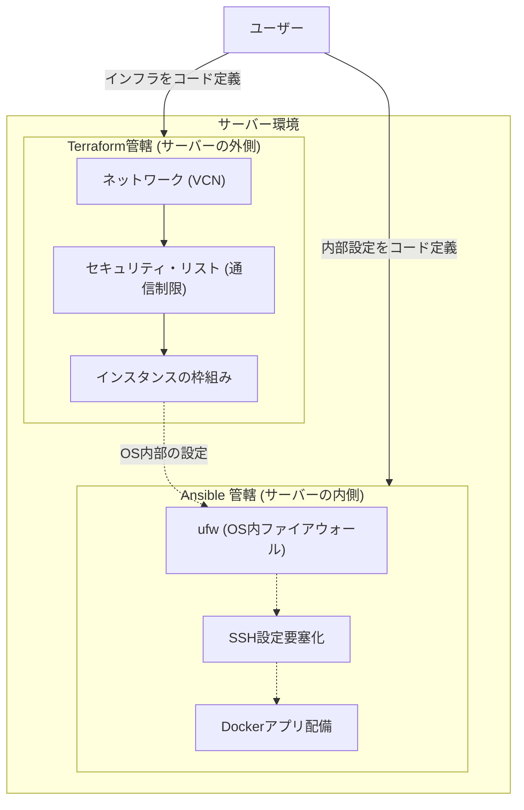

## はじめに

2026年4月、米AI企業Anthropicが限定公開した「Claude Mythos」は、あらゆる主要ソフトウェアの未知の脆弱性を自律的に発見し、攻撃コードまで生成する能力を示しました。あまりにも危険なため一般公開は見送られ、限られた組織にのみアクセスが許されています。
この「Mythos Shock」は、AIがサイバー空間の戦略兵器となりうる現実を私たちに突きつけました。

このような自律型AIは、人間の手作業では到底及ばない超高速でシステムの隙を見つけ出し、私たちが気づく前に攻撃を完了させます。これに対抗するには、守る側である人間もまた、超高速かつ隙のないインフラ構築能力を持つことが大切です。
本記事では、Terraformでインフラを定義し、Ansibleで一貫したセキュリティ設定を適用する、自動化された堅牢なインフラを構築する方法を紹介します。

## 対象者

* 攻撃AIの脅威に対して、具体的にどうインフラを守ればいいか知りたい方
* サーバーやネットワークなどのインフラ設定を手動で行っている方
* セキュリティ対策として IaC を使いたい方

## 前提知識：IaCと主要ツールの役割

「IaC（Infrastructure as Code）」とは、サーバーやネットワークの構築手順をプログラミングコードのように記述し、ソフトウェアの力で自動的に環境を構築・管理する手法のことです。
本記事では、このIaCを実現するために以下の2つのツールを組み合わせて使用します。

* Terraform
サーバーの外側（ネットワークやインスタンスそのものの作成）をコード化するツールです。設計図（.tfファイル）を渡すと、クラウド側と通信して必要なインフラを自動で用意してくれます。

* Ansible
サーバーの内側（OSの設定、ミドルウェアのインストール、ファイアウォールの設定など）を構築手順書（.ymlファイル）でコード化するツールです。構築済みのサーバーに対して、指定した状態になるように内部の設定を自動で行います。

この2つを適材適所で使い分けることで、外側から内側まで一貫したセキュリティ管理が可能になります。

### アーキテクチャ概要図

これらの役割分担と構成を図にすると以下のようになります。



## なぜ今、IaCが必要なのか

例えば、ブラウザの画面でポートを一つずつ開閉し、SSHでログインしてコマンドを叩く。
かつては、それが当たり前でした。しかし、設定ミスや古いパッケージの放置は、攻撃AIにとって格好の的となります。
手作業の最大の弱点は、時間とともに設定が標準から乖離する「設定の漂流」が発生しやすい点にあります。

設定をコード化することで、この状況は一変します。
常に最新で隙のないセキュリティ設定をすべてのサーバーに正確に適用し続けることができ、そもそも攻撃される隙を劇的に減らすことができます。
その上で、万が一、強固な防御壁を越えて被害を受けたとしても、コードから数分で無傷の環境を再構築できる。この「未然の防御」と「迅速な復元」の掛け合わせこそが、これからの時代に必要な真の防御力となります。

## 実践：Terraformでインフラを定義する

OCI上に手動で作った既存のインスタンスがある場合、Terraformのimport機能を活用して、それら「サーバーの外側のリソース」をコードの管理下に取り込むことができます。
例えば、以下のコマンドを実行することで、クラウド上の現在の状態が抽出され、以降の変更を安全に追跡できるようになります。

```bash
terraform import <リソースタイプ>.<リソース名> <リソースID>
```

セキュリティ・リストの定義においても、最小権限の原則に基づき必要なポートのみを開放します。
以下は、必要なポートのみを開放するTerraformのコード例です。

```hcl:security.tf
resource "security_list" "secure_list" {
  compartment_id = var.compartment_id
  vcn_id         = vcn.main.id
  display_name   = "strict-security-list"

  ingress_security_rules {
    protocol  = "6"
    source    = "[IP_ADDRESS]"
    tcp_options {
      max = 443
      min = 443
    }
  }
}
```

このようにコードで管理することで、意図しないポートの開放を未然に防ぐことができます。

## 実践：Ansibleでサーバーを要塞化する

サーバー内部のセキュリティ設定も、Ansibleを用いて自動化します。Ansibleは「サーバーをあるべき状態にする」ツールです。そのため、例えばすでに手作業でufw（ファイアウォール）の設定を済ませてしまったサーバーであっても、コードを書いて適用するだけで、安全にコード管理下へと移行できます。設定がすでに正しければAnsibleは「変更なし」と判断し、設定が漏れていれば自動で修正してくれます。

Ansibleを使えば、一度正しく動いたコードを再利用できるため、重要なセキュリティ設定の漏れや、設定ミスの防止につながります。

以下は、SSHの鍵を閉め、パスワード認証やRootログインを禁止するタスクの例です。

```yaml:playbook.yml
- name: Secure SSH configuration
  ansible.builtin.lineinfile:
    path: /etc/ssh/sshd_config
    regexp: "^PasswordAuthentication"
    line: "PasswordAuthentication no"
    state: present
  notify: Restart SSH

- name: Disable Root Login
  ansible.builtin.lineinfile:
    path: /etc/ssh/sshd_config
    regexp: "^PermitRootLogin"
    line: "PermitRootLogin no"
    state: present
  notify: Restart SSH
```

さらにセキュリティ性を向上させるなら、
`unattended-upgrades`パッケージを利用して、セキュリティアップデートを自動で適用する仕組みを構築したり、Dockerを用いたアプリケーションのデプロイも、`docker-compose.yml`をAnsible経由でサーバーに配置して起動させることも可能です。

---

### コラム：AIセキュリティへの備え、敵を知り盾を強化する

#### OWASP Top 10 for LLM を知る
インフラ層での防御を固めた後は、「敵を知る」ことも重要です。
OWASPが提唱する「LLM向けセキュリティトップ10（OWASP Top 10 for LLM）」などの指針には、現代のAIがいかにしてシステムの隙を突くか、あるいはAIアプリがどう狙われるかが体系化されています。攻撃AIは人間には思いつかないような速度と手法で、サーバー上の認証の甘いAPIや意図しない入力を執拗に狙ってきます。こうした脅威の傾向を知ることで、アプリケーションの実行権限を最小化し、ネットワークを分離するという対策の重要性がより明確になります。

#### Immutable Infrastructure を知る
また、「不変のインフラ（Immutable Infrastructure）」という考え方もあります。
もしサーバーが攻撃を受けた疑いがある場合、どこにバックドアが仕掛けられたかを人間が一つずつ手作業で調査するのは、AIの攻撃速度に対して非効率です。IaCの力を使えば、感染したサーバーを調査のために隔離しつつ、並行してコードから数分で「完全にクリーンな新しいサーバー」を作り直すことができます。これにより、被害の拡大を防ぎつつ、最速でサービスを復旧することが可能になります。

---

### おわりに

サーバーを一台ずつコマンドで設定していく作業は多くの現場で行なわれていると思います。しかし、AIによる超高速攻撃が飛び交う現代では、設定ミスや古いパッケージの放置といった些細なことが致命傷になる場合もあります。そして、人間がやる以上、設定ミスはいつでも起こり得ます。
本記事でご紹介したインフラのコード化は、私たちのミスを補うだけでなく、攻撃者に立ち向かうための強力な盾になります。本記事がサーバーをサイバー攻撃から大切なシステムを守る手段の参考になれば幸いです。