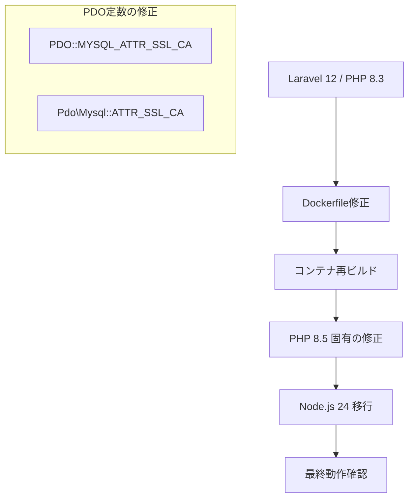

# はじめに

Laravel本体のアップグレード、お疲れ様でした。
しかし、アプリケーションの近代化はフレームワークの更新だけでは完結しません。それを動かすエンジンである「言語（PHP）」と「ランタイム（Node.js）」もまた、時代に合わせて載せ替える必要があります。

本記事は「Laravel最新化プロジェクト」       スタンダードとなる **PHP 8.5** および **Node.js 24** への移行手順と、それに伴う修正ポイントを解説します。

## 対象者

* Laravel 12 への移行が完了している方
* Dockerなどのコンテナ環境で開発している方
* `Deprecated` （非推奨）という警告ログを根絶したい方

## 移行の全体像

本記事で実施する作業の流れです。インフラ定義（Dockerfile）の更新と、それに伴うアプリケーションコードの微修正が主となります。



## ステップ1 PHP 8.5 への引き上げ

まずはサーバーサイドの言語バージョンを更新します。
PHP 8.5 はパフォーマンスの向上に加え、より厳格な型安全性を提供します。

### Dockerfile の修正

`docker/app/Dockerfile` などの定義ファイルを編集し、ベースイメージを更新します。

```dockerfile
# PHP 8.3 から 8.5 へ変更します
FROM php:8.5-apache

# 必要な拡張機能のインストール（例: Imagick）
RUN pecl install imagick && docker-php-ext-enable imagick

# その他の設定は既存のものを維持します

```

### コンテナの再ビルド

設定を変更したら、キャッシュを使わずにビルドし直します。

```bash
docker-compose build --no-cache
docker-compose up -d

```

起動後、コンテナ内でバージョンを確認します。

```bash
php -v

```

期待される結果
`PHP 8.5.x (cli)` と表示されること。

## ステップ2 PHP 8.5 における PDO 定数の修正

PHP 8.5 へ移行した直後、データベース接続周りで以下のような非推奨エラー（Deprecated）が発生することがあります。

エラー内容
`Deprecated: Constant PDO::MYSQL_ATTR_SSL_CA is deprecated since 8.5, use Pdo\Mysql::ATTR_SSL_CA instead`

### 原因と対策

PHP 8.5 では、データベース関連の定数が整理され、名前空間付きの定数へと移行が進んでいます。これまでの `PDO::MYSQL_ATTR_SSL_CA` は非推奨となり、代わりに `Pdo\Mysql::ATTR_SSL_CA` を使用する必要があります。

`config/database.php` を開き、MySQLの設定オプションを修正します。

修正前

```php
'options' => extension_loaded('pdo_mysql') ? array_filter([
    PDO::MYSQL_ATTR_SSL_CA => env('MYSQL_ATTR_SSL_CA'),
]) : [],

```

修正後
まず、ファイルの先頭で新しい名前空間をインポートします。

```php
use Pdo\Mysql;

```

続いて、オプション配列内の定数を書き換えます。

```php
'options' => extension_loaded('pdo_mysql') ? array_filter([
    Mysql::ATTR_SSL_CA => env('MYSQL_ATTR_SSL_CA'),
]) : [],

```

これで非推奨警告は解消されます。

## ステップ3 Node.js 24 (LTS) への移行

続いて、フロントエンドのビルド環境を最新のLTS（長期サポート）版である Node.js 24 へ更新します。

### Dockerfile の修正と再インストール

Dockerfile 内で Node.js をインストールしている箇所を更新します。

```dockerfile
# Node.js v24 & npm最新化
RUN curl -sL https://deb.nodesource.com/setup_24.x | bash \
    && apt-get install -y nodejs \
    && npm install -g npm@latest

```

### パッケージのクリーンインストール

Node.js のメジャーバージョンアップ後は、`node_modules` のバイナリ互換性が失われることが多いため、必ず再構築を行います。

```bash
# 既存の依存ファイルを削除します
rm -rf node_modules package-lock.json

# 新しいNode環境でインストールし直します
npm install

# ビルドが通るか確認します
npm run build

```

最後に、脆弱性監査を行います。

```bash
npm audit

```

ここで脆弱性が報告された場合は `npm audit fix` を実行し、可能な限り修正を行ってください。

## 最終確認

これですべてのレイヤー（Laravel, PHP, Node.js）が最新化されました。
最後に以下のコマンドでアプリケーション全体の健全性をチェックします。

```bash
# キャッシュをクリア
php artisan optimize:clear

# テストの実行
php artisan test

# バージョン情報の最終確認
php artisan about

```

## おわりに

全3回にわたるアップグレード作業、本当にお疲れ様でした。

最初は「脆弱性対応」というマイナスをゼロに戻す作業から始まりました。
次に「Laravel 12への移行」でシステムを現代の水準に合わせました。
そして今回、PHPとNode.jsを最新化することで、未来へ進むための準備が整いました。

ターミナルに表示される `PHP 8.5` や `Node.js v24` という文字列は、単なる数字ではありません。それは、私たちが技術的負債という重力に抗い、システムを前進させた証です。

この一連の記事が、あなたのシステムの寿命を延ばし、開発する楽しさを取り戻すきっかけになれば、これ以上の喜びはありません。
