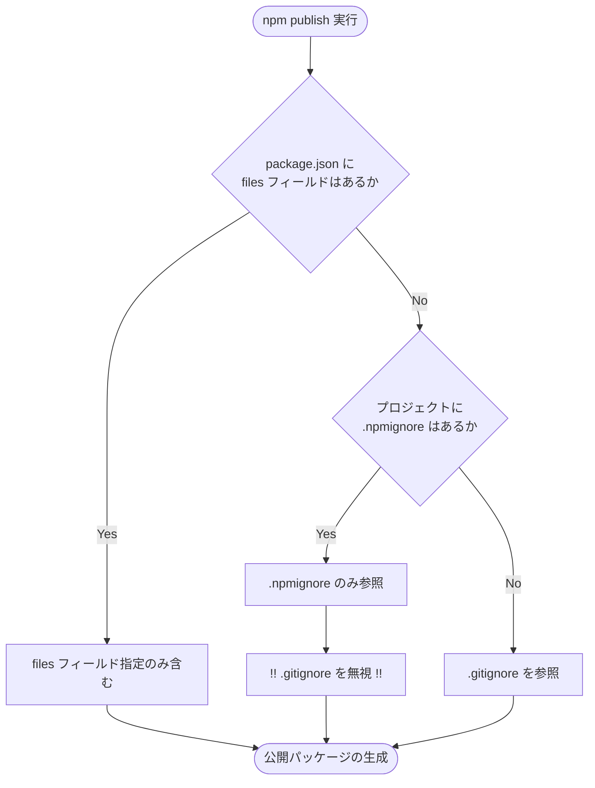
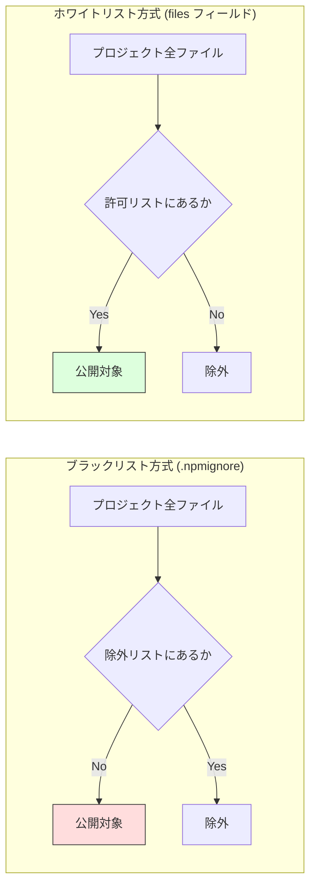

## はじめに

2026年3月、Anthropic社のAIツールであるClaude Codeに関連するキャッシュファイルが、npmを通じて誰でも閲覧できる状態で公開される事例が発生しました。これは第三者によるハッキングの結果ではありません。
この問題は、ツール自体の欠陥ではなく、npmというエコシステムが持つ特定の仕様にありました。追加した設定ファイルが、既存の公開設定をすべて上書きしていたということが原因のようです。本記事では、その具体的なメカニズムを解説します。

## 対象者

* npm publish を利用している、利用予定のあるエンジニア
* `.gitignore` に秘密情報を記載しているから安心だと考えている方
* 設定ファイルの優先順位について正確な知識を整理しておきたい方

## 事件の経緯：なぜ Claude Code のキャッシュは流出したのか

今回の流出における主要な原因は、パッケージに混入したソースマップと、ツールが生成するキャッシュデータでした。
ソースマップは、実行環境が読み込む機械向けのコードを、開発者が書いた元のコードに対応させるための設計図です。本来は本番環境のパッケージに含めるべきではないファイルですが、設定の不備によって同梱されてしまいました。

さらに、Claude Code はプロジェクト構造を高速に解析するために `.claude.json` などのキャッシュデータを生成します。ここにはファイル構造やシンボル情報が含まれるため、通常は `.gitignore` で管理し、Git の管理対象から外すのが一般的です。
しかし、ある設定ファイルの存在によって、これらの「隠されているはずのファイル」が、公開パッケージへと混入する事態を招きました。

## npm の仕様という罠：二つの設定ファイルの優先順位

ここが本記事で最も重要なポイントです。
通常、npm は `.gitignore` に記載されたファイルを公開対象から除外してくれます。しかし、プロジェクト内に `.npmignore` が一つでも作成されると、npm は `.gitignore` の内容を一切参照しなくなります。



たとえば、`.gitignore` で `.env` などの環境変数を隠している場合、別の目的で `.npmignore` を作成し、ビルドログの除外設定だけを記述した場合、除外リストのソースは `.npmignore` のみに切り替わります。`.gitignore` に書いてあった `.env` は除外リストから外れてしまい、世界中に公開されてしまうことになります。今回起きたキャッシュ情報の流出も、これと同様のメカニズムによって引き起こされました。

## 開発現場で発生するシーン

開発現場において、この問題は以下のようなシーンで発生します。

- ライブラリのアップデート作業:
新機能を追加し、`npm publish` を実行する際、手元の環境で `.npmignore` が新しく追加されていたり、内容に不備があったりしても、コマンド一つでアップロードは完了してしまいます。

- CI/CD による自動公開プロセス:
GitHub へのプッシュをトリガーに、サーバー側で自動的に `npm publish` が実行される仕組みです。自動化は効率的ですが、人間による最終確認が行われないため、設定ミスに気付かないまま秘密情報が放流され続ける恐れがあります。

## ブラックリスト管理の限界

`.npmignore` による管理は、公開したくないものを列挙するブラックリスト方式です。
しかし、今回の `.claude*` のようなツール固有のキャッシュファイルや、予期せぬタイミングで生成される一時ファイルをすべて把握し、リストを更新し続けるのは至難の業です。設定ファイルが一つ増えるだけで既存の除外設定が無効化される挙動は、運用上のリスクが高いです。

このリスクは、以下の解決策を導入することで根本的に回避できます。

## 解決策1：files フィールドによるホワイトリスト方式

漏らさないように消すのではなく、必要なものだけを入れる設計にすることが重要です。
npm 公式も推奨している対策は、`package.json` の files フィールドを利用することです。

```json:package.json
{
  "name": "my-app",
  "files": [
    "dist",
    "README.md"
    // 必要なファイルを追記する
  ]
}
```

:::message
**必要なものだけを明示的に許可する設計思想**
files フィールドに記述したファイル以外は、設定ファイルの有無にかかわらず絶対に公開されません。
:::




## 解決策2：公開前のドライランによる確認

files フィールドの設定と併用することで、より確実性が高まります。以下のコマンドを実行すると、実際にアップロードされるファイルの一覧を事前に確認できます。意図しないファイルが表示されないかを目視でチェックする習慣が、事故を未然に防ぎます。

```bash
npm pack --dry-run
```

## おわりに

Claude Code の流出事例を深く掘り下げていくと、その引き金となったのは、私たちが日々の業務で何気なく叩いているコマンドで身近な設定ミスでした。世界最高峰の技術を持つ現場でも、こうした仕組みの盲点によって一瞬で大切なデータが放流されてしまう事故は、私にとっても大きな衝撃でした。一時の油断がインシデントに直結しかねないからこそ、守りの設定を徹底していかねばならないのだと痛感しました。この記事が、大切なプロジェクトやソースコードを守るための一助となれば幸いです。

---

## 株式会社ONE WEDGE
【Serverlessで世の中をもっと楽しく】
ONE WEDGEはServerlessシステム開発を中核技術としてWeb系システム開発、AWS/GCPを利用した業務システム・サービス開発、PWAを用いたモバイル開発、Alexaスキル開発など、元気と技術力を武器にお客様に真摯に向き合う価値創造企業です。
https://onewedge.co.jp/