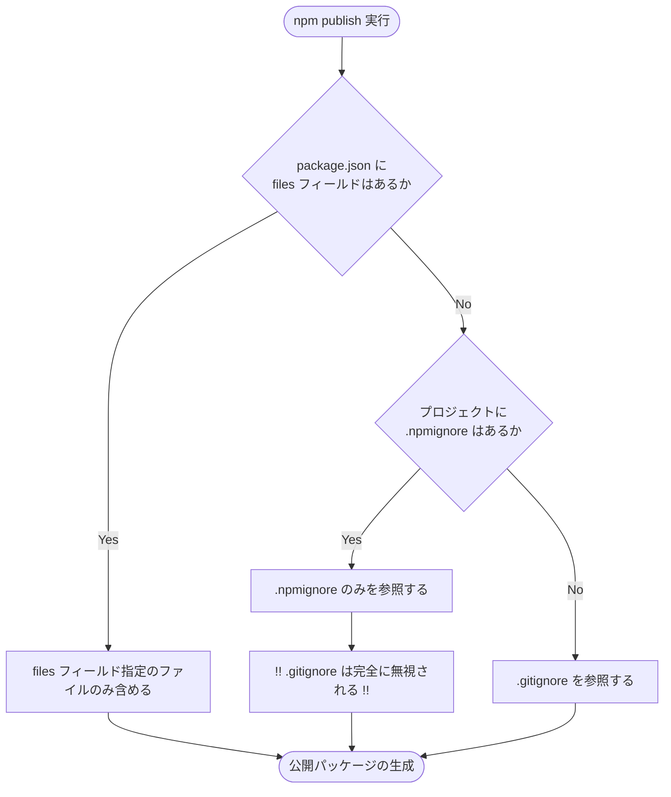
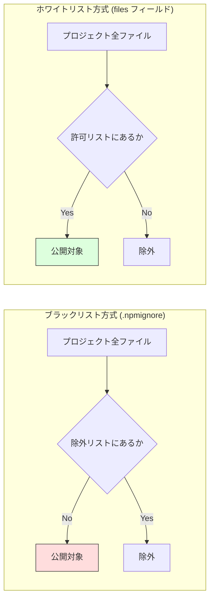

## はじめに

2026年3月、Anthropic社のAIツールであるClaude Codeに関連するキャッシュファイルが、npmを通じて誰でも閲覧できる状態で公開される事例が発生しました。これは第三者によるハッキングの結果ではありません。
この問題は、ツール自体の欠陥ではなく、npmというエコシステムが持つ特定の仕様にありました。追加した設定ファイルが、既存の防御策をすべて無効化している可能性があります。本記事では、その具体的なメカニズムを解説します。

## 対象者

* npm publish を利用している、利用予定のあるエンジニア
* gitignore に秘密情報を記載しているから安心だと考えている方
* 設定ファイルの優先順位について正確な知識を整理しておきたい方

## 事件の経緯：なぜ Claude Code のキャッシュは流出したのか

今回の流出における主要な原因は、パッケージに混入したソースマップと、ツールが生成するキャッシュデータでした。

ソースマップは、実行環境が読み込む機械向けのコードを、開発者が書いた元のコードに対応させるための設計図です。本来は本番環境のパッケージに含めるべきではないファイルですが、設定の不備によって同梱されてしまいました。

さらに、Claude Code はプロジェクト構造を高速に解析するために .claude.json などのキャッシュデータを生成します。ここにはファイル構造やシンボル情報が含まれるため、通常は gitignore で管理し、Git の管理対象から外すのが一般的です。

しかし、ある設定ファイルの存在によって、これらの「隠されているはずのファイル」が、公開パッケージへと混入する事態を招きました。

## npm の仕様という罠：二つの設定ファイルの優先順位

ここが本記事で重視すべき npm の挙動です。
通常、npm は gitignore に記載されたファイルを公開対象から除外してくれます。しかし、プロジェクト内に npmignore が一つでも作成されると、npm は gitignore の内容を一切参照しなくなります。



たとえば、gitignore で .env などの環境変数を隠しているとします。そこで別の目的で npmignore を作成し、ビルドログの除外設定だけを記述したとしましょう。

この瞬間、除外リストのソースは '.npmignore' のみに切り替わります。'.gitignore' に書いてあった .env は除外リストから外れてしまい、世界中に公開されてしまうことになります。今回起きたキャッシュ情報の流出も、これと同様のメカニズムによって引き起こされました。

## リスクが顕在化する瞬間

開発現場において、この問題は以下のようなシーンで音もなく忍び寄ります。

### ライブラリのアップデート作業

新機能を追加し、npm publish を実行するその瞬間です。手元の環境で .npmignore が新しく追加されていたり、内容に不備があったりしても、コマンド一つでアップロードは完了してしまいます。

### CI/CD による自動公開プロセス

GitHub へのプッシュをトリガーに、サーバー側で自動的に npm publish が実行される仕組みです。自動化は効率的ですが、人間による最終確認が行われないため、設定ミスに気付かないまま秘密情報が放流され続ける恐意があります。

## ブラックリスト管理の限界

npmignore による管理は、公開したくないものを列挙するブラックリスト方式です。
しかし、今回の .claude* のようなツール固有のキャッシュファイルや、予期せぬタイミングで生成される一時ファイルをすべて把握し、リストを更新し続けるのは至難の業です。設定ファイルが一つ増えるだけで既存の除外設定が無効化される挙動は、運用上のリスクが極めて高いと言わざるを得ません。

このリスクは、以下の解決策を導入することで根本的に回避できます。

## 解決策1：files フィールドによるホワイトリスト方式

漏らさないように消すのではなく、必要なものだけを入れる考え方に転換しましょう。
npm 公式も推奨している最も安全な対策は、package.json の files フィールドを利用することです。



```json
{
  "name": "my-awesome-tool",
  "files": [
    "dist",
    "README.md"
  ]
}
```

注釈として付け加えると、files フィールドに記述したファイル以外は、設定ファイルの有無にかかわらず絶対に公開されません。必要なものだけを明示的に許可する設計思想こそが、最大の防御となります。

## 解決策2：公開前のドライランによる確認

files フィールドの設定と併用することで、より確実性が高まります。以下のコマンドを実行すると、実際にアップロードされるファイルの一覧を事前に確認できます。意図しないファイルが表示されないかを目視でチェックする習慣が、事故を未然に防ぎます。

```bash
npm pack --dry-run
```

## おわりに

設定ファイルを一つ追加しただけで、大切に守ってきた秘密情報が漏洩する。この仕様の存在を知ったとき、私もエンジニアとして背筋が凍るような思いを抱きました。

プロフェッショナルの現場で起きるミスの多くは、個人の能力不足ではなく、仕組みの中に潜む巧妙な罠によって引き起こされます。最先端のツールを開発する企業であっても、こうした設定の盲点に陥ることはあります。この事実は、私たちに不安を与えるのではなく、むしろ謙虚に仕組みを理解することの大切さを教えてくれています。

私自身、過去に一度だけ、本来含めるべきでないテスト用の設定ファイルをパッケージに含めそうになり、公開直前の dry-run で救われたことがあります。あの時の冷や汗こそが、現在の慎重な開発スタイルを形作っています。

コードは開発者にとってかけがえのない財産です。そして環境変数は、その財産を預ける金庫の鍵です。npm publish という強力な道具を使いこなすために、files フィールドという鞘を用意し、安全かつ確実に技術を届けていきましょう。

この記事が、あなたの素晴らしい成果を安全に世界へ届ける一助となれば幸いです。
