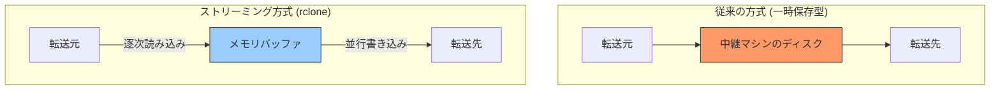
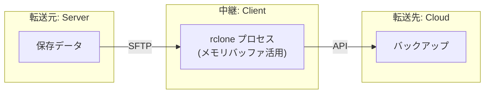
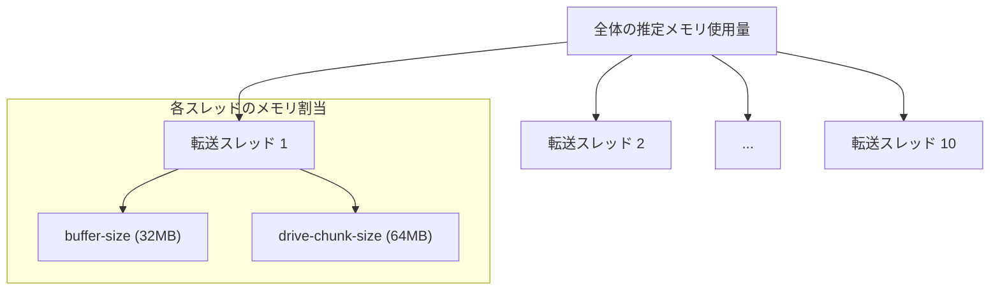

## はじめに
長年運用されてきたシステムには、最近のツールが通用しない環境が存在します。
私が参画した案件では、利用中のクラウドバックアップサービスが提供するバックアップ機能が、ファイル数の多さやデータ容量によりタイムアウトしてしまうという課題がありました。そのため、バックアップ手法が「ファイルサーバーからダウンロードして、ローカルディスクに保存してから、クラウドストレージにアップロードする」方式でした。
本記事では、古いOSのファイルサーバーから、手元のクライアントマシンをプロキシとして活用し、大規模なデータをローカルディスクを介さず、直接転送する手法を解説します。

## 対象者
- 古い共有サーバーのバックアップ手段に困っているエンジニア
- サーバーのディスク容量不足でローカル経由の効率的な転送が困難な方
- rclone を用いた高度な転送設定や最適化を学びたい方

## 前提知識

### rclone とは
rclone は「クラウドストレージ用の rsync」とも称されるオープンソースのコマンドラインツールです。Google Drive、Amazon S3、Dropbox、SFTP など、70種類以上の異なるストレージサービス間でファイルを同期、移動、コピーできます。強力なバッファリング機能や並列転送制御を備えており、ネットワーク経由のデータ管理におけるデファクトスタンダードのひとつです。

### なぜ「ストリーミング」なのか
この記事で紹介するrcloneの手法は「ストリーミング転送」です。一般的なファイル転送とは以下の点が異なります。

#### 1. ローカルディスクを一切消費しない
rclone は、転送元（SFTP）から読み取ったデータを、ローカルマシンのストレージに書き込む代わりに、OS上のメモリ（RAM）に小さなバッファとして展開します。データはこのバッファを通り道として、そのまま転送先（Google Drive）へ送り出されます。

#### 2. メモリをパイプとして利用する
読み込みと書き込みを並行して行うパイプ処理により、中継機となるマシンのディスク容量が 1 GB しかなくても、1 TB のデータを転送することが可能です。



### 実践環境
本記事の内容は以下の構成に基づいています。
- クライアントマシン：M1 MacBook Pro（macOS）
- 転送元：さくらインターネット 共有サーバー（FreeBSD 11.2）
- 転送先：Google Drive

## 課題と背景
保守案件で直面するレガシーな環境では、以下のような制約が発生することがあります。

1. 標準のバックアップ機能がファイル数の多さやデータ容量によりタイムアウトする
2. 最新のバイナリがOSのライブラリ依存関係により動作しない
3. サーバー内の空き容量が少なく、圧縮アーカイブを作成する余裕がない

これらの制約を打破するため、サーバー側に実行ファイルを置かず、クライアント側から命令を出す構成を採用します。

## 解決策のアーキテクチャ
クライアントマシンのメモリをバッファとして利用し、サーバーとクラウドストレージを直結します。



この構成では、クライアント側のディスクを経由せずデータが流れるため、ローカルマシンの空き容量を気にする必要がありません。

## 実践セットアップ
まずは rclone の設定ファイルである rclone.conf を準備します。

### 接続先の設定
以下は SFTP 経由でサーバーに接続し、Google Drive を転送先とする設定例です。

```ini:rclone.conf
[source_server]
type = sftp
host = example.com
user = username
port = 22
key_file = ~/.ssh/id_rsa

[dest_storage]
type = drive
scope = drive
root_folder_id = your_folder_id
```

:::message
**TIPS**
root_folder_id は Google Drive の URL 末尾にある文字列を指定することで、特定のディレクトリをルートとして扱えます。
:::

### 実行コマンドの最適化
以下のコマンドは、サーバー側の負荷を抑えつつ、大量の小ファイルの転送を効率的に行うように設計されています。

```bash
caffeinate -i rclone copy source_server:path/to/data dest_storage:"backup_destination" \
  --transfers 10 \
  --checkers 20 \
  --fast-list \
  --buffer-size 32M \
  --drive-chunk-size 64M \
  --progress
```

### 各オプションの技術的根拠
- transfers 10 は同時に転送するファイル数です。共有サーバー等の制限を考慮しつつ並列性を確保しています。

- checkers 20 は差分チェックを並列で行うスレッド数です。転送そのものよりも CPU への負荷が低いため、多めに割り当てることでリストアップを高速化させています。

- fast-list はディレクトリ構造をメモリ上に保持し、API リクエスト回数を最小化する設定です。数万件のファイルを扱う場合に劇的な効果を発揮します。

- buffer-size 32M は各接続ごとに確保されるメモリ上の転送バッファです。通信の揺らぎを吸収し、ストリーミングの安定性を高めます。

- drive-chunk-size 64M は Google Drive へのアップロード単位です。この値を大きくするほどスループットが向上しますが、その分メモリを消費します。



#### メモリ消費量の目安
全体のメモリ使用量は、おおよそ「transfers × (buffer-size + drive-chunk-size)」で算出できます。上記の設定では 10 × (32M + 64M) = 約 960 MB となり、モダンなラップトップ環境であれば十分に余裕を持って動作させることが可能です。

### コラム：長時間実行の安定化
大容量の転送には数時間を要するため、途中でシステムがスリープ状態に移行することを防ぐ必要があります。macOS では caffeinate コマンドを使用することで、プロセスの実行中にシステムアサーションを維持し、通信の切断を防止できます。

```bash
caffeinate -i
```

## 実践レポートと知見
今回、私の環境で実施した際のデータは以下の通りです。

転送総量は約 70 GiB、ファイル数は 50,000 件以上ありました。バックアップ当初、データ量は 20 GB 程度と認識されていたデータが、実体は約 70 GB に膨れ上がっていました。以前のバックアップシステムが作成した一時ファイルが原因でしたが、今回の手法でそれらも含めてすべてクラウドへ退避できました。

所要時間は 13 時間を超えましたが、caffeinate によるスリープ抑制のおかげで、一度も通信が途切れることなく完了しました。

## 今後の展望
今回の暫定対応を脱却し、定期バックアップを自動化するためには、S3 互換のオブジェクトストレージ（案1：さくらクラウド オブジェクトストレージ、案2：Backblaze B2）などを活用するのが効果的だと考えられます。安価なストレージサービスを選択肢に入れ、GitHub Actions 等を用いて定期的に同期する体制へ移行することを検討中です。

https://cloud.sakura.ad.jp/products/object-storage/
https://www.backblaze.com/cloud-storage

## おわりに
技術の進歩は速いものですが、現場では依然として古いシステムが大切なデータを守り続けています。今回、レガシーな環境を前にして、運用設計に頭を悩ませましたが、外部から制御するという視点を変えるだけで、膨大な負の遺産を含めてすべてを救い出すことができました。
本記事が、同じように困っている方の一助になれば幸いです。

---

## 株式会社ONE WEDGE
【Serverlessで世の中をもっと楽しく】
ONE WEDGEはServerlessシステム開発を中核技術としてWeb系システム開発、AWS/GCPを利用した業務システム・サービス開発、PWAを用いたモバイル開発、Alexaスキル開発など、元気と技術力を武器にお客様に真摯に向き合う価値創造企業です。
https://onewedge.co.jp/
