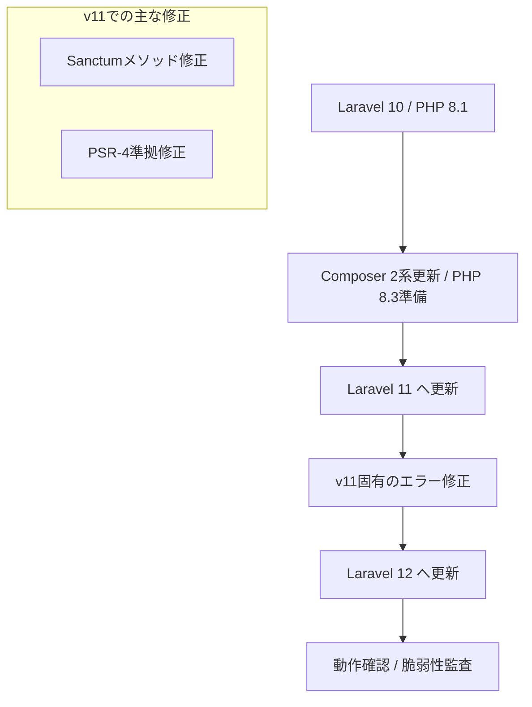

# はじめに

2026年現在、Laravel 12の登場によりWeb開発の生産性はさらに向上しました。しかし、既存のシステムを最新環境へ適応させる作業は、多くのエンジニアにとって頭の痛い問題です。

本記事は、Laravel 10 から Laravel 12 への段階的アップグレード手順を解説します。

## 対象者

* Laravel 10 以前のプロジェクトを保守しているエンジニア
* `composer update` で依存関係地獄に陥った経験がある方
* Sanctum や Breeze などの周辺ライブラリの整合性に不安がある方

## 移行の全体像

本記事で実施する作業の流れです。Laravel 11へのクッションを挟むことで、トラブルシューティングを容易にします。



## ステップ1 前提環境の整備

Laravelの更新を行う前に、パッケージ管理ツールであるComposerと、PHPのバージョンを整える必要があります。

### Composerのバージョン固定と更新

Laravel 12への移行において、Composerのバージョンは安定性の鍵を握ります。ここでは互換性を重視し、2系の最新版を利用します。

```bash
# バージョンを確認します
composer --version

# メジャーバージョンを2系に固定して更新します
composer self-update --2
```

### 依存関係のリセット

アップグレード時のトラブルの9割は、古い依存関係の残留が原因です。一度 `composer.lock` と `vendor` ディレクトリを削除し、更地に戻します。

```bash
rm composer.lock
rm -rf vendor
```

## ステップ2 Laravel 11 への更新

まずは Laravel 11 へ移行します。フレームワーク本体だけでなく、SanctumやBreezeなどの公式パッケージも、Laravel 11と互換性のあるバージョンへ明示的に指定します。

以下のコマンドを実行し、パッケージをインストールします。

```bash
composer require \
  laravel/framework:^11.0 \
  laravel/sanctum:^4.0 \
  laravel/breeze:^2.0 \
  nunomaduro/termwind:^2.0 \
  nunomaduro/collision:^8.0 \
  --update-with-all-dependencies
```

### テストツールの更新

Pestを利用している場合、開発用依存関係も更新が必要です。

```bash
composer require \
  pestphp/pest:^3.0 \
  pestphp/pest-plugin-laravel:^3.0 \
  --dev \
  --update-with-all-dependencies
```

### PHP 8.3 への引き上げ

Laravel 11 は PHP 8.2以上を要求します。このタイミングで `composer.json` および Docker環境（Dockerfile）のPHPバージョンを `8.3` へ変更し、コンテナを再ビルドしてください。

## ステップ3 Laravel 11 移行時のエラー修正

インストール後、いくつかの破壊的変更によりエラーが発生する場合があります。実際に遭遇したエラーとその修正方法を共有します。

### Sanctum v4 の仕様変更対応

エラー内容
`Call to undefined method Laravel\Sanctum\Sanctum::ignoreMigrations()`

原因と対策
Laravel 11 (Sanctum v4) では、マイグレーションを無効化するためのメソッド `ignoreMigrations` が削除されました。代わりに設定ファイルを使用する必要があります。

`app/Providers/AppServiceProvider.php` から以下の記述を削除します。

```php
// 削除対象
// Sanctum::ignoreMigrations();
```

続いて、`config/sanctum.php` に以下の設定を追加します。

```php
'migrations' => false,
```

### PSR-4 オートロードの厳格化

エラー内容
クラスが見つからない、またはオートロードが機能しない。

原因と対策
新しいバージョンでは、PSR-4準拠（ファイル名とクラス名の一致）がより厳格にチェックされる場合があります。
今回のケースでは、ファイル名のスペルミス `CaseCouferenceForm.php` が原因でエラーとなりました。これを正しい `CaseConferenceForm.php` に修正することで解決しました。

修正後は必ずキャッシュをクリアし、変更を反映させます。

```bash
php artisan config:clear
composer dump-autoload
```

## ステップ4 Laravel 12 への更新

Laravel 11 環境での動作が安定したら、いよいよ Laravel 12 へ移行します。手順はフェーズ1と同様ですが、依存解決をよりクリーンに行うため、再度依存ファイルをリセットすることを推奨します。

```bash
# 依存関係のロックを解除
rm composer.lock
rm -rf vendor

# 再インストール（Laravel 12指定）
composer require \
  laravel/framework:^12.0 \
  laravel/sanctum:^4.0 \
  laravel/breeze:^2.0 \
  nunomaduro/termwind:^2.0 \
  nunomaduro/collision:^8.0 \
  --update-with-all-dependencies
```

更新完了後、以下のコマンドで環境を最適化します。

```bash
# キャッシュクリアと最適化
php artisan optimize:clear
php artisan package:discover
php artisan migrate
```

## ステップ5 動作確認とセキュリティ監査

最後に、アプリケーションが正常に動作し、かつ安全であることを確認します。

### 脆弱性スキャン

Composerには脆弱性データベースと照合する機能があります。移行作業の仕上げとして必ず実行しましょう。

```bash
composer audit
```

期待される結果
`No security vulnerability advisories found`

### 動作確認チェックリスト

以下の項目を確認し、問題がなければ移行は完了です。

* `php artisan test` がすべて通ること
* ブラウザでトップページが表示されること
* ログイン・ログアウト機能が正常に動作すること
* `php artisan serve` でエラーが出力されないこと

## おわりに

大規模なメジャーバージョンアップは、まるで住み慣れた家をリフォームするかのような緊張感があります。「壁を壊して（`rm -rf vendor`）、本当に元通りになるのだろうか」という不安は、何度経験しても慣れるものではありません。

しかし、その不安を乗り越えて `composer audit` の「脆弱性なし」という表示を見たとき、エンジニアとしての静かな達成感が訪れます。

システムを最新の状態に保つことは、ユーザーを守り、そして未来の自分自身の開発体験を守ることに他なりません。本記事の手順が、あなたのプロジェクトの安全な「リフォーム」の一助となれば幸いです。
