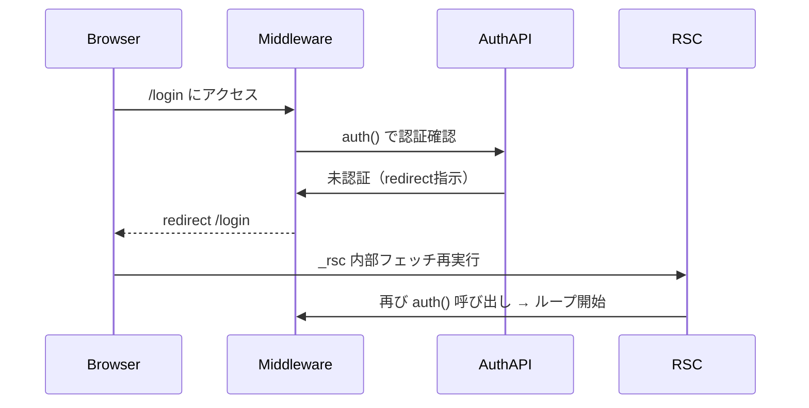

## はじめに

Next.js 15で App Router と React Server Components（以下 RSC）を用いて、Auth.js v5によるログイン制御を導入していると、ログイン認証後に「/login で止まる」「_rsc リクエストが延々続く」「/api/auth/session が秒単位で叩かれる」といったリダイレクトループ現象に悩まされたことはありませんか？

本記事では、、Auth.js の内部構造と Next.js の middleware 機構を踏まえ、この現象の根本原因と対策を整理します。

---

## 対象者

* Next.js 15で App Router を使用中のエンジニア
* Auth.js v5を導入済みの方
* middleware・認証・RSCの挙動を安定化したい方

---

## 1. 症状の分析

### 症状：/login 無限リロード（ループ）

**特徴**

* `/api/auth/session` が周期的に呼ばれる（100〜500ms間隔）
* Networkログに 307 / 308 が混在
* middleware.ts に `_rsc` や `/api/auth` 判定がない

**原因**
middleware が内部フェッチに対しても `auth()` を実行し、
「再フェッチ → 認証確認 → redirect → 再フェッチ...」の無限循環が発生。

---

## 2. ループが発生する構造を理解する

Next.js App Router + Auth.js v5 環境では、
認証確認が3つの非同期レイヤーに分離されています。

| レイヤー           | 主な処理           | 実行環境         |
| -------------- | -------------- | ------------ |
| middleware     | ルーティング前のEdge検証 | Edge Runtime |
| API（/api/auth） | セッション確立・JWT発行  | Node Runtime |
| RSC            | データフェッチ・SSR再構築 | サーバー内部フェッチ   |

この3層を正しく切り分けないと、RSC内部からの `_rsc` フェッチまで認証ガードしてしまい、
再帰的に `auth()` が呼ばれてループが生じます。

---

### ループ構造のイメージ



---

## 3. 正しいmiddleware設計テンプレート

以下のテンプレートは、再フェッチ除外・ログイン除外・セッション確認の3段構成で安全です。

```ts
// middleware.ts
import { NextResponse } from "next/server";
import { auth } from "@/lib/auth";

export async function middleware(req) {
  const { pathname } = req.nextUrl;

  // 1. 内部フェッチ系を除外
  if (
    pathname.startsWith("/_next") ||
    pathname.startsWith("/api/auth") ||
    pathname.includes("_rsc")
  ) {
    return NextResponse.next();
  }

  // 2. ログインページは除外
  if (pathname.startsWith("/login")) return NextResponse.next();

  // 3. Edge環境でセッション確認
  const session = await auth();
  if (!session) return NextResponse.redirect(new URL("/login", req.url));

  return NextResponse.next();
}
```

### 確認ポイント

1. `/login` にアクセス後、Network の `_rsc` 呼び出しが1〜2回で収まる
2. `/api/auth/session` が周期的に呼ばれない
3. 307/308が混在しない

---

## 4. クライアント側での再フェッチループ防止策

Auth.js v5では、`useSession()` による `update()` 呼び出しもループの温床になります。

```tsx
// 悪い例
useEffect(() => {
  if (status === "authenticated") update(); // 無限ループ
}, [status]);
```

**安全な書き方**

以下のように、再フェッチ条件を限定しておくことで、RSC→CSR間のループも防げます。

```tsx
useEffect(() => {
  if (status === "authenticated" && !session?.refreshed) {
    session.refreshed = true;
    update();
  }
}, [status, session]);
```


---

## 5. API層との整合性を保つ

Edge（middleware）と Node（API）はランタイムが異なり、
cookie や session の扱いも微妙に違います。

| 項目            | Edge（middleware） | Node（/api/auth） |
| ------------- | ---------------- | --------------- |
| cookie domain | `.example.com`   | `example.com`   |
| secure        | 常時 `true`        | 環境変数で制御可        |
| runtime       | V8 isolate       | Node.js         |

これを無視して同一設定を共有すると、cookieが正しく解釈されず `auth()` が常に `null` を返します。
防止策として、`authConfig` の `trustHost` と `cookies.sessionToken` を環境ごとに定義しましょう。

---

## 6. 確認と検証の手順

| 手順 | 内容                             | 期待結果 |
| -- | ------------------------------ | ---- |
| 1  | `/login` でリロードが止まるか確認          | OK   |
| 2  | `_rsc` が1〜2回で止まる               | OK   |
| 3  | `/api/auth/session` が周期呼び出ししない | OK   |
| 4  | 307/308がNetworkに出ない            | OK   |

**検証環境例**
Next.js 15.0.3 / Auth.js 5.0.1 / Node 20 / Vercel Edge / Chrome 118

~~~~
---

## おわりに

私自身、Next.js 15 と Auth.js v5 を導入した際に、「ログインできずにネットワークが騒がしい」というバグの解消に悩まされました。
原因を辿れば、非同期フェッチと同期的なセッション検証部分の責務が混在したことが本質でした。

本記事がもし同じ状況に直面している方の参考になれば幸いです。

---

### 主要キーワード

Next.js 15, Auth.js v5, middleware, redirect loop, _rsc, App Router, Edge Runtime, セッション管理, クロスログイン, 無限リロード, 再フェッチ, 防止策

---

### サムネイル提案

* 背景：Next.jsロゴ × 無限ループの矢印
* テキスト：
  「Next.js × Auth.js 無限ループの正体」
  サブテキスト：「middleware と RSC の交差点を解剖」

---

### SNS投稿テンプレート

🆕 Zenn記事を公開しました！
【Next.js】Auth.js v5でハマる無限ループの正体と防止策

止まらない `/login`、続く `_rsc`。
その本質は「Edge認証 × RSCフェッチの交差」にありました。

✅ 症状の見分け方
✅ middleware設計テンプレート
✅ 再発防止の3層モデル

▼記事はこちら
[https://zenn.dev/xxx/articles/nextjs-auth-loop](https://zenn.dev/xxx/articles/nextjs-auth-loop)
#Nextjs #Authjs #Web開発 #Zenn

---

ご希望があれば、この改訂版に対応した
**図解付き Zenn Canvas 用 Markdown（Mermaid／message対応）** を生成して投稿用に最適化できます。
出力しますか？
