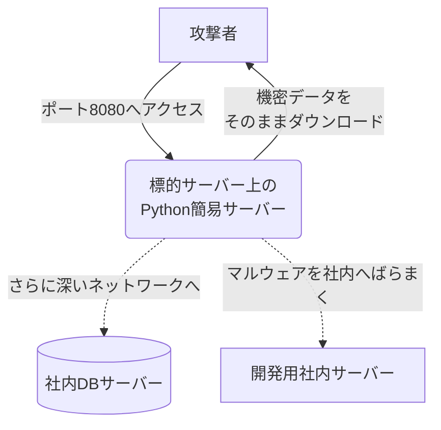

## はじめに

フロントエンドの開発時や、ちょっとしたファイルの受け渡しを行いたいとき、エンジニアがよく使う便利なコマンドの一つに `python -m http.server` があります。環境構築の手間なく、たった一行でカレントディレクトリをWebホスティングできるこの魔法のようなワンライナーは、実はサイバー攻撃における「データ持ち出し」や「マルウェアの配信拠点」として頻繁に悪用されています。

本記事では、開発用の便利なツールがどのように牙をむき、情報漏洩の土管へと変貌するのか、その原理と対策を解説します。

## 対象者

- サーバーの運用やアプリケーション開発に携わるエンジニア
- 便利な標準ツールの裏に潜むセキュリティリスクを知りたい方
- 最新のサイバー攻撃の手口を学び、防御策を講じたい方

## 環境寄生型攻撃と標準ツールの甘い罠

攻撃者がシステムへ侵入したのち、価値ある情報を見つけ出して外部へ持ち出そうとするとき、一番の壁となるのは「どうやって大容量のデータを外部へ送信するか」という点です。独自のファイル転送ソフトを外から持ち込んで実行すれば、すぐにセキュリティ製品に検知されてしまいます。

そこで攻撃者は、すでにサーバーにインストールされている言語ランタイムなどの正規ツール群に目を向けました。攻撃者が持ち込んだ不審なプログラムではなく、もともと環境に存在していた「正規のツール」を使って目的を達成する手口は「環境寄生型攻撃（Living off the Land）」と呼ばれ、検知の網をかいくぐる常套手段となっています。

特にPythonは、多くのLinuxディストリビューションに標準でインストールされているため、攻撃者にとって最も身近で使い勝手の良い武器の一つとなっています。

## 攻撃プロセスとメカニズム

サーバーの内部に侵入した攻撃者は、クレデンシャル情報や機密データが格納されているディレクトリを特定すると、すかさずそのディレクトリに移動して以下のコマンドを実行します。

```bash
$ cd /var/www/backup_data/
$ python3 -m http.server 8080 &
```

このコマンドが実行されると、その瞬間からバックアップディレクトリの中身がすべて、ネットワーク上の誰からでもWebブラウザ越しにアクセス可能（ディレクトリリスティング可能）な状態になります。

攻撃者はあとは自身のパソコンから該当ポートへアクセスし、機密ファイルを悠々とダウンロードするだけです。



また、上記の図のように、この簡易サーバーはデータの「持ち出し」だけでなく、「マルウェアの配信拠点」としても悪用されます。侵入した最初のサーバーでこのワンライナーを立ち上げ、社内ネットワークの別環境からこの簡易サーバーへアクセスさせることで、インターネットに出られない内部のシステムにも次々と感染を広げていく横展開（ラテラルムーブメント）の足場にされてしまうのです。

:::message alert
実行されているのは単なる正規のPythonプロセスであるため、プロセスの稼働自体を見ただけで即座に不正アクセスだと断定するのは非常に困難であり、長期的な情報流出に繋がりやすい性質を持っています。
:::

#### コラム（不審な待受ポートの発見コマンド）

このように「本来提供しているWebサービス（80や443）」とは別に、背後でこっそりと立ち上がっている簡易サーバーを見つけるには、OS上で待ち受けているポート（リスニングポート）を定期的に監視・確認するのが効果的です。

```bash
# 現在待ち受け状態になっているTCPポートと起動プロセスを確認する
$ sudo ss -tlnp
State   Recv-Q  Send-Q  Local Address:Port   Peer Address:Port  Process
LISTEN  0       128           0.0.0.0:80          0.0.0.0:*      users:(("nginx",pid=111,fd=5))
LISTEN  0       5             0.0.0.0:8080        0.0.0.0:*      users:(("python3",pid=222,fd=3))

# または lsof コマンドで8080番ポートを使っているプロセスを特定する
$ sudo lsof -i :8080
COMMAND   PID USER   FD   TYPE DEVICE SIZE/OFF NODE NAME
python3   222 root    3u  IPv4  88888      0t0  TCP *:http-alt (LISTEN)
```

## サイバー攻撃に対する防衛手段

このように、標準で備わっている便利なツール群を悪用した攻撃に対しては、「不要なものは置かない」「実行させない」「通信させない」という基本に立ち返った対策が必要です。

第一の対策は、本番環境のサーバーへ不要な言語ランタイムやツールをインストールしないことです。開発環境や検証環境であれば便利ですが、アプリケーションの実行にPythonが必要ない本番Webサーバーにおいて、デフォルトでPythonがインストールされたままになっているケースは多数存在します。コンテナ環境であれば、アプリケーションのバイナリのみを含めた最小構成のイメージ（Distrolessなど）を利用することで、攻撃者の選択肢を物理的に奪うことができます。

第二の対策は、異常なプロセスの起動監視と権限の最小化です。Webサーバー専用の実行ユーザーが、予期せずシェルを起動したり、Pythonなどのスクリプトエンジンを呼び出したりする挙動を監視しブロックする仕組み（EDRやAppArmorなどの強制アクセス制御）を導入することが望ましいです。

第三の対策は、ネットワークの意図しないポート通信の遮断です。アプリケーションが本来使用するポート（80や443など）以外のローカルポート（8080や8000など）が待ち受け状態になったとしても、サーバー間の横方向の通信（マイクロセグメンテーション）やファイアウォールで厳格にブロックされていれば、簡易サーバーを通じた被害の拡大を防ぐことができます。

## おわりに

私自身、ローカル環境で「ちょっとこのディレクトリの中身を確認したいな」と思ったときに、息をするようにこのPythonのワンライナーを叩いています。しかし、その「便利さ」は、攻撃者が喉から手が出るほど欲しい「手軽さ」と表裏一体であるという事実を強く認識させられました。

本番環境のサーバーを構築する際、つい「後で何かに使うかもしれないから」と色々なツールをインストールしたままにしがちですが、それが結果的にシステムの寿命を縮めることになりかねません。「必要最小限」というセキュリティの基本原則を胸に刻み、日々の運用業務を見直していくことがなにより大切だと感じています。

本記事が、サーバー運用のセキュリティ方針を見直す参考となれば幸いです。

---

### SNS共有用テンプレート

🆕 Zenn記事を公開しました！
【🐍便利なワンライナーが情報漏洩の土管に：Python簡易サーバーを悪用した脅威と対策】

普段「ちょっとファイルを共有したい」時に使うコマンド、実は攻撃者にとっても最高のデータ持ち出しツールです。
✅ 環境寄生型攻撃でのデータ流出の仕組み
✅ Python簡易サーバーを悪用した横展開（ラテラルムーブメント）
✅ 本番環境における不要ツールの排除と最小権限の原則

▼記事はこちら
https://zenn.dev/xxx/articles/lotl-python-server
#セキュリティ #インフラ #Python #サイバー攻撃 #エンジニア
